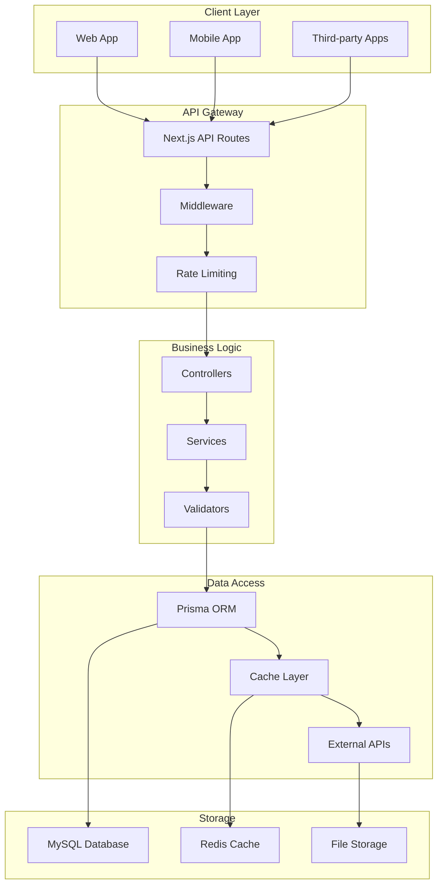

# IntakeFlow - API Architecture & Endpoints

## Overview

This document outlines the complete API architecture for IntakeFlow, including RESTful endpoints, authentication, validation, and error handling. The API is built using Next.js 14 App Router with TypeScript and follows REST conventions with proper HTTP status codes.

## API Architecture



## API Structure

### Base URL Structure

```
Production: https://your-domain.com/api
Development: http://localhost:3000/api
```

### Versioning Strategy

```
/api/v1/...  (Current version)
/api/v2/...  (Future versions)
```

### Authentication

- **Method**: JWT tokens via NextAuth.js
- **Header**: `Authorization: Bearer <token>`
- **Session**: Server-side sessions for web app

## Core API Endpoints

### Authentication Endpoints

#### POST /api/auth/signin

```typescript
// Sign in user
interface SignInRequest {
  email: string;
  password?: string;
  provider?: "google" | "github";
}

interface SignInResponse {
  user: {
    id: string;
    email: string;
    name: string;
    image?: string;
  };
  token: string;
  expires: string;
}
```

#### POST /api/auth/signout

```typescript
// Sign out user
interface SignOutResponse {
  success: boolean;
}
```

#### GET /api/auth/session

```typescript
// Get current session
interface SessionResponse {
  user: {
    id: string;
    email: string;
    name: string;
    image?: string;
    workspaces: Workspace[];
  } | null;
}
```

### Workspace Management

#### GET /api/workspaces

```typescript
// Get user's workspaces
interface WorkspacesResponse {
  workspaces: {
    id: string;
    name: string;
    slug: string;
    description?: string;
    plan: string;
    role: "owner" | "admin" | "member";
    createdAt: string;
  }[];
}
```

#### POST /api/workspaces

```typescript
// Create new workspace
interface CreateWorkspaceRequest {
  name: string;
  slug: string;
  description?: string;
}

interface CreateWorkspaceResponse {
  workspace: {
    id: string;
    name: string;
    slug: string;
    description?: string;
    plan: string;
    createdAt: string;
  };
}
```

#### GET /api/workspaces/[id]

```typescript
// Get workspace details
interface WorkspaceResponse {
  workspace: {
    id: string;
    name: string;
    slug: string;
    description?: string;
    plan: string;
    settings: any;
    stats: {
      totalWorkflows: number;
      totalForms: number;
      totalClients: number;
      totalExecutions: number;
    };
    createdAt: string;
    updatedAt: string;
  };
}
```

#### PATCH /api/workspaces/[id]

```typescript
// Update workspace
interface UpdateWorkspaceRequest {
  name?: string;
  description?: string;
  settings?: any;
}
```

#### DELETE /api/workspaces/[id]

```typescript
// Delete workspace
interface DeleteWorkspaceResponse {
  success: boolean;
}
```

### Workflow Management

#### GET /api/workspaces/[workspaceId]/workflows

```typescript
// Get workflows
interface WorkflowsQuery {
  page?: number;
  limit?: number;
  status?: "draft" | "active" | "paused" | "archived";
  search?: string;
}

interface WorkflowsResponse {
  workflows: {
    id: string;
    name: string;
    description?: string;
    status: string;
    stepCount: number;
    executionCount: number;
    lastRun?: string;
    createdAt: string;
    updatedAt: string;
  }[];
  pagination: {
    page: number;
    limit: number;
    total: number;
    totalPages: number;
  };
}
```

#### POST /api/workspaces/[workspaceId]/workflows

```typescript
// Create workflow
interface CreateWorkflowRequest {
  name: string;
  description?: string;
  steps: WorkflowStep[];
  connections: StepConnection[];
}

interface CreateWorkflowResponse {
  workflow: {
    id: string;
    name: string;
    description?: string;
    status: string;
    steps: WorkflowStep[];
    connections: StepConnection[];
    createdAt: string;
  };
}
```

#### GET /api/workspaces/[workspaceId]/workflows/[id]

```typescript
// Get workflow details
interface WorkflowResponse {
  workflow: {
    id: string;
    name: string;
    description?: string;
    status: string;
    settings?: any;
    steps: WorkflowStep[];
    connections: StepConnection[];
    executions: {
      id: string;
      status: string;
      startedAt: string;
      completedAt?: string;
      client?: {
        id: string;
        name: string;
        email: string;
      };
    }[];
    createdAt: string;
    updatedAt: string;
  };
}
```

#### PATCH /api/workspaces/[workspaceId]/workflows/[id]

```typescript
// Update workflow
interface UpdateWorkflowRequest {
  name?: string;
  description?: string;
  status?: "draft" | "active" | "paused" | "archived";
  steps?: WorkflowStep[];
  connections?: StepConnection[];
  settings?: any;
}
```

#### POST /api/workspaces/[workspaceId]/workflows/[id]/execute

```typescript
// Execute workflow manually
interface ExecuteWorkflowRequest {
  clientId?: string;
  context?: any;
}

interface ExecuteWorkflowResponse {
  execution: {
    id: string;
    status: string;
    startedAt: string;
  };
}
```

#### POST /api/workspaces/[workspaceId]/workflows/[id]/duplicate

```typescript
// Duplicate workflow
interface DuplicateWorkflowRequest {
  name: string;
}

interface DuplicateWorkflowResponse {
  workflow: {
    id: string;
    name: string;
    status: string;
  };
}
```

### Form Management

#### GET /api/workspaces/[workspaceId]/forms

```typescript
// Get forms
interface FormsQuery {
  page?: number;
  limit?: number;
  status?: "draft" | "published" | "archived";
  search?: string;
}

interface FormsResponse {
  forms: {
    id: string;
    name: string;
    slug: string;
    status: string;
    submissionCount: number;
    lastSubmission?: string;
    createdAt: string;
    updatedAt: string;
  }[];
  pagination: {
    page: number;
    limit: number;
    total: number;
    totalPages: number;
  };
}
```

#### POST /api/workspaces/[workspaceId]/forms

```typescript
// Create form
interface CreateFormRequest {
  name: string;
  description?: string;
  slug: string;
  fields: FormField[];
  settings?: any;
}

interface CreateFormResponse {
  form: {
    id: string;
    name: string;
    slug: string;
    status: string;
    fields: FormField[];
    createdAt: string;
  };
}
```

#### GET /api/workspaces/[workspaceId]/forms/[id]

```typescript
// Get form details
interface FormResponse {
  form: {
    id: string;
    name: string;
    description?: string;
    slug: string;
    status: string;
    settings?: any;
    fields: FormField[];
    submissions: {
      id: string;
      submittedAt: string;
      client?: {
        id: string;
        name: string;
        email: string;
      };
    }[];
    createdAt: string;
    updatedAt: string;
  };
}
```

#### GET /api/forms/[slug]

```typescript
// Get public form (for embedding)
interface PublicFormResponse {
  form: {
    id: string;
    name: string;
    description?: string;
    fields: FormField[];
    settings?: any;
  };
}
```

#### POST /api/forms/[slug]/submit

```typescript
// Submit form (public endpoint)
interface FormSubmissionRequest {
  responses: {
    fieldId: string;
    value: any;
  }[];
  clientInfo?: {
    name?: string;
    email?: string;
    phone?: string;
  };
}

interface FormSubmissionResponse {
  submission: {
    id: string;
    submittedAt: string;
  };
  message: string;
}
```

### Client Management

#### GET /api/workspaces/[workspaceId]/clients

```typescript
// Get clients
interface ClientsQuery {
  page?: number;
  limit?: number;
  status?: "active" | "inactive" | "archived";
  search?: string;
}

interface ClientsResponse {
  clients: {
    id: string;
    name?: string;
    email: string;
    phone?: string;
    company?: string;
    status: string;
    submissionCount: number;
    lastActivity?: string;
    createdAt: string;
  }[];
  pagination: {
    page: number;
    limit: number;
    total: number;
    totalPages: number;
  };
}
```

#### POST /api/workspaces/[workspaceId]/clients

```typescript
// Create client
interface CreateClientRequest {
  email: string;
  name?: string;
  phone?: string;
  company?: string;
  metadata?: any;
}

interface CreateClientResponse {
  client: {
    id: string;
    email: string;
    name?: string;
    phone?: string;
    company?: string;
    status: string;
    createdAt: string;
  };
}
```

#### GET /api/workspaces/[workspaceId]/clients/[id]

```typescript
// Get client details
interface ClientResponse {
  client: {
    id: string;
    email: string;
    name?: string;
    phone?: string;
    company?: string;
    status: string;
    metadata?: any;
    submissions: FormSubmission[];
    workflowExecutions: WorkflowExecution[];
    documents: Document[];
    payments: Payment[];
    createdAt: string;
    updatedAt: string;
  };
}
```

### Workflow Execution Management

#### GET /api/workspaces/[workspaceId]/executions

```typescript
// Get workflow executions
interface ExecutionsQuery {
  page?: number;
  limit?: number;
  status?: "running" | "completed" | "failed" | "paused";
  workflowId?: string;
  clientId?: string;
}

interface ExecutionsResponse {
  executions: {
    id: string;
    workflow: {
      id: string;
      name: string;
    };
    client?: {
      id: string;
      name: string;
      email: string;
    };
    status: string;
    startedAt: string;
    completedAt?: string;
    progress: number;
  }[];
  pagination: {
    page: number;
    limit: number;
    total: number;
    totalPages: number;
  };
}
```

#### GET /api/workspaces/[workspaceId]/executions/[id]

```typescript
// Get execution details
interface ExecutionResponse {
  execution: {
    id: string;
    workflow: {
      id: string;
      name: string;
    };
    client?: {
      id: string;
      name: string;
      email: string;
    };
    status: string;
    startedAt: string;
    completedAt?: string;
    context?: any;
    steps: {
      id: string;
      stepId: string;
      status: string;
      startedAt?: string;
      completedAt?: string;
      result?: any;
      error?: string;
    }[];
    logs: {
      id: string;
      level: string;
      message: string;
      data?: any;
      timestamp: string;
    }[];
  };
}
```

#### POST /api/workspaces/[workspaceId]/executions/[id]/pause

```typescript
// Pause execution
interface PauseExecutionResponse {
  success: boolean;
}
```

#### POST /api/workspaces/[workspaceId]/executions/[id]/resume

```typescript
// Resume execution
interface ResumeExecutionResponse {
  success: boolean;
}
```

#### POST /api/workspaces/[workspaceId]/executions/[id]/cancel

```typescript
// Cancel execution
interface CancelExecutionResponse {
  success: boolean;
}
```

### Integration Management

#### GET /api/workspaces/[workspaceId]/integrations

```typescript
// Get integrations
interface IntegrationsResponse {
  integrations: {
    id: string;
    provider: string;
    status: "active" | "inactive" | "error";
    lastSync?: string;
    createdAt: string;
  }[];
}
```

#### POST /api/workspaces/[workspaceId]/integrations

```typescript
// Create integration
interface CreateIntegrationRequest {
  provider: string;
  config: any;
  credentials?: any;
}

interface CreateIntegrationResponse {
  integration: {
    id: string;
    provider: string;
    status: string;
    createdAt: string;
  };
}
```

#### PATCH /api/workspaces/[workspaceId]/integrations/[id]

```typescript
// Update integration
interface UpdateIntegrationRequest {
  config?: any;
  credentials?: any;
  status?: "active" | "inactive";
}
```

#### POST /api/workspaces/[workspaceId]/integrations/[id]/test

```typescript
// Test integration
interface TestIntegrationResponse {
  success: boolean;
  message: string;
  details?: any;
}
```

### Analytics & Reporting

#### GET /api/workspaces/[workspaceId]/analytics/dashboard

```typescript
// Get dashboard analytics
interface DashboardAnalyticsResponse {
  stats: {
    totalClients: number;
    totalSubmissions: number;
    totalExecutions: number;
    avgResponseTime: number;
    conversionRate: number;
  };
  trends: {
    submissions: { date: string; count: number }[];
    executions: { date: string; count: number }[];
    clients: { date: string; count: number }[];
  };
  topWorkflows: {
    id: string;
    name: string;
    executionCount: number;
    successRate: number;
  }[];
}
```

#### GET /api/workspaces/[workspaceId]/analytics/workflows/[id]

```typescript
// Get workflow analytics
interface WorkflowAnalyticsResponse {
  workflow: {
    id: string;
    name: string;
  };
  stats: {
    totalExecutions: number;
    successfulExecutions: number;
    failedExecutions: number;
    avgExecutionTime: number;
    successRate: number;
  };
  stepPerformance: {
    stepId: string;
    stepName: string;
    successRate: number;
    avgExecutionTime: number;
    errorCount: number;
  }[];
  timeline: {
    date: string;
    executions: number;
    successes: number;
    failures: number;
  }[];
}
```

## API Implementation

### Middleware Stack

```typescript
// middleware.ts
import { NextRequest, NextResponse } from "next/server";
import { auth } from "@/auth";
import { rateLimit } from "@/lib/rate-limit";

export async function middleware(request: NextRequest) {
  const { pathname } = request.nextUrl;

  // Skip middleware for public routes
  if (pathname.startsWith("/api/forms/") && pathname.endsWith("/submit")) {
    return NextResponse.next();
  }

  // Rate limiting
  const rateLimitResult = await rateLimit(request);
  if (!rateLimitResult.success) {
    return NextResponse.json({ error: "Too many requests" }, { status: 429 });
  }

  // Authentication for API routes
  if (pathname.startsWith("/api/") && !pathname.startsWith("/api/auth/")) {
    const session = await auth();
    if (!session) {
      return NextResponse.json({ error: "Unauthorized" }, { status: 401 });
    }

    // Add user info to headers
    const requestHeaders = new Headers(request.headers);
    requestHeaders.set("x-user-id", session.user.id);
    requestHeaders.set("x-user-email", session.user.email);

    return NextResponse.next({
      request: {
        headers: requestHeaders,
      },
    });
  }

  return NextResponse.next();
}

export const config = {
  matcher: ["/api/:path*"],
};
```

### Base Controller Class

```typescript
// lib/api/base-controller.ts
import { NextRequest, NextResponse } from "next/server";
import { z } from "zod";
import { PrismaClient } from "@prisma/client";
import logger from "@/lib/logger";

export abstract class BaseController {
  protected prisma: PrismaClient;

  constructor() {
    this.prisma = new PrismaClient();
  }

  protected getUserId(request: NextRequest): string {
    const userId = request.headers.get("x-user-id");
    if (!userId) {
      throw new Error("User ID not found in request headers");
    }
    return userId;
  }

  protected async validateRequest<T>(
    request: NextRequest,
    schema: z.ZodSchema<T>
  ): Promise<T> {
    try {
      const body = await request.json();
      return schema.parse(body);
    } catch (error) {
      if (error instanceof z.ZodError) {
        throw new ValidationError("Invalid request data", error.errors);
      }
      throw error;
    }
  }

  protected success<T>(data: T, status = 200): NextResponse {
    return NextResponse.json(data, { status });
  }

  protected error(message: string, status = 400, details?: any): NextResponse {
    logger.error("API Error", { message, status, details });
    return NextResponse.json({ error: message, details }, { status });
  }

  protected async handleRequest(
    request: NextRequest,
    handler: (request: NextRequest) => Promise<NextResponse>
  ): Promise<NextResponse> {
    try {
      return await handler(request);
    } catch (error) {
      if (error instanceof ValidationError) {
        return this.error(error.message, 400, error.details);
      }
      if (error instanceof NotFoundError) {
        return this.error(error.message, 404);
      }
      if (error instanceof UnauthorizedError) {
        return this.error(error.message, 401);
      }
      if (error instanceof ForbiddenError) {
        return this.error(error.message, 403);
      }

      logger.error("Unhandled API error", error);
      return this.error("Internal server error", 500);
    }
  }
}

// Custom error classes
export class ValidationError extends Error {
  constructor(message: string, public details: any) {
    super(message);
    this.name = "ValidationError";
  }
}

export class NotFoundError extends Error {
  constructor(message: string) {
    super(message);
    this.name = "NotFoundError";
  }
}

export class UnauthorizedError extends Error {
  constructor(message: string) {
    super(message);
    this.name = "UnauthorizedError";
  }
}

export class ForbiddenError extends Error {
  constructor(message: string) {
    super(message);
    this.name = "ForbiddenError";
  }
}
```

### Example Controller Implementation

```typescript
// app/api/workspaces/[workspaceId]/workflows/route.ts
import { NextRequest } from "next/server";
import { z } from "zod";
import { BaseController } from "@/lib/api/base-controller";

const createWorkflowSchema = z.object({
  name: z.string().min(1).max(255),
  description: z.string().optional(),
  steps: z.array(z.any()),
  connections: z.array(z.any()),
});

class WorkflowController extends BaseController {
  async getWorkflows(
    request: NextRequest,
    { params }: { params: { workspaceId: string } }
  ) {
    return this.handleRequest(request, async () => {
      const userId = this.getUserId(request);
      const { workspaceId } = params;

      // Verify workspace access
      const workspace = await this.prisma.workspace.findFirst({
        where: {
          id: workspaceId,
          ownerId: userId,
        },
      });

      if (!workspace) {
        throw new ForbiddenError("Access denied to workspace");
      }

      // Get query parameters
      const url = new URL(request.url);
      const page = parseInt(url.searchParams.get("page") || "1");
      const limit = parseInt(url.searchParams.get("limit") || "10");
      const status = url.searchParams.get("status");
      const search = url.searchParams.get("search");

      // Build where clause
      const where: any = { workspaceId };
      if (status) where.status = status;
      if (search) {
        where.OR = [
          { name: { contains: search } },
          { description: { contains: search } },
        ];
      }

      // Get workflows with pagination
      const [workflows, total] = await Promise.all([
        this.prisma.workflowTemplate.findMany({
          where,
          include: {
            steps: true,
            _count: {
              select: { executions: true },
            },
          },
          skip: (page - 1) * limit,
          take: limit,
          orderBy: { updatedAt: "desc" },
        }),
        this.prisma.workflowTemplate.count({ where }),
      ]);

      return this.success({
        workflows: workflows.map((workflow) => ({
          id: workflow.id,
          name: workflow.name,
          description: workflow.description,
          status: workflow.status,
          stepCount: workflow.steps.length,
          executionCount: workflow._count.executions,
          createdAt: workflow.createdAt.toISOString(),
          updatedAt: workflow.updatedAt.toISOString(),
        })),
        pagination: {
          page,
          limit,
          total,
          totalPages: Math.ceil(total / limit),
        },
      });
    });
  }

  async createWorkflow(
    request: NextRequest,
    { params }: { params: { workspaceId: string } }
  ) {
    return this.handleRequest(request, async () => {
      const userId = this.getUserId(request);
      const { workspaceId } = params;
      const data = await this.validateRequest(request, createWorkflowSchema);

      // Verify workspace access
      const workspace = await this.prisma.workspace.findFirst({
        where: {
          id: workspaceId,
          ownerId: userId,
        },
      });

      if (!workspace) {
        throw new ForbiddenError("Access denied to workspace");
      }

      // Create workflow
      const workflow = await this.prisma.workflowTemplate.create({
        data: {
          name: data.name,
          description: data.description,
          workspaceId,
          status: "draft",
          steps: {
            create: data.steps.map((step, index) => ({
              ...step,
              order: index,
            })),
          },
        },
        include: {
          steps: true,
        },
      });

      return this.success(
        {
          workflow: {
            id: workflow.id,
            name: workflow.name,
            description: workflow.description,
            status: workflow.status,
            steps: workflow.steps,
            createdAt: workflow.createdAt.toISOString(),
          },
        },
        201
      );
    });
  }
}

const controller = new WorkflowController();

export async function GET(
  request: NextRequest,
  context: { params: { workspaceId: string } }
) {
  return controller.getWorkflows(request, context);
}

export async function POST(
  request: NextRequest,
  context: { params: { workspaceId: string } }
) {
  return controller.createWorkflow(request, context);
}
```

### Rate Limiting

```typescript
// lib/rate-limit.ts
import { NextRequest } from "next/server";
import { Redis } from "ioredis";

const redis = new Redis(process.env.REDIS_URL!);

interface RateLimitConfig {
  windowMs: number;
  maxRequests: number;
}

const rateLimitConfigs: Record<string, RateLimitConfig> = {
  "/api/auth/": { windowMs: 60000, maxRequests: 5 }, // 5 requests per minute
  "/api/forms/": { windowMs: 60000, maxRequests: 10 }, // 10 requests per minute
  "/api/": { windowMs: 60000, maxRequests: 100 }, // 100 requests per minute (default)
};

export async function rateLimit(request: NextRequest) {
  const ip = request.ip || "unknown";
  const pathname = request.nextUrl.pathname;

  // Find matching rate limit config
  const config =
    Object.entries(rateLimitConfigs).find(([path]) =>
      pathname.startsWith(path)
    )?.[1] || rateLimitConfigs["/api/"];

  const key = `rate_limit:${ip}:${pathname}`;
  const current = await redis.incr(key);

  if (current === 1) {
    await redis.expire(key, Math.ceil(config.windowMs / 1000));
  }

  return {
    success: current <= config.maxRequests,
    remaining: Math.max(0, config.maxRequests - current),
    reset: Date.now() + config.windowMs,
  };
}
```

### API Documentation Generation

```typescript
// lib/api/docs.ts
export const apiDocumentation = {
  openapi: "3.0.0",
  info: {
    title: "IntakeFlow API",
    version: "1.0.0",
    description: "API for IntakeFlow client onboarding automation platform",
  },
  servers: [
    {
      url: "https://your-domain.com/api",
      description: "Production server",
    },
    {
      url: "http://localhost:3000/api",
      description: "Development server",
    },
  ],
  components: {
    securitySchemes: {
      bearerAuth: {
        type: "http",
        scheme: "bearer",
        bearerFormat: "JWT",
      },
    },
  },
  security: [
    {
      bearerAuth: [],
    },
  ],
  paths: {
    "/workspaces": {
      get: {
        summary: "Get user workspaces",
        responses: {
          "200": {
            description: "List of workspaces",
            content: {
              "application/json": {
                schema: {
                  type: "object",
                  properties: {
                    workspaces: {
                      type: "array",
                      items: {
                        $ref: "#/components/schemas/Workspace",
                      },
                    },
                  },
                },
              },
            },
          },
        },
      },
    },
    // ... more endpoints
  },
  components: {
    schemas: {
      Workspace: {
        type: "object",
        properties: {
          id: { type: "string" },
          name: { type: "string" },
          slug: { type: "string" },
          description: { type: "string" },
          plan: { type: "string" },
          createdAt: { type: "string", format: "date-time" },
        },
      },
      // ... more schemas
    },
  },
};
```

This API architecture provides a comprehensive, scalable foundation for IntakeFlow with proper authentication, validation, error handling, and documentation.
