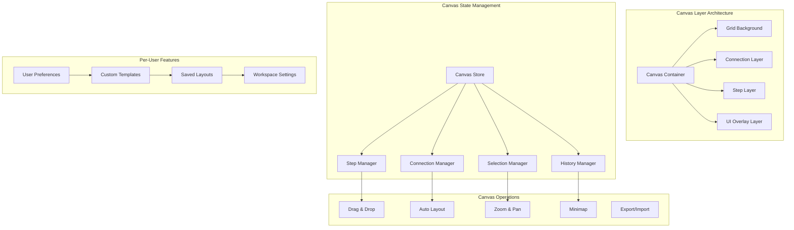

# IntakeFlow - Canvas Implementation Strategy

## Overview

This document outlines the implementation strategy for the visual workflow canvas system in IntakeFlow. The canvas allows users to create, edit, and manage automated workflows through a drag-and-drop interface. The implementation focuses on performance, user experience, and per-user customization.

## Current Canvas Analysis

Based on the existing [`WorkflowCanvas.tsx`](app/dashboard/workflows/_components/WorkflowCanvas.tsx:1) implementation, you already have:

- Basic drag-and-drop functionality
- Visual step representation with icons and colors
- Connection lines between workflow steps
- Grid background for alignment
- Step selection and configuration

## Enhanced Canvas Architecture



## Canvas State Management

### 1. Enhanced Canvas Store

```typescript
// lib/stores/canvas-store.ts
import { create } from "zustand";
import { devtools, persist } from "zustand/middleware";

interface CanvasState {
  // Canvas properties
  zoom: number;
  pan: { x: number; y: number };
  gridSize: number;
  snapToGrid: boolean;

  // Workflow data
  workflow: WorkflowData;
  selectedSteps: string[];
  selectedConnections: string[];

  // UI state
  isConnecting: boolean;
  connectionStart: string | null;
  draggedStep: string | null;

  // History for undo/redo
  history: WorkflowData[];
  historyIndex: number;

  // Actions
  setZoom: (zoom: number) => void;
  setPan: (pan: { x: number; y: number }) => void;
  addStep: (step: WorkflowStep) => void;
  updateStep: (stepId: string, updates: Partial<WorkflowStep>) => void;
  deleteStep: (stepId: string) => void;
  addConnection: (from: string, to: string) => void;
  deleteConnection: (connectionId: string) => void;
  selectStep: (stepId: string, multi?: boolean) => void;
  clearSelection: () => void;
  undo: () => void;
  redo: () => void;
  saveToHistory: () => void;
}

export const useCanvasStore = create<CanvasState>()(
  devtools(
    persist(
      (set, get) => ({
        // Initial state
        zoom: 1,
        pan: { x: 0, y: 0 },
        gridSize: 20,
        snapToGrid: true,
        workflow: {
          id: "",
          name: "",
          description: "",
          status: "draft",
          steps: [],
          connections: [],
        },
        selectedSteps: [],
        selectedConnections: [],
        isConnecting: false,
        connectionStart: null,
        draggedStep: null,
        history: [],
        historyIndex: -1,

        // Actions
        setZoom: (zoom) => set({ zoom }),
        setPan: (pan) => set({ pan }),

        addStep: (step) => {
          const { workflow, saveToHistory } = get();
          saveToHistory();
          set({
            workflow: {
              ...workflow,
              steps: [...workflow.steps, step],
            },
          });
        },

        updateStep: (stepId, updates) => {
          const { workflow, saveToHistory } = get();
          saveToHistory();
          set({
            workflow: {
              ...workflow,
              steps: workflow.steps.map((step) =>
                step.id === stepId ? { ...step, ...updates } : step
              ),
            },
          });
        },

        deleteStep: (stepId) => {
          const { workflow, saveToHistory } = get();
          saveToHistory();
          set({
            workflow: {
              ...workflow,
              steps: workflow.steps.filter((step) => step.id !== stepId),
              connections: workflow.connections.filter(
                (conn) => conn.from !== stepId && conn.to !== stepId
              ),
            },
            selectedSteps: get().selectedSteps.filter((id) => id !== stepId),
          });
        },

        addConnection: (from, to) => {
          const { workflow, saveToHistory } = get();
          const connectionId = `${from}-${to}`;

          // Prevent duplicate connections
          if (
            workflow.connections.some(
              (conn) => conn.from === from && conn.to === to
            )
          ) {
            return;
          }

          saveToHistory();
          set({
            workflow: {
              ...workflow,
              connections: [
                ...workflow.connections,
                { id: connectionId, from, to },
              ],
            },
          });
        },

        selectStep: (stepId, multi = false) => {
          const { selectedSteps } = get();
          if (multi) {
            const newSelection = selectedSteps.includes(stepId)
              ? selectedSteps.filter((id) => id !== stepId)
              : [...selectedSteps, stepId];
            set({ selectedSteps: newSelection });
          } else {
            set({ selectedSteps: [stepId] });
          }
        },

        clearSelection: () =>
          set({ selectedSteps: [], selectedConnections: [] }),

        saveToHistory: () => {
          const { workflow, history, historyIndex } = get();
          const newHistory = history.slice(0, historyIndex + 1);
          newHistory.push(JSON.parse(JSON.stringify(workflow)));
          set({
            history: newHistory.slice(-50), // Keep last 50 states
            historyIndex: Math.min(newHistory.length - 1, 49),
          });
        },

        undo: () => {
          const { history, historyIndex } = get();
          if (historyIndex > 0) {
            set({
              workflow: JSON.parse(JSON.stringify(history[historyIndex - 1])),
              historyIndex: historyIndex - 1,
            });
          }
        },

        redo: () => {
          const { history, historyIndex } = get();
          if (historyIndex < history.length - 1) {
            set({
              workflow: JSON.parse(JSON.stringify(history[historyIndex + 1])),
              historyIndex: historyIndex + 1,
            });
          }
        },
      }),
      {
        name: "canvas-store",
        partialize: (state) => ({
          zoom: state.zoom,
          pan: state.pan,
          gridSize: state.gridSize,
          snapToGrid: state.snapToGrid,
        }),
      }
    )
  )
);
```

### 2. Enhanced Canvas Component

```typescript
// components/canvas/EnhancedWorkflowCanvas.tsx
"use client";

import React, { useRef, useCallback, useEffect } from "react";
import { useCanvasStore } from "@/lib/stores/canvas-store";
import { CanvasStep } from "./CanvasStep";
import { CanvasConnection } from "./CanvasConnection";
import { CanvasGrid } from "./CanvasGrid";
import { CanvasMinimap } from "./CanvasMinimap";
import { CanvasToolbar } from "./CanvasToolbar";

interface EnhancedWorkflowCanvasProps {
  workspaceId: string;
  workflowId?: string;
  readOnly?: boolean;
}

export function EnhancedWorkflowCanvas({
  workspaceId,
  workflowId,
  readOnly = false,
}: EnhancedWorkflowCanvasProps) {
  const canvasRef = useRef<HTMLDivElement>(null);
  const {
    workflow,
    zoom,
    pan,
    selectedSteps,
    draggedStep,
    isConnecting,
    connectionStart,
    setZoom,
    setPan,
    addStep,
    updateStep,
    deleteStep,
    addConnection,
    selectStep,
    clearSelection,
  } = useCanvasStore();

  // Handle canvas panning
  const handleCanvasPan = useCallback(
    (deltaX: number, deltaY: number) => {
      setPan({
        x: pan.x + deltaX / zoom,
        y: pan.y + deltaY / zoom,
      });
    },
    [pan, zoom, setPan]
  );

  // Handle zoom
  const handleZoom = useCallback(
    (delta: number, centerX: number, centerY: number) => {
      const newZoom = Math.max(0.1, Math.min(3, zoom + delta));
      const zoomFactor = newZoom / zoom;

      setPan({
        x: pan.x + (centerX - pan.x) * (1 - zoomFactor),
        y: pan.y + (centerY - pan.y) * (1 - zoomFactor),
      });
      setZoom(newZoom);
    },
    [zoom, pan, setZoom, setPan]
  );

  // Handle step drop
  const handleStepDrop = useCallback(
    (stepType: string, x: number, y: number) => {
      const newStep: WorkflowStep = {
        id: `step-${Date.now()}`,
        type: stepType as any,
        name: `New ${stepType} step`,
        config: {},
        position: { x, y },
      };
      addStep(newStep);
    },
    [addStep]
  );

  // Keyboard shortcuts
  useEffect(() => {
    const handleKeyDown = (e: KeyboardEvent) => {
      if (e.target !== document.body) return;

      switch (e.key) {
        case "Delete":
        case "Backspace":
          selectedSteps.forEach(deleteStep);
          break;
        case "Escape":
          clearSelection();
          break;
        case "a":
          if (e.ctrlKey || e.metaKey) {
            e.preventDefault();
            // Select all steps
            workflow.steps.forEach((step) => selectStep(step.id, true));
          }
          break;
      }
    };

    document.addEventListener("keydown", handleKeyDown);
    return () => document.removeEventListener("keydown", handleKeyDown);
  }, [selectedSteps, deleteStep, clearSelection, workflow.steps, selectStep]);

  return (
    <div className="relative w-full h-full overflow-hidden bg-gray-50">
      {/* Canvas Toolbar */}
      <CanvasToolbar
        zoom={zoom}
        onZoomChange={setZoom}
        onFitToScreen={() => {
          // Calculate bounds and fit to screen
        }}
        onResetView={() => {
          setZoom(1);
          setPan({ x: 0, y: 0 });
        }}
      />

      {/* Main Canvas */}
      <div
        ref={canvasRef}
        className="w-full h-full cursor-grab active:cursor-grabbing"
        style={{
          transform: `scale(${zoom}) translate(${pan.x}px, ${pan.y}px)`,
          transformOrigin: "0 0",
        }}
        onWheel={(e) => {
          e.preventDefault();
          const rect = canvasRef.current?.getBoundingClientRect();
          if (rect) {
            const centerX = (e.clientX - rect.left) / zoom - pan.x;
            const centerY = (e.clientY - rect.top) / zoom - pan.y;
            handleZoom(-e.deltaY * 0.001, centerX, centerY);
          }
        }}
      >
        {/* Grid Background */}
        <CanvasGrid zoom={zoom} />

        {/* Connections */}
        <svg className="absolute inset-0 w-full h-full pointer-events-none">
          {workflow.connections.map((connection) => (
            <CanvasConnection
              key={connection.id}
              connection={connection}
              steps={workflow.steps}
              selected={false}
            />
          ))}
        </svg>

        {/* Steps */}
        {workflow.steps.map((step) => (
          <CanvasStep
            key={step.id}
            step={step}
            selected={selectedSteps.includes(step.id)}
            dragged={draggedStep === step.id}
            connecting={isConnecting && connectionStart === step.id}
            readOnly={readOnly}
            onSelect={(multi) => selectStep(step.id, multi)}
            onUpdate={(updates) => updateStep(step.id, updates)}
            onDelete={() => deleteStep(step.id)}
            onStartConnection={() => {
              // Start connection logic
            }}
          />
        ))}
      </div>

      {/* Minimap */}
      <CanvasMinimap
        workflow={workflow}
        zoom={zoom}
        pan={pan}
        onPanChange={setPan}
      />
    </div>
  );
}
```

### 3. Canvas Step Component

```typescript
// components/canvas/CanvasStep.tsx
"use client";

import React, { useState, useRef } from "react";
import { Card, CardContent } from "@/components/ui/card";
import { Badge } from "@/components/ui/badge";
import { Button } from "@/components/ui/button";
import { Settings, Trash2, Plus } from "lucide-react";
import { getStepIcon, getStepColor } from "@/lib/workflow-utils";

interface CanvasStepProps {
  step: WorkflowStep;
  selected: boolean;
  dragged: boolean;
  connecting: boolean;
  readOnly: boolean;
  onSelect: (multi: boolean) => void;
  onUpdate: (updates: Partial<WorkflowStep>) => void;
  onDelete: () => void;
  onStartConnection: () => void;
}

export function CanvasStep({
  step,
  selected,
  dragged,
  connecting,
  readOnly,
  onSelect,
  onUpdate,
  onDelete,
  onStartConnection,
}: CanvasStepProps) {
  const [isDragging, setIsDragging] = useState(false);
  const dragRef = useRef<{ startX: number; startY: number; moved: boolean }>({
    startX: 0,
    startY: 0,
    moved: false,
  });

  const Icon = getStepIcon(step.type);
  const colorClass = getStepColor(step.type);

  const handleMouseDown = (e: React.MouseEvent) => {
    if (readOnly) return;

    e.preventDefault();
    setIsDragging(true);
    dragRef.current = {
      startX: e.clientX - step.position.x,
      startY: e.clientY - step.position.y,
      moved: false,
    };

    const handleMouseMove = (e: MouseEvent) => {
      if (
        !dragRef.current.moved &&
        (Math.abs(e.clientX - dragRef.current.startX - step.position.x) > 5 ||
          Math.abs(e.clientY - dragRef.current.startY - step.position.y) > 5)
      ) {
        dragRef.current.moved = true;
      }

      if (dragRef.current.moved) {
        onUpdate({
          position: {
            x: e.clientX - dragRef.current.startX,
            y: e.clientY - dragRef.current.startY,
          },
        });
      }
    };

    const handleMouseUp = (e: MouseEvent) => {
      setIsDragging(false);

      if (!dragRef.current.moved) {
        // This was a click, not a drag
        onSelect(e.ctrlKey || e.metaKey);
      }

      document.removeEventListener("mousemove", handleMouseMove);
      document.removeEventListener("mouseup", handleMouseUp);
    };

    document.addEventListener("mousemove", handleMouseMove);
    document.addEventListener("mouseup", handleMouseUp);
  };

  return (
    <Card
      className={`absolute w-72 cursor-pointer transition-all duration-200 ${
        selected ? "ring-2 ring-primary shadow-lg" : "hover:shadow-md"
      } ${dragged || isDragging ? "opacity-50" : ""} ${
        connecting ? "ring-2 ring-blue-400" : ""
      }`}
      style={{
        left: step.position.x,
        top: step.position.y,
        zIndex: selected ? 10 : 2,
      }}
      onMouseDown={handleMouseDown}
    >
      <CardContent className="p-4">
        <div className="flex items-start justify-between">
          <div className="flex items-start space-x-3 flex-1">
            <div
              className={`w-10 h-10 rounded-lg flex items-center justify-center ${colorClass}`}
            >
              <Icon className="h-5 w-5" />
            </div>
            <div className="flex-1 min-w-0">
              <h3 className="font-medium text-sm truncate">{step.name}</h3>
              <p className="text-xs text-muted-foreground mt-1 line-clamp-2">
                {step.description}
              </p>
              <Badge variant="outline" className="mt-2 text-xs">
                {step.type}
              </Badge>
            </div>
          </div>

          {!readOnly && (
            <div className="flex items-center space-x-1 ml-2">
              <Button
                variant="ghost"
                size="sm"
                className="h-6 w-6 p-0"
                onClick={(e) => {
                  e.stopPropagation();
                  onStartConnection();
                }}
              >
                <Plus className="h-3 w-3" />
              </Button>
              <Button
                variant="ghost"
                size="sm"
                className="h-6 w-6 p-0"
                onClick={(e) => {
                  e.stopPropagation();
                  onSelect(false);
                }}
              >
                <Settings className="h-3 w-3" />
              </Button>
              <Button
                variant="ghost"
                size="sm"
                className="h-6 w-6 p-0 text-destructive hover:text-destructive"
                onClick={(e) => {
                  e.stopPropagation();
                  onDelete();
                }}
              >
                <Trash2 className="h-3 w-3" />
              </Button>
            </div>
          )}
        </div>
      </CardContent>
    </Card>
  );
}
```

## Per-User Customization Features

### 1. User Preferences System

```typescript
// lib/user-preferences.ts
interface CanvasPreferences {
  gridSize: number;
  snapToGrid: boolean;
  autoLayout: boolean;
  theme: "light" | "dark" | "auto";
  stepStyle: "compact" | "detailed";
  connectionStyle: "straight" | "curved" | "orthogonal";
  showMinimap: boolean;
  defaultZoom: number;
}

interface UserPreferences {
  canvas: CanvasPreferences;
  workflow: {
    autoSave: boolean;
    autoSaveInterval: number;
    defaultStepTypes: string[];
  };
  notifications: {
    workflowCompleted: boolean;
    workflowFailed: boolean;
    clientSubmission: boolean;
  };
}

export class UserPreferencesManager {
  private userId: string;
  private preferences: UserPreferences;

  constructor(userId: string) {
    this.userId = userId;
    this.preferences = this.getDefaultPreferences();
  }

  async load(): Promise<UserPreferences> {
    // Load from database or localStorage
    const saved = localStorage.getItem(`preferences-${this.userId}`);
    if (saved) {
      this.preferences = { ...this.preferences, ...JSON.parse(saved) };
    }
    return this.preferences;
  }

  async save(preferences: Partial<UserPreferences>): Promise<void> {
    this.preferences = { ...this.preferences, ...preferences };
    localStorage.setItem(
      `preferences-${this.userId}`,
      JSON.stringify(this.preferences)
    );

    // Also save to database for cross-device sync
    await fetch("/api/user/preferences", {
      method: "POST",
      headers: { "Content-Type": "application/json" },
      body: JSON.stringify(this.preferences),
    });
  }

  get(): UserPreferences {
    return this.preferences;
  }

  private getDefaultPreferences(): UserPreferences {
    return {
      canvas: {
        gridSize: 20,
        snapToGrid: true,
        autoLayout: false,
        theme: "auto",
        stepStyle: "detailed",
        connectionStyle: "curved",
        showMinimap: true,
        defaultZoom: 1,
      },
      workflow: {
        autoSave: true,
        autoSaveInterval: 30000, // 30 seconds
        defaultStepTypes: ["form", "email", "document"],
      },
      notifications: {
        workflowCompleted: true,
        workflowFailed: true,
        clientSubmission: true,
      },
    };
  }
}
```

### 2. Custom Templates System

```typescript
// lib/workflow-templates.ts
interface WorkflowTemplate {
  id: string;
  name: string;
  description: string;
  category: string;
  isPublic: boolean;
  createdBy: string;
  workflow: WorkflowData;
  thumbnail?: string;
  tags: string[];
  usageCount: number;
}

export class WorkflowTemplateManager {
  async getUserTemplates(userId: string): Promise<WorkflowTemplate[]> {
    const response = await fetch(`/api/templates?userId=${userId}`);
    return response.json();
  }

  async getPublicTemplates(): Promise<WorkflowTemplate[]> {
    const response = await fetch("/api/templates/public");
    return response.json();
  }

  async saveTemplate(
    template: Omit<WorkflowTemplate, "id" | "usageCount">
  ): Promise<WorkflowTemplate> {
    const response = await fetch("/api/templates", {
      method: "POST",
      headers: { "Content-Type": "application/json" },
      body: JSON.stringify(template),
    });
    return response.json();
  }

  async useTemplate(templateId: string): Promise<WorkflowData> {
    const response = await fetch(`/api/templates/${templateId}/use`, {
      method: "POST",
    });
    return response.json();
  }

  generateThumbnail(workflow: WorkflowData): string {
    // Generate a simple SVG thumbnail of the workflow
    const svg = `
      <svg width="200" height="120" xmlns="http://www.w3.org/2000/svg">
        <rect width="200" height="120" fill="#f8f9fa"/>
        ${workflow.steps
          .map(
            (step, index) => `
          <rect x="${
            20 + index * 40
          }" y="40" width="30" height="30" rx="4" fill="#3b82f6"/>
          <text x="${
            35 + index * 40
          }" y="85" text-anchor="middle" font-size="8" fill="#6b7280">${
              step.type
            }</text>
        `
          )
          .join("")}
        ${workflow.connections
          .map(
            (conn, index) => `
          <line x1="${50 + index * 40}" y1="55" x2="${
              90 + index * 40
            }" y2="55" stroke="#9ca3af" stroke-width="2"/>
        `
          )
          .join("")}
      </svg>
    `;
    return `data:image/svg+xml;base64,${btoa(svg)}`;
  }
}
```

### 3. Workspace-Specific Settings

```typescript
// lib/workspace-settings.ts
interface WorkspaceCanvasSettings {
  allowedStepTypes: string[];
  maxStepsPerWorkflow: number;
  customStepTypes: CustomStepType[];
  branding: {
    primaryColor: string;
    secondaryColor: string;
    logo?: string;
  };
  integrations: {
    enabled: string[];
    configurations: Record<string, any>;
  };
}

interface CustomStepType {
  id: string;
  name: string;
  icon: string;
  color: string;
  category: string;
  configSchema: any; // JSON schema for step configuration
}

export class WorkspaceSettingsManager {
  async getSettings(workspaceId: string): Promise<WorkspaceCanvasSettings> {
    const response = await fetch(`/api/workspaces/${workspaceId}/settings`);
    return response.json();
  }

  async updateSettings(
    workspaceId: string,
    settings: Partial<WorkspaceCanvasSettings>
  ): Promise<void> {
    await fetch(`/api/workspaces/${workspaceId}/settings`, {
      method: "PATCH",
      headers: { "Content-Type": "application/json" },
      body: JSON.stringify(settings),
    });
  }

  async addCustomStepType(
    workspaceId: string,
    stepType: CustomStepType
  ): Promise<void> {
    await fetch(`/api/workspaces/${workspaceId}/step-types`, {
      method: "POST",
      headers: { "Content-Type": "application/json" },
      body: JSON.stringify(stepType),
    });
  }
}
```

## Advanced Canvas Features

### 1. Auto-Layout Algorithm

```typescript
// lib/canvas/auto-layout.ts
export class AutoLayoutEngine {
  static layoutWorkflow(workflow: WorkflowData): WorkflowData {
    const steps = [...workflow.steps];
    const connections = workflow.connections;

    // Build adjacency list
    const graph = this.buildGraph(steps, connections);

    // Perform topological sort
    const sorted = this.topologicalSort(graph);

    // Calculate positions using hierarchical layout
    const positioned = this.calculatePositions(sorted, connections);

    return {
      ...workflow,
      steps: positioned,
    };
  }

  private static buildGraph(steps: WorkflowStep[], connections: any[]) {
    const graph = new Map<string, string[]>();

    steps.forEach((step) => {
      graph.set(step.id, []);
    });

    connections.forEach((conn) => {
      const children = graph.get(conn.from) || [];
      children.push(conn.to);
      graph.set(conn.from, children);
    });

    return graph;
  }

  private static topologicalSort(graph: Map<string, string[]>): string[][] {
    // Implement topological sort to create layers
    const layers: string[][] = [];
    const visited = new Set<string>();
    const inDegree = new Map<string, number>();

    // Calculate in-degrees
    graph.forEach((children, node) => {
      if (!inDegree.has(node)) inDegree.set(node, 0);
      children.forEach((child) => {
        inDegree.set(child, (inDegree.get(child) || 0) + 1);
      });
    });

    // Process nodes layer by layer
    while (visited.size < graph.size) {
      const currentLayer = [];

      graph.forEach((_, node) => {
        if (!visited.has(node) && (inDegree.get(node) || 0) === 0) {
          currentLayer.push(node);
        }
      });

      if (currentLayer.length === 0) break; // Circular dependency

      layers.push(currentLayer);
      currentLayer.forEach((node) => {
        visited.add(node);
        const children = graph.get(node) || [];
        children.forEach((child) => {
          inDegree.set(child, (inDegree.get(child) || 0) - 1);
        });
      });
    }

    return layers;
  }

  private static calculatePositions(
    layers: string[][],
    connections: any[]
  ): WorkflowStep[] {
    const positioned: WorkflowStep[] = [];
    const stepWidth = 300;
    const stepHeight = 120;
    const layerSpacing = 400;
    const nodeSpacing = 150;

    layers.forEach((layer, layerIndex) => {
      const layerY = layerIndex * layerSpacing + 100;
      const startX = (-(layer.length - 1) * (stepWidth + nodeSpacing)) / 2;

      layer.forEach((stepId, nodeIndex) => {
        const x = startX + nodeIndex * (stepWidth + nodeSpacing);
        positioned.push({
          id: stepId,
          // ... other step properties would be preserved
          position: { x, y: layerY },
        } as WorkflowStep);
      });
    });

    return positioned;
  }
}
```

### 2. Canvas Export/Import

```typescript
// lib/canvas/export-import.ts
export class CanvasExporter {
  static exportToJSON(workflow: WorkflowData): string {
    return JSON.stringify(workflow, null, 2);
  }

  static exportToSVG(workflow: WorkflowData): string {
    // Generate SVG representation of the workflow
    const steps = workflow.steps;
    const connections = workflow.connections;

    const svg = `
      <svg xmlns="http://www.w3.org/2000/svg" viewBox="0 0 1200 800">
        <defs>
          <marker id="arrowhead" markerWidth="10" markerHeight="7"
                  refX="9" refY="3.5" orient="auto">
            <polygon points="0 0, 10 3.5, 0 7" fill="#6b7280" />
          </marker>
        </defs>

        <!-- Connections -->
        ${connections.map(conn => {
          const fromStep = steps.find(s => s.id === conn.from);
          const toStep = steps.find(s => s.id === conn.to);
          if (!fromStep || !toStep) return '';

          return `<line x1="${fromStep.position.x + 150}" y1="${fromStep.position.y + 40}"
                       x2="${toStep.position.x + 150}" y2="${toStep.position.y + 40}"
                       stroke="#6b7280" stroke-width="2" marker-end="url(#arrowhead)" />`;
        }).join('')}

        <!-- Steps -->
        ${steps.map(step => `
          <g transform="translate(${step.position.x}, ${step.position.y})">
            <rect width="300" height="80" rx="8" fill="white" stroke="#e5e7eb" stroke-width="1"/>
            <text x="20" y="30" font-family="
```
