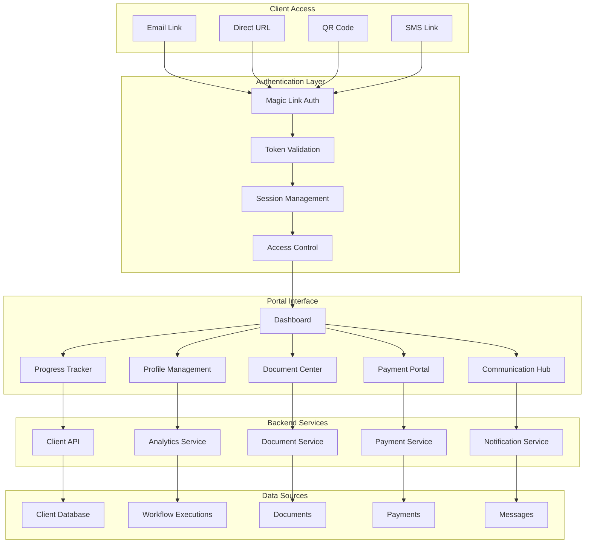

# IntakeFlow - Client Portal Architecture

## Overview

This document outlines the client portal architecture for IntakeFlow, providing clients with a branded, secure interface to track their onboarding progress, access documents, make payments, and communicate with service providers. The portal enhances the client experience while reducing support overhead.

## Client Portal Architecture



## Portal Authentication System

### 1. Magic Link Authentication

```typescript
// lib/portal/auth.ts
import crypto from "crypto";
import { SignJWT, jwtVerify } from "jose";

interface PortalAccessToken {
  clientId: string;
  workspaceId: string;
  expiresAt: Date;
  permissions: string[];
}

export class PortalAuth {
  private static readonly SECRET = new TextEncoder().encode(
    process.env.PORTAL_JWT_SECRET || "your-secret-key"
  );
  private static readonly TOKEN_EXPIRY = 24 * 60 * 60 * 1000; // 24 hours

  static async generateAccessToken(
    clientId: string,
    workspaceId: string,
    permissions: string[] = ["read"]
  ): Promise<string> {
    const expiresAt = new Date(Date.now() + this.TOKEN_EXPIRY);

    const token = await new SignJWT({
      clientId,
      workspaceId,
      permissions,
    })
      .setProtectedHeader({ alg: "HS256" })
      .setIssuedAt()
      .setExpirationTime(expiresAt)
      .setSubject(clientId)
      .sign(this.SECRET);

    // Store token in database for tracking
    await prisma.clientPortalAccess.create({
      data: {
        clientId,
        accessToken: token,
        expiresAt,
        createdAt: new Date(),
      },
    });

    return token;
  }

  static async verifyAccessToken(
    token: string
  ): Promise<PortalAccessToken | null> {
    try {
      const { payload } = await jwtVerify(token, this.SECRET);

      // Check if token exists in database and is not revoked
      const tokenRecord = await prisma.clientPortalAccess.findUnique({
        where: { accessToken: token },
      });

      if (!tokenRecord || tokenRecord.expiresAt < new Date()) {
        return null;
      }

      // Update last access time
      await prisma.clientPortalAccess.update({
        where: { accessToken: token },
        data: { lastAccess: new Date() },
      });

      return {
        clientId: payload.clientId as string,
        workspaceId: payload.workspaceId as string,
        expiresAt: new Date(payload.exp! * 1000),
        permissions: payload.permissions as string[],
      };
    } catch (error) {
      console.error("Token verification failed:", error);
      return null;
    }
  }

  static async generateMagicLink(
    clientId: string,
    workspaceId: string,
    redirectPath: string = "/"
  ): Promise<string> {
    const token = await this.generateAccessToken(clientId, workspaceId);
    const baseUrl = process.env.NEXT_PUBLIC_APP_URL || "http://localhost:3000";

    return `${baseUrl}/portal/auth?token=${token}&redirect=${encodeURIComponent(
      redirectPath
    )}`;
  }

  static async revokeToken(token: string): Promise<void> {
    await prisma.clientPortalAccess.delete({
      where: { accessToken: token },
    });
  }

  static async revokeAllClientTokens(clientId: string): Promise<void> {
    await prisma.clientPortalAccess.deleteMany({
      where: { clientId },
    });
  }
}
```

### 2. Portal Middleware

```typescript
// middleware/portal-auth.ts
import { NextRequest, NextResponse } from "next/server";
import { PortalAuth } from "@/lib/portal/auth";

export async function portalAuthMiddleware(request: NextRequest) {
  const { pathname } = request.nextUrl;

  // Skip auth for public portal routes
  if (
    pathname.startsWith("/portal/auth") ||
    pathname.startsWith("/portal/public")
  ) {
    return NextResponse.next();
  }

  // Check for access token
  const token =
    request.cookies.get("portal-token")?.value ||
    request.headers.get("authorization")?.replace("Bearer ", "");

  if (!token) {
    return NextResponse.redirect(new URL("/portal/auth/login", request.url));
  }

  // Verify token
  const tokenData = await PortalAuth.verifyAccessToken(token);

  if (!tokenData) {
    return NextResponse.redirect(new URL("/portal/auth/login", request.url));
  }

  // Add client info to headers
  const requestHeaders = new Headers(request.headers);
  requestHeaders.set("x-client-id", tokenData.clientId);
  requestHeaders.set("x-workspace-id", tokenData.workspaceId);
  requestHeaders.set(
    "x-portal-permissions",
    JSON.stringify(tokenData.permissions)
  );

  return NextResponse.next({
    request: {
      headers: requestHeaders,
    },
  });
}
```

## Portal Components

### 1. Client Dashboard

```typescript
// app/portal/dashboard/page.tsx
"use client";

import { useEffect, useState } from "react";
import { Card, CardContent, CardHeader, CardTitle } from "@/components/ui/card";
import { Progress } from "@/components/ui/progress";
import { Badge } from "@/components/ui/badge";
import { Button } from "@/components/ui/button";
import {
  FileText,
  CreditCard,
  Calendar,
  MessageCircle,
  CheckCircle,
  Clock,
  AlertCircle,
} from "lucide-react";

interface ClientDashboardData {
  client: {
    id: string;
    name: string;
    email: string;
    company?: string;
  };
  onboardingProgress: {
    currentStep: number;
    totalSteps: number;
    completedSteps: string[];
    nextSteps: Array<{
      id: string;
      name: string;
      description: string;
      type: string;
      dueDate?: string;
    }>;
  };
  documents: Array<{
    id: string;
    name: string;
    status: string;
    createdAt: string;
    signedAt?: string;
  }>;
  payments: Array<{
    id: string;
    amount: number;
    status: string;
    dueDate?: string;
    paidAt?: string;
  }>;
  messages: Array<{
    id: string;
    subject: string;
    preview: string;
    isRead: boolean;
    createdAt: string;
  }>;
}

export default function ClientDashboard() {
  const [data, setData] = useState<ClientDashboardData | null>(null);
  const [loading, setLoading] = useState(true);

  useEffect(() => {
    fetchDashboardData();
  }, []);

  const fetchDashboardData = async () => {
    try {
      const response = await fetch("/api/portal/dashboard");
      const dashboardData = await response.json();
      setData(dashboardData);
    } catch (error) {
      console.error("Failed to fetch dashboard data:", error);
    } finally {
      setLoading(false);
    }
  };

  if (loading) {
    return (
      <div className="flex items-center justify-center h-64">Loading...</div>
    );
  }

  if (!data) {
    return (
      <div className="text-center text-red-600">Failed to load dashboard</div>
    );
  }

  const progressPercentage =
    (data.onboardingProgress.currentStep / data.onboardingProgress.totalSteps) *
    100;

  return (
    <div className="min-h-screen bg-gray-50">
      {/* Header */}
      <header className="bg-white shadow-sm border-b">
        <div className="max-w-7xl mx-auto px-4 sm:px-6 lg:px-8 py-4">
          <div className="flex justify-between items-center">
            <div>
              <h1 className="text-2xl font-bold text-gray-900">
                Welcome, {data.client.name}
              </h1>
              <p className="text-gray-600">Track your onboarding progress</p>
            </div>
            <div className="flex items-center space-x-4">
              <Badge variant="outline" className="text-sm">
                {data.client.company || "Individual"}
              </Badge>
            </div>
          </div>
        </div>
      </header>

      <div className="max-w-7xl mx-auto px-4 sm:px-6 lg:px-8 py-8">
        {/* Progress Overview */}
        <Card className="mb-8">
          <CardHeader>
            <CardTitle className="flex items-center">
              <CheckCircle className="h-5 w-5 mr-2 text-green-600" />
              Onboarding Progress
            </CardTitle>
          </CardHeader>
          <CardContent>
            <div className="space-y-4">
              <div className="flex justify-between items-center">
                <span className="text-sm font-medium">
                  Step {data.onboardingProgress.currentStep} of{" "}
                  {data.onboardingProgress.totalSteps}
                </span>
                <span className="text-sm text-gray-600">
                  {Math.round(progressPercentage)}% Complete
                </span>
              </div>
              <Progress value={progressPercentage} className="h-2" />

              {data.onboardingProgress.nextSteps.length > 0 && (
                <div className="mt-6">
                  <h4 className="font-medium mb-3">Next Steps</h4>
                  <div className="space-y-2">
                    {data.onboardingProgress.nextSteps.map((step) => (
                      <div
                        key={step.id}
                        className="flex items-center justify-between p-3 bg-blue-50 rounded-lg"
                      >
                        <div>
                          <p className="font-medium text-blue-900">
                            {step.name}
                          </p>
                          <p className="text-sm text-blue-700">
                            {step.description}
                          </p>
                        </div>
                        {step.dueDate && (
                          <Badge variant="outline" className="text-xs">
                            Due {new Date(step.dueDate).toLocaleDateString()}
                          </Badge>
                        )}
                      </div>
                    ))}
                  </div>
                </div>
              )}
            </div>
          </CardContent>
        </Card>

        <div className="grid lg:grid-cols-3 gap-6">
          {/* Documents */}
          <Card>
            <CardHeader>
              <CardTitle className="flex items-center">
                <FileText className="h-5 w-5 mr-2" />
                Documents
              </CardTitle>
            </CardHeader>
            <CardContent>
              <div className="space-y-3">
                {data.documents.slice(0, 3).map((doc) => (
                  <div
                    key={doc.id}
                    className="flex items-center justify-between"
                  >
                    <div className="flex-1 min-w-0">
                      <p className="text-sm font-medium truncate">{doc.name}</p>
                      <p className="text-xs text-gray-500">
                        {new Date(doc.createdAt).toLocaleDateString()}
                      </p>
                    </div>
                    <Badge
                      variant={
                        doc.status === "signed" ? "default" : "secondary"
                      }
                      className="ml-2"
                    >
                      {doc.status}
                    </Badge>
                  </div>
                ))}
                <Button variant="outline" size="sm" className="w-full mt-3">
                  View All Documents
                </Button>
              </div>
            </CardContent>
          </Card>

          {/* Payments */}
          <Card>
            <CardHeader>
              <CardTitle className="flex items-center">
                <CreditCard className="h-5 w-5 mr-2" />
                Payments
              </CardTitle>
            </CardHeader>
            <CardContent>
              <div className="space-y-3">
                {data.payments.slice(0, 3).map((payment) => (
                  <div
                    key={payment.id}
                    className="flex items-center justify-between"
                  >
                    <div>
                      <p className="text-sm font-medium">
                        ${payment.amount.toFixed(2)}
                      </p>
                      <p className="text-xs text-gray-500">
                        {payment.dueDate
                          ? `Due ${new Date(
                              payment.dueDate
                            ).toLocaleDateString()}`
                          : payment.paidAt
                          ? `Paid ${new Date(
                              payment.paidAt
                            ).toLocaleDateString()}`
                          : "No due date"}
                      </p>
                    </div>
                    <Badge
                      variant={
                        payment.status === "paid" ? "default" : "destructive"
                      }
                    >
                      {payment.status}
                    </Badge>
                  </div>
                ))}
                <Button variant="outline" size="sm" className="w-full mt-3">
                  View All Payments
                </Button>
              </div>
            </CardContent>
          </Card>

          {/* Messages */}
          <Card>
            <CardHeader>
              <CardTitle className="flex items-center">
                <MessageCircle className="h-5 w-5 mr-2" />
                Messages
              </CardTitle>
            </CardHeader>
            <CardContent>
              <div className="space-y-3">
                {data.messages.slice(0, 3).map((message) => (
                  <div key={message.id} className="space-y-1">
                    <div className="flex items-center justify-between">
                      <p
                        className={`text-sm font-medium ${
                          !message.isRead ? "text-blue-600" : ""
                        }`}
                      >
                        {message.subject}
                      </p>
                      {!message.isRead && (
                        <div className="w-2 h-2 bg-blue-600 rounded-full"></div>
                      )}
                    </div>
                    <p className="text-xs text-gray-500 line-clamp-2">
                      {message.preview}
                    </p>
                    <p className="text-xs text-gray-400">
                      {new Date(message.createdAt).toLocaleDateString()}
                    </p>
                  </div>
                ))}
                <Button variant="outline" size="sm" className="w-full mt-3">
                  View All Messages
                </Button>
              </div>
            </CardContent>
          </Card>
        </div>
      </div>
    </div>
  );
}
```

### 2. Document Center

```typescript
// app/portal/documents/page.tsx
"use client";

import { useState, useEffect } from "react";
import { Card, CardContent, CardHeader, CardTitle } from "@/components/ui/card";
import { Button } from "@/components/ui/button";
import { Badge } from "@/components/ui/badge";
import { Input } from "@/components/ui/input";
import {
  FileText,
  Download,
  Eye,
  Search,
  Filter,
  Calendar,
  Signature,
} from "lucide-react";

interface Document {
  id: string;
  name: string;
  type: string;
  status: "draft" | "sent" | "signed" | "completed";
  createdAt: string;
  signedAt?: string;
  fileUrl?: string;
  requiresSignature: boolean;
  signatureUrl?: string;
}

export default function DocumentCenter() {
  const [documents, setDocuments] = useState<Document[]>([]);
  const [loading, setLoading] = useState(true);
  const [searchTerm, setSearchTerm] = useState("");
  const [statusFilter, setStatusFilter] = useState<string>("all");

  useEffect(() => {
    fetchDocuments();
  }, []);

  const fetchDocuments = async () => {
    try {
      const response = await fetch("/api/portal/documents");
      const data = await response.json();
      setDocuments(data.documents);
    } catch (error) {
      console.error("Failed to fetch documents:", error);
    } finally {
      setLoading(false);
    }
  };

  const handleDownload = async (documentId: string) => {
    try {
      const response = await fetch(
        `/api/portal/documents/${documentId}/download`
      );
      const blob = await response.blob();
      const url = window.URL.createObjectURL(blob);
      const a = document.createElement("a");
      a.href = url;
      a.download = `document-${documentId}.pdf`;
      document.body.appendChild(a);
      a.click();
      window.URL.revokeObjectURL(url);
      document.body.removeChild(a);
    } catch (error) {
      console.error("Failed to download document:", error);
    }
  };

  const handleSign = (signatureUrl: string) => {
    window.open(signatureUrl, "_blank");
  };

  const filteredDocuments = documents.filter((doc) => {
    const matchesSearch = doc.name
      .toLowerCase()
      .includes(searchTerm.toLowerCase());
    const matchesStatus = statusFilter === "all" || doc.status === statusFilter;
    return matchesSearch && matchesStatus;
  });

  const getStatusColor = (status: string) => {
    switch (status) {
      case "signed":
      case "completed":
        return "default";
      case "sent":
        return "secondary";
      case "draft":
        return "outline";
      default:
        return "secondary";
    }
  };

  if (loading) {
    return (
      <div className="flex items-center justify-center h-64">
        Loading documents...
      </div>
    );
  }

  return (
    <div className="min-h-screen bg-gray-50">
      <header className="bg-white shadow-sm border-b">
        <div className="max-w-7xl mx-auto px-4 sm:px-6 lg:px-8 py-4">
          <h1 className="text-2xl font-bold text-gray-900">Document Center</h1>
          <p className="text-gray-600">Access and manage your documents</p>
        </div>
      </header>

      <div className="max-w-7xl mx-auto px-4 sm:px-6 lg:px-8 py-8">
        {/* Filters */}
        <Card className="mb-6">
          <CardContent className="pt-6">
            <div className="flex flex-col sm:flex-row gap-4">
              <div className="flex-1">
                <div className="relative">
                  <Search className="absolute left-3 top-1/2 transform -translate-y-1/2 text-gray-400 h-4 w-4" />
                  <Input
                    placeholder="Search documents..."
                    value={searchTerm}
                    onChange={(e) => setSearchTerm(e.target.value)}
                    className="pl-10"
                  />
                </div>
              </div>
              <div className="flex gap-2">
                <select
                  value={statusFilter}
                  onChange={(e) => setStatusFilter(e.target.value)}
                  className="px-3 py-2 border border-gray-300 rounded-md text-sm"
                >
                  <option value="all">All Status</option>
                  <option value="draft">Draft</option>
                  <option value="sent">Sent for Signature</option>
                  <option value="signed">Signed</option>
                  <option value="completed">Completed</option>
                </select>
              </div>
            </div>
          </CardContent>
        </Card>

        {/* Documents Grid */}
        <div className="grid gap-4">
          {filteredDocuments.map((document) => (
            <Card
              key={document.id}
              className="hover:shadow-md transition-shadow"
            >
              <CardContent className="p-6">
                <div className="flex items-center justify-between">
                  <div className="flex items-center space-x-4">
                    <div className="p-2 bg-blue-100 rounded-lg">
                      <FileText className="h-6 w-6 text-blue-600" />
                    </div>
                    <div>
                      <h3 className="font-semibold text-gray-900">
                        {document.name}
                      </h3>
                      <div className="flex items-center space-x-4 mt-1">
                        <span className="text-sm text-gray-500">
                          Created{" "}
                          {new Date(document.createdAt).toLocaleDateString()}
                        </span>
                        {document.signedAt && (
                          <span className="text-sm text-green-600">
                            Signed{" "}
                            {new Date(document.signedAt).toLocaleDateString()}
                          </span>
                        )}
                      </div>
                    </div>
                  </div>

                  <div className="flex items-center space-x-3">
                    <Badge variant={getStatusColor(document.status)}>
                      {document.status}
                    </Badge>

                    <div className="flex space-x-2">
                      {document.requiresSignature &&
                        document.status === "sent" &&
                        document.signatureUrl && (
                          <Button
                            size="sm"
                            onClick={() => handleSign(document.signatureUrl!)}
                            className="bg-blue-600 hover:bg-blue-700"
                          >
                            <Signature className="h-4 w-4 mr-2" />
                            Sign
                          </Button>
                        )}

                      {document.fileUrl && (
                        <>
                          <Button
                            variant="outline"
                            size="sm"
                            onClick={() =>
                              window.open(document.fileUrl, "_blank")
                            }
                          >
                            <Eye className="h-4 w-4 mr-2" />
                            View
                          </Button>
                          <Button
                            variant="outline"
                            size="sm"
                            onClick={() => handleDownload(document.id)}
                          >
                            <Download className="h-4 w-4 mr-2" />
                            Download
                          </Button>
                        </>
                      )}
                    </div>
                  </div>
                </div>
              </CardContent>
            </Card>
          ))}
        </div>

        {filteredDocuments.length === 0 && (
          <Card>
            <CardContent className="text-center py-12">
              <FileText className="h-12 w-12 text-gray-400 mx-auto mb-4" />
              <h3 className="text-lg font-medium text-gray-900 mb-2">
                No documents found
              </h3>
              <p className="text-gray-500">
                {searchTerm || statusFilter !== "all"
                  ? "Try adjusting your search or filter criteria."
                  : "Your documents will appear here once they are created."}
              </p>
            </CardContent>
          </Card>
        )}
      </div>
    </div>
  );
}
```

### 3. Payment Portal

```typescript
// app/portal/payments/page.tsx
'use client';

import { useState, useEffect } from 'react';
import { Card, CardContent, CardHeader, CardTitle } from '@/components/ui/card';
import { Button } from '@/components/ui/button';
import { Badge } from '@/components/ui/badge';
import {
  CreditCard,
  DollarSign,
  Calendar,
  CheckCircle,
  AlertCircle,
  ExternalLink
} from 'lucide-react';

interface Payment {
  id: string;
  amount: number;
  currency: string;
  description: string;
  status: 'pending' | 'paid' | 'failed' | 'refunded';
  dueDate?: string;
  paidAt?: string;
  paymentUrl?: string;
  invoiceUrl?: string;
}

export default function PaymentPortal() {
  const [payments, setPayments] = useState<Payment[]>([]);
  const [loading, setLoading] = useState(true);

  useEffect(() => {
    fetchPayments();
  }, []);

  const fetchPayments = async () => {
    try {
      const response = await fetch('/api/portal/payments');
      const data = await response.json();
      setPayments(data.payments);
    } catch (error) {
      console.error('Failed to fetch payments:', error);
    } finally {
      setLoading(false);
    }
  };

  const handlePayment = (paymentUrl: string) => {
    window.open(paymentUrl, '_blank');
  };

  const getStatusColor = (status: string) => {
    switch (status) {
      case 'paid':
        return 'default';
      case 'pending':
        return 'secondary';
      case 'failed':
        return 'destructive';
      case 'refunded':
        return 'outline';
      default:
        return 'secondary';
    }
  };

  const getStatusIcon = (status: string) => {
    switch (status) {
      case 'paid':
        return <CheckCircle className="h-4 w-4 text-green-600" />;
      case 'pending':
        return <Clock className="h-4 w-4 text-yellow-600" />;
      case 'failed':
        return <AlertCircle className="h-4 w-4 text-red-600" />;
      default:
        return <DollarSign className="h-4 w-4 text-gray-600" />;
    }
  };

  const totalAmount = payments.reduce((sum, payment) => sum + payment.amount, 0);
  const paidAmount = payments
    .filter(p => p.status === 'paid')
    .reduce((sum, payment) => sum + payment.amount, 0);
  const pendingAmount = payments
    .filter(p => p.status === 'pending')
    .reduce((sum, payment) => sum + payment.amount, 0);

  if (loading) {
    return <div className="flex items-center justify-center h-64">Loading payments...</div>;
  }

  return (
    <div className="min-h-screen bg-gray-50">
      <header className="bg-white shadow-sm border-b">
        <div className="max-w-7xl mx-auto px-4 sm:px-6 lg:px-8 py-4">
          <h1 className="text-2xl font-bold text-gray-900">Payment Center</h1>
          <p className="text-gray-600">Manage your payments and invoices</p>
        </div>
      </header>

      <div className="max-w-7xl mx-auto px-4 sm:px-6 lg:px-8 py-8">
        {/* Payment Summary */}
        <div className="grid md:grid-cols-3 gap-6 mb-8">
          <Card>
            <CardHeader className="pb-2">
              <CardTitle className="text-sm font-medium text-gray-600">Total Amount</CardTitle>
            </CardHeader>
            <CardContent>
              <div className="text-2xl font-bold">${totalAmount.toFixed(2)}</div>
            </CardContent>
          </Card>

          <Card>
            <CardHeader className="pb-2">
              <CardTitle className="text-sm font-medium text-gray-600">Paid</CardTitle>
            </CardHeader>
            <CardContent>
              <div className="text-2xl font-bold text-green-600">${paidAmount.toFixed(2)}</div>
            </CardContent>
          </Card>

          <Card>
            <CardHeader className="pb-2">
              <CardTitle className="text-sm font-medium text-gray-600">Pending</CardTitle>
            </CardHeader>
            <CardContent>
              <div className="text-2xl font-bold text-yellow-600">${pendingAmount.toFixed(2)}</div>
            </CardContent>
          </Card>
        </div>

        {/* Payments List */}
        <div className="space-y-4">
          {payments.map((payment) => (
            <Card key={payment.id} className="hover:shadow-md transition-shadow">
              <CardContent className="p-6">
                <div className="flex items-center justify-between">
                  <div className="flex items-center space-x-4">
                    <div className="p-2 bg-blue-100 rounded-lg">
                      <CreditCard className="h-6 w-6 text-blue-600" />
                    </div>
                    <div>
                      <h3 className="font-semibold text-gray-900">{payment.description}</h3>
                      <div className="flex items-center space-x-4 mt-1">
                        <span className="text-lg font-bold">
                          ${payment.amount.toFixed(2)} {payment.currency.toUpperCase()}
                        </span>
                        {payment.dueDate && (
                          <span className="text-sm text-gray-500 flex items-center">
                            <Calendar className="h-4 w-4 mr-1" />
                            Due {new Date(payment.dueDate).toLocaleDateString()}
                          </span>
                        )}
                        {payment.paidAt && (
                          <span className="text-sm text-green-600 flex items-center">
                            <CheckCircle className="h-4 w-4 mr-1" />
                            Paid {new Date(payment.paidAt).toLocaleDateString()}
                          </span>
```
