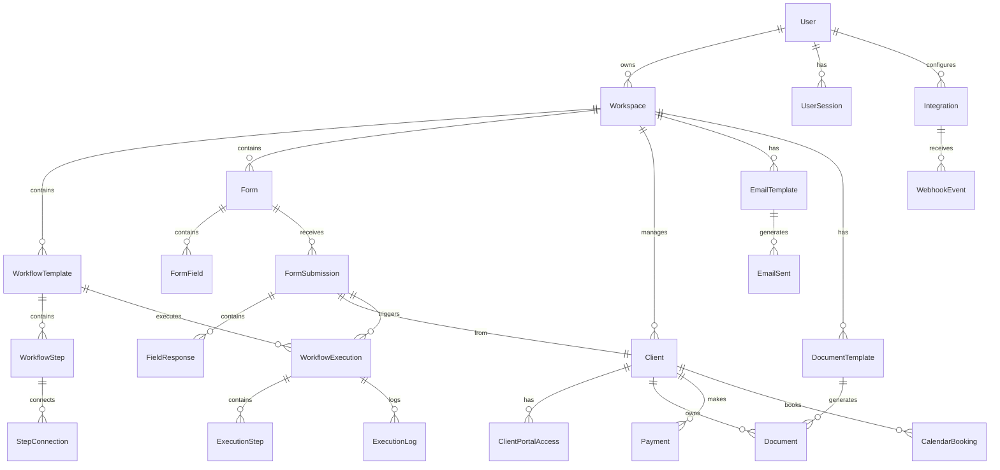

# IntakeFlow - Database Schema Design

## Overview

This document outlines the complete database schema for IntakeFlow using Prisma ORM with MySQL. The schema is designed to support multi-tenant SaaS architecture with efficient querying and scalability.

## Entity Relationship Diagram



## Core Schema Definition

### Prisma Schema File

```prisma
// prisma/schema.prisma
generator client {
  provider = "prisma-client-js"
}

datasource db {
  provider = "mysql"
  url      = env("DATABASE_URL")
}

// ================================
// USER MANAGEMENT
// ================================

model User {
  id            String    @id @default(cuid())
  email         String    @unique
  name          String?
  image         String?
  emailVerified DateTime?
  createdAt     DateTime  @default(now())
  updatedAt     DateTime  @updatedAt

  // Auth.js required fields
  accounts      Account[]
  sessions      Session[]

  // Business logic
  workspaces    Workspace[]
  integrations  Integration[]

  @@map("users")
}

model Account {
  id                String  @id @default(cuid())
  userId            String
  type              String
  provider          String
  providerAccountId String
  refresh_token     String? @db.Text
  access_token      String? @db.Text
  expires_at        Int?
  token_type        String?
  scope             String?
  id_token          String? @db.Text
  session_state     String?

  user User @relation(fields: [userId], references: [id], onDelete: Cascade)

  @@unique([provider, providerAccountId])
  @@map("accounts")
}

model Session {
  id           String   @id @default(cuid())
  sessionToken String   @unique
  userId       String
  expires      DateTime
  user         User     @relation(fields: [userId], references: [id], onDelete: Cascade)

  @@map("sessions")
}

model VerificationToken {
  identifier String
  token      String   @unique
  expires    DateTime

  @@unique([identifier, token])
  @@map("verificationtokens")
}

// ================================
// WORKSPACE & ORGANIZATION
// ================================

model Workspace {
  id          String   @id @default(cuid())
  name        String
  slug        String   @unique
  description String?
  settings    Json?    // Workspace-level settings
  plan        String   @default("free") // free, pro, enterprise
  createdAt   DateTime @default(now())
  updatedAt   DateTime @updatedAt

  // Relationships
  ownerId           String
  owner             User                @relation(fields: [ownerId], references: [id])
  workflowTemplates WorkflowTemplate[]
  forms             Form[]
  clients           Client[]
  emailTemplates    EmailTemplate[]
  documentTemplates DocumentTemplate[]
  integrations      Integration[]

  @@map("workspaces")
}

// ================================
// WORKFLOW SYSTEM
// ================================

model WorkflowTemplate {
  id          String   @id @default(cuid())
  name        String
  description String?
  status      String   @default("draft") // draft, active, paused, archived
  settings    Json?    // Workflow-specific settings
  createdAt   DateTime @default(now())
  updatedAt   DateTime @updatedAt

  // Relationships
  workspaceId String
  workspace   Workspace @relation(fields: [workspaceId], references: [id], onDelete: Cascade)

  steps       WorkflowStep[]
  executions  WorkflowExecution[]

  @@map("workflow_templates")
}

model WorkflowStep {
  id          String @id @default(cuid())
  name        String
  type        String // form, email, document, payment, calendar, condition, delay, webhook
  config      Json   // Step-specific configuration
  position    Json   // Canvas position {x, y}
  order       Int    // Execution order

  // Relationships
  workflowId String
  workflow   WorkflowTemplate @relation(fields: [workflowId], references: [id], onDelete: Cascade)

  connectionsFrom StepConnection[] @relation("FromStep")
  connectionsTo   StepConnection[] @relation("ToStep")

  @@map("workflow_steps")
}

model StepConnection {
  id       String @id @default(cuid())
  fromStepId String
  toStepId   String
  condition  Json?  // Optional condition for connection

  fromStep WorkflowStep @relation("FromStep", fields: [fromStepId], references: [id], onDelete: Cascade)
  toStep   WorkflowStep @relation("ToStep", fields: [toStepId], references: [id], onDelete: Cascade)

  @@unique([fromStepId, toStepId])
  @@map("step_connections")
}

// ================================
// WORKFLOW EXECUTION
// ================================

model WorkflowExecution {
  id          String   @id @default(cuid())
  status      String   @default("running") // running, completed, failed, paused
  startedAt   DateTime @default(now())
  completedAt DateTime?
  context     Json?    // Execution context and variables

  // Relationships
  workflowId String
  workflow   WorkflowTemplate @relation(fields: [workflowId], references: [id])

  clientId String?
  client   Client? @relation(fields: [clientId], references: [id])

  formSubmissionId String?
  formSubmission   FormSubmission? @relation(fields: [formSubmissionId], references: [id])

  steps ExecutionStep[]
  logs  ExecutionLog[]

  @@map("workflow_executions")
}

model ExecutionStep {
  id          String    @id @default(cuid())
  stepId      String    // Reference to WorkflowStep
  status      String    @default("pending") // pending, running, completed, failed, skipped
  startedAt   DateTime?
  completedAt DateTime?
  result      Json?     // Step execution result
  error       String?   // Error message if failed

  // Relationships
  executionId String
  execution   WorkflowExecution @relation(fields: [executionId], references: [id], onDelete: Cascade)

  @@map("execution_steps")
}

model ExecutionLog {
  id        String   @id @default(cuid())
  level     String   // info, warning, error
  message   String
  data      Json?
  timestamp DateTime @default(now())

  // Relationships
  executionId String
  execution   WorkflowExecution @relation(fields: [executionId], references: [id], onDelete: Cascade)

  @@map("execution_logs")
}

// ================================
// FORMS SYSTEM
// ================================

model Form {
  id          String   @id @default(cuid())
  name        String
  description String?
  slug        String   // URL-friendly identifier
  settings    Json?    // Form settings (branding, notifications, etc.)
  status      String   @default("draft") // draft, published, archived
  createdAt   DateTime @default(now())
  updatedAt   DateTime @updatedAt

  // Relationships
  workspaceId String
  workspace   Workspace @relation(fields: [workspaceId], references: [id], onDelete: Cascade)

  fields      FormField[]
  submissions FormSubmission[]

  @@unique([workspaceId, slug])
  @@map("forms")
}

model FormField {
  id          String @id @default(cuid())
  name        String // Field name/key
  label       String
  type        String // text, email, phone, textarea, select, date, file, number
  placeholder String?
  required    Boolean @default(false)
  options     Json?   // For select fields
  validation  Json?   // Validation rules
  order       Int

  // Relationships
  formId String
  form   Form @relation(fields: [formId], references: [id], onDelete: Cascade)

  responses FieldResponse[]

  @@map("form_fields")
}

model FormSubmission {
  id          String   @id @default(cuid())
  submittedAt DateTime @default(now())
  ipAddress   String?
  userAgent   String?

  // Relationships
  formId String
  form   Form @relation(fields: [formId], references: [id])

  clientId String?
  client   Client? @relation(fields: [clientId], references: [id])

  responses         FieldResponse[]
  workflowExecutions WorkflowExecution[]

  @@map("form_submissions")
}

model FieldResponse {
  id    String @id @default(cuid())
  value Json   // Field response value

  // Relationships
  submissionId String
  submission   FormSubmission @relation(fields: [submissionId], references: [id], onDelete: Cascade)

  fieldId String
  field   FormField @relation(fields: [fieldId], references: [id])

  @@map("field_responses")
}

// ================================
// CLIENT MANAGEMENT
// ================================

model Client {
  id        String   @id @default(cuid())
  email     String
  name      String?
  phone     String?
  company   String?
  metadata  Json?    // Additional client data
  status    String   @default("active") // active, inactive, archived
  createdAt DateTime @default(now())
  updatedAt DateTime @updatedAt

  // Relationships
  workspaceId String
  workspace   Workspace @relation(fields: [workspaceId], references: [id], onDelete: Cascade)

  submissions        FormSubmission[]
  workflowExecutions WorkflowExecution[]
  portalAccess       ClientPortalAccess[]
  documents          Document[]
  payments           Payment[]
  calendarBookings   CalendarBooking[]

  @@unique([workspaceId, email])
  @@map("clients")
}

model ClientPortalAccess {
  id          String    @id @default(cuid())
  accessToken String    @unique
  expiresAt   DateTime?
  lastAccess  DateTime?
  createdAt   DateTime  @default(now())

  // Relationships
  clientId String
  client   Client @relation(fields: [clientId], references: [id], onDelete: Cascade)

  @@map("client_portal_access")
}

// ================================
// DOCUMENT MANAGEMENT
// ================================

model DocumentTemplate {
  id          String   @id @default(cuid())
  name        String
  description String?
  content     String   @db.Text // Template content (HTML/Markdown)
  variables   Json?    // Available template variables
  settings    Json?    // Template settings
  createdAt   DateTime @default(now())
  updatedAt   DateTime @updatedAt

  // Relationships
  workspaceId String
  workspace   Workspace @relation(fields: [workspaceId], references: [id], onDelete: Cascade)

  documents Document[]

  @@map("document_templates")
}

model Document {
  id          String    @id @default(cuid())
  name        String
  content     String    @db.Text
  fileUrl     String?   // Generated PDF URL
  status      String    @default("draft") // draft, sent, signed, completed
  sentAt      DateTime?
  signedAt    DateTime?
  createdAt   DateTime  @default(now())
  updatedAt   DateTime  @updatedAt

  // Relationships
  templateId String?
  template   DocumentTemplate? @relation(fields: [templateId], references: [id])

  clientId String
  client   Client @relation(fields: [clientId], references: [id])

  @@map("documents")
}

// ================================
// EMAIL SYSTEM
// ================================

model EmailTemplate {
  id          String   @id @default(cuid())
  name        String
  subject     String
  content     String   @db.Text // HTML content
  variables   Json?    // Available template variables
  settings    Json?    // Email settings
  createdAt   DateTime @default(now())
  updatedAt   DateTime @updatedAt

  // Relationships
  workspaceId String
  workspace   Workspace @relation(fields: [workspaceId], references: [id], onDelete: Cascade)

  emailsSent EmailSent[]

  @@map("email_templates")
}

model EmailSent {
  id          String    @id @default(cuid())
  to          String
  subject     String
  content     String    @db.Text
  status      String    @default("pending") // pending, sent, delivered, bounced, failed
  sentAt      DateTime?
  deliveredAt DateTime?
  openedAt    DateTime?
  clickedAt   DateTime?
  createdAt   DateTime  @default(now())

  // Relationships
  templateId String?
  template   EmailTemplate? @relation(fields: [templateId], references: [id])

  @@map("emails_sent")
}

// ================================
// PAYMENT SYSTEM
// ================================

model Payment {
  id          String    @id @default(cuid())
  amount      Decimal   @db.Decimal(10, 2)
  currency    String    @default("USD")
  status      String    @default("pending") // pending, completed, failed, refunded
  paymentId   String?   // External payment provider ID
  paymentUrl  String?   // Payment link URL
  paidAt      DateTime?
  createdAt   DateTime  @default(now())
  updatedAt   DateTime  @updatedAt

  // Relationships
  clientId String
  client   Client @relation(fields: [clientId], references: [id])

  @@map("payments")
}

// ================================
// CALENDAR INTEGRATION
// ================================

model CalendarBooking {
  id          String    @id @default(cuid())
  eventId     String?   // External calendar event ID
  title       String
  description String?
  startTime   DateTime
  endTime     DateTime
  status      String    @default("scheduled") // scheduled, completed, cancelled
  meetingUrl  String?
  createdAt   DateTime  @default(now())
  updatedAt   DateTime  @updatedAt

  // Relationships
  clientId String
  client   Client @relation(fields: [clientId], references: [id])

  @@map("calendar_bookings")
}

// ================================
// INTEGRATIONS
// ================================

model Integration {
  id          String   @id @default(cuid())
  provider    String   // calendly, stripe, docusign, etc.
  status      String   @default("active") // active, inactive, error
  config      Json     // Integration-specific configuration
  credentials Json?    // Encrypted credentials
  lastSync    DateTime?
  createdAt   DateTime @default(now())
  updatedAt   DateTime @updatedAt

  // Relationships
  userId String
  user   User @relation(fields: [userId], references: [id], onDelete: Cascade)

  workspaceId String
  workspace   Workspace @relation(fields: [workspaceId], references: [id], onDelete: Cascade)

  webhookEvents WebhookEvent[]

  @@unique([workspaceId, provider])
  @@map("integrations")
}

model WebhookEvent {
  id          String   @id @default(cuid())
  provider    String
  eventType   String
  payload     Json
  processed   Boolean  @default(false)
  processedAt DateTime?
  error       String?
  createdAt   DateTime @default(now())

  // Relationships
  integrationId String
  integration   Integration @relation(fields: [integrationId], references: [id], onDelete: Cascade)

  @@map("webhook_events")
}
```

## Database Indexes

```sql
-- Performance indexes
CREATE INDEX idx_workspace_owner ON workspaces(ownerId);
CREATE INDEX idx_workflow_workspace ON workflow_templates(workspaceId);
CREATE INDEX idx_workflow_status ON workflow_templates(status);
CREATE INDEX idx_form_workspace_slug ON forms(workspaceId, slug);
CREATE INDEX idx_client_workspace_email ON clients(workspaceId, email);
CREATE INDEX idx_execution_workflow ON workflow_executions(workflowId);
CREATE INDEX idx_execution_client ON workflow_executions(clientId);
CREATE INDEX idx_execution_status ON workflow_executions(status);
CREATE INDEX idx_submission_form ON form_submissions(formId);
CREATE INDEX idx_submission_client ON form_submissions(clientId);
CREATE INDEX idx_email_status ON emails_sent(status);
CREATE INDEX idx_webhook_processed ON webhook_events(processed);
CREATE INDEX idx_integration_workspace ON integrations(workspaceId);

-- Composite indexes for common queries
CREATE INDEX idx_workflow_workspace_status ON workflow_templates(workspaceId, status);
CREATE INDEX idx_client_workspace_status ON clients(workspaceId, status);
CREATE INDEX idx_execution_workflow_status ON workflow_executions(workflowId, status);
```

## Migration Strategy

### Initial Migration

```bash
# Initialize Prisma
npx prisma init

# Generate and run migrations
npx prisma migrate dev --name init

# Generate Prisma client
npx prisma generate
```

### Seed Data

```typescript
// prisma/seed.ts
import { PrismaClient } from "@prisma/client";

const prisma = new PrismaClient();

async function main() {
  // Create default workspace
  const workspace = await prisma.workspace.create({
    data: {
      name: "Default Workspace",
      slug: "default",
      ownerId: "user-id-here",
    },
  });

  // Create default email templates
  await prisma.emailTemplate.createMany({
    data: [
      {
        name: "Welcome Email",
        subject: "Welcome to {{workspace.name}}!",
        content:
          "<h1>Welcome {{client.name}}!</h1><p>Thank you for choosing us.</p>",
        workspaceId: workspace.id,
      },
      {
        name: "Contract Sent",
        subject: "Contract Ready for Signature",
        content:
          "<h1>Hi {{client.name}},</h1><p>Your contract is ready for signature.</p>",
        workspaceId: workspace.id,
      },
    ],
  });
}

main()
  .catch((e) => {
    console.error(e);
    process.exit(1);
  })
  .finally(async () => {
    await prisma.$disconnect();
  });
```

## Data Access Patterns

### Common Queries

```typescript
// Get workspace with all workflows
const workspace = await prisma.workspace.findUnique({
  where: { id: workspaceId },
  include: {
    workflowTemplates: {
      include: {
        steps: true,
        executions: {
          where: { status: "running" },
        },
      },
    },
  },
});

// Get form with submissions
const form = await prisma.form.findUnique({
  where: { id: formId },
  include: {
    fields: true,
    submissions: {
      include: {
        responses: {
          include: {
            field: true,
          },
        },
        client: true,
      },
    },
  },
});

// Get client with all related data
const client = await prisma.client.findUnique({
  where: { id: clientId },
  include: {
    submissions: true,
    workflowExecutions: {
      include: {
        workflow: true,
        steps: true,
      },
    },
    documents: true,
    payments: true,
  },
});
```

## Backup and Recovery

### Automated Backups

```bash
# Daily backup script
#!/bin/bash
DATE=$(date +%Y%m%d_%H%M%S)
mysqldump -h $DB_HOST -u $DB_USER -p$DB_PASSWORD $DB_NAME > backup_$DATE.sql
aws s3 cp backup_$DATE.sql s3://intakeflow-backups/
rm backup_$DATE.sql
```

### Point-in-Time Recovery

- Enable MySQL binary logging
- Regular incremental backups
- Test recovery procedures monthly

## Performance Considerations

### Query Optimization

- Use appropriate indexes for common queries
- Implement pagination for large datasets
- Use database views for complex reporting queries
- Consider read replicas for high-traffic scenarios

### Data Archival

- Archive completed workflow executions after 1 year
- Soft delete clients and forms
- Implement data retention policies per workspace

This schema provides a robust foundation for the IntakeFlow SaaS platform with proper relationships, indexing, and scalability considerations.
