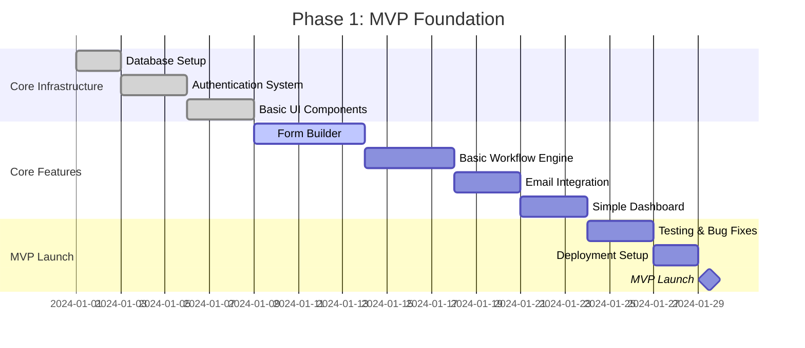
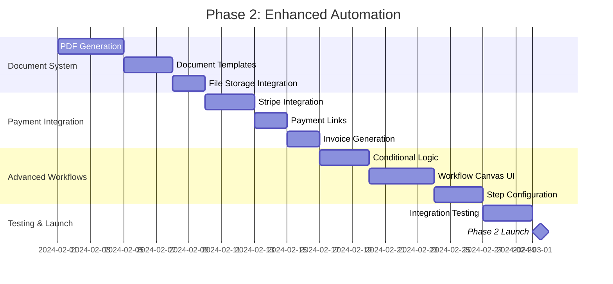
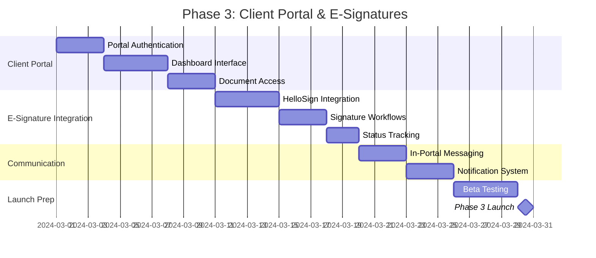
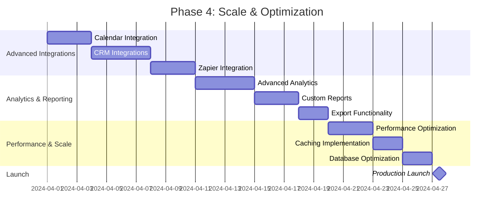

# IntakeFlow - Development Roadmap & MVP Implementation Plan

## Overview

This document outlines the complete development roadmap for IntakeFlow, from MVP to full-scale SaaS platform. The plan is structured in phases to ensure rapid time-to-market while building a solid foundation for future growth.

## MVP Definition & Success Metrics

### MVP Core Value Proposition

**"Automate your client onboarding in 15 minutes"**

The MVP focuses on the essential workflow: Form Submission → Email Automation → Document Generation → Payment Collection

### Success Metrics

- **Time to First Value**: < 15 minutes from signup to first automated workflow
- **User Activation**: 70% of users create their first workflow within 24 hours
- **Client Conversion**: 60% improvement in client onboarding completion rates
- **Time Savings**: 50% reduction in manual onboarding tasks

## Development Phases

### Phase 1: MVP Foundation (Weeks 1-4)

**Goal**: Launch a functional MVP that demonstrates core value



#### Week 1: Infrastructure & Authentication

**Database & Core Setup**

- [ ] Initialize Next.js 14 project with TypeScript
- [ ] Set up Prisma with MySQL database
- [ ] Implement core database schema (Users, Workspaces, Forms, Workflows)
- [ ] Configure Auth.js with Google OAuth
- [ ] Set up basic middleware and route protection
- [ ] Create development environment with Docker

**Deliverables:**

- Working authentication system
- Database with core tables
- Protected routes and middleware

#### Week 2: Form Builder & Basic UI

**Form Creation System**

- [ ] Build drag-and-drop form builder interface
- [ ] Implement form field types (text, email, phone, textarea, select, date)
- [ ] Create form preview functionality
- [ ] Build form submission API endpoints
- [ ] Implement form validation and error handling
- [ ] Create public form rendering system

**Deliverables:**

- Functional form builder
- Public form submission system
- Form management dashboard

#### Week 3: Workflow Engine & Email Integration

**Basic Workflow System**

- [ ] Implement simple linear workflow engine
- [ ] Create workflow step types (form, email, delay)
- [ ] Build workflow execution system with queue
- [ ] Integrate Resend for email sending
- [ ] Create basic email templates
- [ ] Implement workflow triggers from form submissions

**Deliverables:**

- Working workflow engine
- Email automation system
- Form-to-workflow integration

#### Week 4: Dashboard & MVP Polish

**User Interface & Experience**

- [ ] Build main dashboard with workflow overview
- [ ] Create workflow management interface
- [ ] Implement basic analytics (form submissions, workflow executions)
- [ ] Add user onboarding flow
- [ ] Implement error handling and user feedback
- [ ] Perform MVP testing and bug fixes

**Deliverables:**

- Complete MVP dashboard
- User onboarding experience
- Tested and deployed MVP

### Phase 2: Enhanced Automation (Weeks 5-8)

**Goal**: Add document generation, payment processing, and advanced workflow features



#### Week 5: Document Generation System

- [ ] Implement PDF generation with Puppeteer
- [ ] Create document template engine with Handlebars
- [ ] Build document template management UI
- [ ] Integrate AWS S3 for file storage
- [ ] Add document workflow steps
- [ ] Create document preview and download functionality

#### Week 6: Payment Processing

- [ ] Integrate Stripe payment processing
- [ ] Implement payment link generation
- [ ] Create invoice templates and generation
- [ ] Build payment tracking and webhooks
- [ ] Add payment workflow steps
- [ ] Create payment dashboard for clients

#### Week 7: Advanced Workflow Features

- [ ] Implement conditional workflow logic
- [ ] Add delay/wait steps with scheduling
- [ ] Create workflow branching capabilities
- [ ] Build advanced trigger conditions
- [ ] Implement workflow variables and data passing
- [ ] Add workflow testing and preview modes

#### Week 8: Visual Workflow Editor

- [ ] Build drag-and-drop workflow canvas
- [ ] Implement step configuration panels
- [ ] Create workflow connection system
- [ ] Add workflow validation and error checking
- [ ] Implement workflow templates and sharing
- [ ] Polish UI/UX for workflow creation

### Phase 3: Client Portal & E-Signatures (Weeks 9-12)

**Goal**: Complete the client experience with portal access and document signing



#### Week 9: Client Portal Foundation

- [ ] Implement magic link authentication for clients
- [ ] Build client portal dashboard
- [ ] Create progress tracking interface
- [ ] Add client profile management
- [ ] Implement portal security and access control
- [ ] Create responsive mobile-friendly design

#### Week 10: Document Management Portal

- [ ] Build document center for clients
- [ ] Implement document viewing and downloading
- [ ] Add document status tracking
- [ ] Create document organization and search
- [ ] Implement document access permissions
- [ ] Add document history and versioning

#### Week 11: E-Signature Integration

- [ ] Integrate HelloSign/Dropbox Sign API
- [ ] Implement signature request workflows
- [ ] Build signature status tracking
- [ ] Create signature reminder system
- [ ] Add webhook handling for signature events
- [ ] Implement signature workflow steps

#### Week 12: Communication & Notifications

- [ ] Build in-portal messaging system
- [ ] Implement email notification preferences
- [ ] Create SMS notification integration (optional)
- [ ] Add real-time status updates
- [ ] Implement notification templates
- [ ] Create communication audit trail

### Phase 4: Scale & Optimization (Weeks 13-16)

**Goal**: Prepare for scale with advanced features, integrations, and optimization



#### Week 13: Calendar & CRM Integrations

- [ ] Integrate Calendly for appointment scheduling
- [ ] Add Google Calendar integration
- [ ] Build basic CRM data sync
- [ ] Implement contact management
- [ ] Create integration management dashboard
- [ ] Add webhook management system

#### Week 14: Advanced Analytics

- [ ] Build comprehensive analytics dashboard
- [ ] Implement conversion tracking
- [ ] Create performance metrics and KPIs
- [ ] Add client journey analytics
- [ ] Implement A/B testing framework
- [ ] Create custom report builder

#### Week 15: Performance & Optimization

- [ ] Implement Redis caching layer
- [ ] Optimize database queries and indexing
- [ ] Add CDN for static assets
- [ ] Implement background job processing
- [ ] Add monitoring and alerting
- [ ] Optimize bundle size and loading times

#### Week 16: Production Readiness

- [ ] Complete security audit and penetration testing
- [ ] Implement comprehensive error handling
- [ ] Add backup and disaster recovery
- [ ] Create documentation and help system
- [ ] Perform load testing and optimization
- [ ] Launch production version

## Technical Implementation Strategy

### Development Environment Setup

```bash
# Initial project setup
npx create-next-app@latest intakeflow --typescript --tailwind --eslint --app
cd intakeflow

# Install core dependencies
npm install prisma @prisma/client
npm install next-auth @auth/prisma-adapter
npm install @radix-ui/react-* lucide-react
npm install resend stripe @stripe/stripe-js
npm install bullmq ioredis
npm install handlebars puppeteer
npm install zod react-hook-form @hookform/resolvers

# Install dev dependencies
npm install -D @types/node tsx prisma-erd-generator
npm install -D jest @testing-library/react @testing-library/jest-dom
npm install -D playwright @playwright/test

# Initialize Prisma
npx prisma init
```

### Database Migration Strategy

```bash
# Development workflow
npx prisma db push          # Push schema changes to dev DB
npx prisma generate         # Generate Prisma client
npx prisma studio          # Open database browser

# Production workflow
npx prisma migrate dev      # Create migration files
npx prisma migrate deploy   # Deploy to production
```

### Testing Strategy

```typescript
// Testing pyramid approach
// 1. Unit Tests (70%) - Individual functions and components
// 2. Integration Tests (20%) - API endpoints and workflows
// 3. E2E Tests (10%) - Critical user journeys

// Example test structure
tests/
├── unit/
│   ├── components/
│   ├── lib/
│   └── utils/
├── integration/
│   ├── api/
│   └── workflows/
└── e2e/
    ├── onboarding.spec.ts
    ├── workflow-creation.spec.ts
    └── client-portal.spec.ts
```

### Deployment Strategy

```yaml
# GitHub Actions CI/CD Pipeline
name: Deploy to Production
on:
  push:
    branches: [main]

jobs:
  test:
    runs-on: ubuntu-latest
    steps:
      - uses: actions/checkout@v3
      - uses: actions/setup-node@v3
      - run: npm ci
      - run: npm run test
      - run: npm run build

  deploy:
    needs: test
    runs-on: ubuntu-latest
    steps:
      - name: Deploy to VPS
        run: |
          ssh user@server 'cd /app && git pull && docker-compose up -d --build'
```

## Resource Requirements

### Development Team (Solo Developer)

**Time Allocation:**

- **Frontend Development**: 40% (UI/UX, React components, forms)
- **Backend Development**: 35% (APIs, workflows, integrations)
- **DevOps & Infrastructure**: 15% (deployment, monitoring, security)
- **Testing & QA**: 10% (unit tests, integration tests, bug fixes)

### Technology Stack Costs

**Monthly Costs (MVP → Production):**

- **Hosting**: $25 → $100 (VPS scaling)
- **Database**: $0 → $25 (managed MySQL)
- **Email Service**: $0 → $35 (Resend scaling)
- **File Storage**: $5 → $25 (AWS S3)
- **Monitoring**: $0 → $20 (error tracking, analytics)
- **Total**: $30 → $205/month

### Third-Party Service Limits

**Free Tier Limits:**

- **Resend**: 3,000 emails/month → $20/month for 100k
- **Stripe**: 2.9% + 30¢ per transaction
- **HelloSign**: 3 documents/month → $15/month for unlimited
- **AWS S3**: 5GB free → $0.023/GB thereafter

## Risk Mitigation

### Technical Risks

1. **Database Performance**: Implement proper indexing and query optimization from day one
2. **Email Deliverability**: Use reputable providers and implement proper authentication
3. **File Storage Costs**: Implement file compression and cleanup policies
4. **Third-Party Dependencies**: Have fallback providers for critical services

### Business Risks

1. **Feature Creep**: Stick to MVP scope, use feature flags for gradual rollout
2. **User Adoption**: Implement comprehensive onboarding and documentation
3. **Competition**: Focus on unique value proposition and rapid iteration
4. **Scalability**: Design for scale from the beginning, use cloud-native approaches

## Success Metrics & KPIs

### Development Metrics

- **Code Coverage**: >80% for critical paths
- **Build Time**: <5 minutes for full deployment
- **Page Load Speed**: <2 seconds for dashboard
- **API Response Time**: <200ms for 95th percentile

### Business Metrics

- **User Activation Rate**: 70% within 24 hours
- **Feature Adoption**: 60% of users create workflows
- **Client Completion Rate**: 80% complete onboarding
- **Support Ticket Volume**: <5% of active users/month

### Technical Metrics

- **Uptime**: 99.9% availability
- **Error Rate**: <0.1% of requests
- **Email Delivery Rate**: >98%
- **Document Generation Time**: <10 seconds

## Post-MVP Roadmap

### Phase 5: Advanced Features (Months 5-6)

- Multi-language support
- Advanced workflow conditions and loops
- Custom integrations and API
- White-label solutions
- Advanced analytics and reporting

### Phase 6: Enterprise Features (Months 7-8)

- Team collaboration and permissions
- Advanced security features (SSO, audit logs)
- Custom branding and domains
- SLA and priority support
- Enterprise integrations

### Phase 7: Scale & Growth (Months 9-12)

- Mobile applications
- Advanced AI features (smart recommendations)
- Marketplace for templates and integrations
- Partner program and reseller network
- International expansion

This roadmap provides a clear path from MVP to a full-featured SaaS platform, with realistic timelines and resource requirements for a solo developer or small team.
