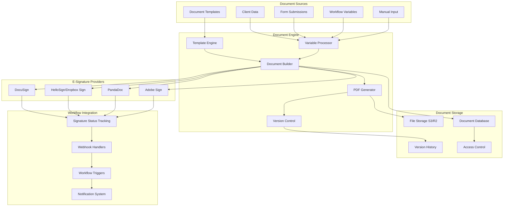

# IntakeFlow - Document Generation & E-Signature Integration

## Overview

This document outlines the comprehensive strategy for document generation and e-signature integration in IntakeFlow. The system enables automated creation of contracts, proposals, invoices, and other business documents, followed by seamless e-signature workflows to streamline client onboarding.

## Document System Architecture



## Document Generation System

### 1. Document Template Engine

```typescript
// lib/documents/template-engine.ts
import Handlebars from "handlebars";
import puppeteer from "puppeteer";
import { JSDOM } from "jsdom";
import DOMPurify from "isomorphic-dompurify";

interface DocumentTemplate {
  id: string;
  name: string;
  description?: string;
  category: "contract" | "proposal" | "invoice" | "agreement" | "other";
  htmlContent: string;
  cssStyles?: string;
  variables: DocumentVariable[];
  settings: {
    pageSize: "A4" | "Letter" | "Legal";
    orientation: "portrait" | "landscape";
    margins: {
      top: string;
      right: string;
      bottom: string;
      left: string;
    };
    headerFooter: {
      displayHeaderFooter: boolean;
      headerTemplate?: string;
      footerTemplate?: string;
    };
  };
  workspaceId: string;
  createdAt: Date;
  updatedAt: Date;
}

interface DocumentVariable {
  key: string;
  label: string;
  type:
    | "text"
    | "number"
    | "date"
    | "boolean"
    | "currency"
    | "signature"
    | "table";
  required: boolean;
  defaultValue?: any;
  validation?: {
    min?: number;
    max?: number;
    pattern?: string;
  };
}

export class DocumentTemplateEngine {
  private static compiledTemplates = new Map<
    string,
    HandlebarsTemplateDelegate
  >();

  static registerHelpers(): void {
    // Date formatting
    Handlebars.registerHelper(
      "formatDate",
      (date: Date, format: string = "MM/DD/YYYY") => {
        if (!date) return "";
        const d = new Date(date);

        const formats: Record<string, string> = {
          "MM/DD/YYYY": d.toLocaleDateString("en-US"),
          "DD/MM/YYYY": d.toLocaleDateString("en-GB"),
          "YYYY-MM-DD": d.toISOString().split("T")[0],
          "MMMM DD, YYYY": d.toLocaleDateString("en-US", {
            year: "numeric",
            month: "long",
            day: "numeric",
          }),
        };

        return formats[format] || d.toLocaleDateString();
      }
    );

    // Currency formatting
    Handlebars.registerHelper(
      "formatCurrency",
      (amount: number, currency = "USD") => {
        if (typeof amount !== "number") return "$0.00";
        return new Intl.NumberFormat("en-US", {
          style: "currency",
          currency,
        }).format(amount);
      }
    );

    // Number formatting
    Handlebars.registerHelper("formatNumber", (num: number, decimals = 2) => {
      if (typeof num !== "number") return "0";
      return num.toFixed(decimals);
    });

    // Conditional helpers
    Handlebars.registerHelper("ifEquals", function (arg1, arg2, options) {
      return arg1 == arg2 ? options.fn(this) : options.inverse(this);
    });

    Handlebars.registerHelper("ifGreater", function (arg1, arg2, options) {
      return arg1 > arg2 ? options.fn(this) : options.inverse(this);
    });

    // Table helpers
    Handlebars.registerHelper("tableRow", function (items, options) {
      let result = "";
      for (let i = 0; i < items.length; i++) {
        result += options.fn({
          ...items[i],
          index: i + 1,
          isFirst: i === 0,
          isLast: i === items.length - 1,
        });
      }
      return result;
    });

    // Math helpers
    Handlebars.registerHelper("add", (a: number, b: number) => a + b);
    Handlebars.registerHelper("subtract", (a: number, b: number) => a - b);
    Handlebars.registerHelper("multiply", (a: number, b: number) => a * b);
    Handlebars.registerHelper("divide", (a: number, b: number) =>
      b !== 0 ? a / b : 0
    );

    // Text helpers
    Handlebars.registerHelper(
      "uppercase",
      (str: string) => str?.toUpperCase() || ""
    );
    Handlebars.registerHelper(
      "lowercase",
      (str: string) => str?.toLowerCase() || ""
    );
    Handlebars.registerHelper("capitalize", (str: string) => {
      if (!str) return "";
      return str.charAt(0).toUpperCase() + str.slice(1).toLowerCase();
    });

    // Signature placeholder
    Handlebars.registerHelper(
      "signatureField",
      function (signerName: string, options) {
        const id = `signature-${signerName.replace(/\s+/g, "-").toLowerCase()}`;
        return new Handlebars.SafeString(`
        <div class="signature-field" data-signer="${signerName}" id="${id}">
          <div class="signature-line"></div>
          <div class="signature-label">${signerName} - Signature</div>
          <div class="signature-date">Date: _______________</div>
        </div>
      `);
      }
    );
  }

  static async compileTemplate(
    template: DocumentTemplate
  ): Promise<HandlebarsTemplateDelegate> {
    const cacheKey = `${template.id}-${template.updatedAt.getTime()}`;

    if (this.compiledTemplates.has(cacheKey)) {
      return this.compiledTemplates.get(cacheKey)!;
    }

    const compiled = Handlebars.compile(template.htmlContent);
    this.compiledTemplates.set(cacheKey, compiled);

    return compiled;
  }

  static async renderTemplate(
    template: DocumentTemplate,
    variables: Record<string, any>
  ): Promise<string> {
    // Validate required variables
    this.validateVariables(template.variables, variables);

    // Sanitize and process variables
    const processedVariables = this.processVariables(
      template.variables,
      variables
    );

    // Add system variables
    const allVariables = {
      ...processedVariables,
      currentDate: new Date(),
      currentYear: new Date().getFullYear(),
      documentId: `DOC-${Date.now()}`,
    };

    const compiled = await this.compileTemplate(template);
    const renderedHtml = compiled(allVariables);

    // Combine with CSS
    const fullHtml = this.combineHtmlWithStyles(
      renderedHtml,
      template.cssStyles
    );

    return this.sanitizeHtml(fullHtml);
  }

  static validateVariables(
    templateVariables: DocumentVariable[],
    providedVariables: Record<string, any>
  ): void {
    const requiredVariables = templateVariables.filter((v) => v.required);

    for (const variable of requiredVariables) {
      if (
        !(variable.key in providedVariables) ||
        providedVariables[variable.key] === null ||
        providedVariables[variable.key] === undefined
      ) {
        throw new Error(`Required variable '${variable.key}' is missing`);
      }

      // Type validation
      const value = providedVariables[variable.key];
      switch (variable.type) {
        case "number":
        case "currency":
          if (typeof value !== "number" && !Number.isFinite(Number(value))) {
            throw new Error(`Variable '${variable.key}' must be a number`);
          }
          break;
        case "date":
          if (!(value instanceof Date) && isNaN(Date.parse(value))) {
            throw new Error(`Variable '${variable.key}' must be a valid date`);
          }
          break;
        case "boolean":
          if (typeof value !== "boolean") {
            throw new Error(`Variable '${variable.key}' must be a boolean`);
          }
          break;
      }

      // Validation rules
      if (variable.validation) {
        const validation = variable.validation;

        if (validation.min !== undefined && Number(value) < validation.min) {
          throw new Error(
            `Variable '${variable.key}' must be at least ${validation.min}`
          );
        }

        if (validation.max !== undefined && Number(value) > validation.max) {
          throw new Error(
            `Variable '${variable.key}' must be at most ${validation.max}`
          );
        }

        if (validation.pattern && typeof value === "string") {
          const regex = new RegExp(validation.pattern);
          if (!regex.test(value)) {
            throw new Error(
              `Variable '${variable.key}' does not match required pattern`
            );
          }
        }
      }
    }
  }

  static processVariables(
    templateVariables: DocumentVariable[],
    providedVariables: Record<string, any>
  ): Record<string, any> {
    const processed: Record<string, any> = {};

    for (const variable of templateVariables) {
      let value = providedVariables[variable.key] ?? variable.defaultValue;

      // Type conversion and processing
      switch (variable.type) {
        case "number":
        case "currency":
          value = Number(value) || 0;
          break;
        case "date":
          value = value instanceof Date ? value : new Date(value);
          break;
        case "boolean":
          value = Boolean(value);
          break;
        case "text":
          value = String(value || "");
          break;
      }

      processed[variable.key] = value;
    }

    return processed;
  }

  static combineHtmlWithStyles(html: string, css?: string): string {
    const defaultStyles = `
      <style>
        body {
          font-family: -apple-system, BlinkMacSystemFont, 'Segoe UI', Roboto, sans-serif;
          line-height: 1.6;
          color: #333;
          max-width: 800px;
          margin: 0 auto;
          padding: 20px;
        }
        .signature-field {
          margin: 40px 0;
          page-break-inside: avoid;
        }
        .signature-line {
          border-bottom: 1px solid #000;
          height: 40px;
          margin-bottom: 5px;
        }
        .signature-label {
          font-size: 12px;
          color: #666;
        }
        .signature-date {
          font-size: 12px;
          color: #666;
          margin-top: 10px;
        }
        table {
          width: 100%;
          border-collapse: collapse;
          margin: 20px 0;
        }
        th, td {
          border: 1px solid #ddd;
          padding: 8px;
          text-align: left;
        }
        th {
          background-color: #f5f5f5;
          font-weight: bold;
        }
        .header {
          text-align: center;
          margin-bottom: 30px;
        }
        .footer {
          margin-top: 30px;
          font-size: 12px;
          color: #666;
        }
        @media print {
          body { margin: 0; padding: 15px; }
          .no-print { display: none; }
        }
      </style>
    `;

    return `
      <!DOCTYPE html>
      <html>
        <head>
          <meta charset="utf-8">
          <meta name="viewport" content="width=device-width, initial-scale=1">
          ${defaultStyles}
          ${css ? `<style>${css}</style>` : ""}
        </head>
        <body>
          ${html}
        </body>
      </html>
    `;
  }

  static sanitizeHtml(html: string): string {
    return DOMPurify.sanitize(html, {
      ALLOWED_TAGS: [
        "html",
        "head",
        "body",
        "title",
        "meta",
        "style",
        "h1",
        "h2",
        "h3",
        "h4",
        "h5",
        "h6",
        "p",
        "br",
        "hr",
        "div",
        "span",
        "strong",
        "b",
        "em",
        "i",
        "u",
        "s",
        "ul",
        "ol",
        "li",
        "table",
        "thead",
        "tbody",
        "tr",
        "td",
        "th",
        "img",
        "a",
      ],
      ALLOWED_ATTR: [
        "class",
        "id",
        "style",
        "src",
        "alt",
        "width",
        "height",
        "href",
        "target",
        "colspan",
        "rowspan",
        "data-signer",
      ],
    });
  }
}

// Initialize helpers
DocumentTemplateEngine.registerHelpers();
```

### 2. PDF Generation Service

```typescript
// lib/documents/pdf-generator.ts
import puppeteer, { Browser, Page } from "puppeteer";

interface PDFOptions {
  format?: "A4" | "Letter" | "Legal";
  orientation?: "portrait" | "landscape";
  margins?: {
    top?: string;
    right?: string;
    bottom?: string;
    left?: string;
  };
  displayHeaderFooter?: boolean;
  headerTemplate?: string;
  footerTemplate?: string;
  printBackground?: boolean;
}

export class PDFGenerator {
  private static browser: Browser | null = null;

  static async getBrowser(): Promise<Browser> {
    if (!this.browser) {
      this.browser = await puppeteer.launch({
        headless: true,
        args: [
          "--no-sandbox",
          "--disable-setuid-sandbox",
          "--disable-dev-shm-usage",
          "--disable-gpu",
        ],
      });
    }
    return this.browser;
  }

  static async generatePDF(
    html: string,
    options: PDFOptions = {}
  ): Promise<Buffer> {
    const browser = await this.getBrowser();
    const page = await browser.newPage();

    try {
      // Set content
      await page.setContent(html, {
        waitUntil: "networkidle0",
        timeout: 30000,
      });

      // Generate PDF
      const pdfBuffer = await page.pdf({
        format: options.format || "A4",
        landscape: options.orientation === "landscape",
        margin: {
          top: options.margins?.top || "1in",
          right: options.margins?.right || "1in",
          bottom: options.margins?.bottom || "1in",
          left: options.margins?.left || "1in",
        },
        displayHeaderFooter: options.displayHeaderFooter || false,
        headerTemplate: options.headerTemplate || "",
        footerTemplate: options.footerTemplate || "",
        printBackground: options.printBackground !== false,
        preferCSSPageSize: true,
      });

      return Buffer.from(pdfBuffer);
    } finally {
      await page.close();
    }
  }

  static async generateFromTemplate(
    template: DocumentTemplate,
    variables: Record<string, any>
  ): Promise<Buffer> {
    const html = await DocumentTemplateEngine.renderTemplate(
      template,
      variables
    );

    const pdfOptions: PDFOptions = {
      format: template.settings.pageSize,
      orientation: template.settings.orientation,
      margins: template.settings.margins,
      displayHeaderFooter: template.settings.headerFooter.displayHeaderFooter,
      headerTemplate: template.settings.headerFooter.headerTemplate,
      footerTemplate: template.settings.headerFooter.footerTemplate,
    };

    return await this.generatePDF(html, pdfOptions);
  }

  static async closeBrowser(): Promise<void> {
    if (this.browser) {
      await this.browser.close();
      this.browser = null;
    }
  }
}

// Cleanup on process exit
process.on("exit", () => {
  PDFGenerator.closeBrowser();
});
```

### 3. Document Management Service

```typescript
// lib/documents/document-service.ts
import { S3Storage } from "@/lib/storage/s3";
import { PDFGenerator } from "./pdf-generator";
import { DocumentTemplateEngine } from "./template-engine";

interface CreateDocumentRequest {
  templateId: string;
  clientId: string;
  workspaceId: string;
  variables: Record<string, any>;
  name?: string;
  sendForSignature?: boolean;
  signers?: Array<{
    name: string;
    email: string;
    role: string;
  }>;
}

export class DocumentService {
  private storage: S3Storage;

  constructor() {
    this.storage = new S3Storage();
  }

  async createDocument(request: CreateDocumentRequest): Promise<{
    document: Document;
    fileUrl: string;
  }> {
    // Get template
    const template = await prisma.documentTemplate.findUnique({
      where: { id: request.templateId },
    });

    if (!template) {
      throw new Error(`Template ${request.templateId} not found`);
    }

    // Verify workspace access
    if (template.workspaceId !== request.workspaceId) {
      throw new Error("Access denied to template");
    }

    // Generate PDF
    const pdfBuffer = await PDFGenerator.generateFromTemplate(
      template,
      request.variables
    );

    // Generate file key
    const timestamp = new Date().toISOString().replace(/[:.]/g, "-");
    const fileKey = `documents/${request.workspaceId}/${request.clientId}/${timestamp}-${template.name}.pdf`;

    // Upload to storage
    await this.storage.uploadFile(fileKey, pdfBuffer, "application/pdf");
    const fileUrl = await this.storage.getSignedUrl(fileKey, 3600 * 24 * 7); // 7 days

    // Create document record
    const document = await prisma.document.create({
      data: {
        name:
          request.name ||
          `${template.name} - ${new Date().toLocaleDateString()}`,
        templateId: request.templateId,
        clientId: request.clientId,
        fileUrl: fileKey, // Store the key, not the signed URL
        status: request.sendForSignature ? "pending_signature" : "completed",
        content: JSON.stringify(request.variables),
      },
    });

    // Send for signature if requested
    if (request.sendForSignature && request.signers) {
      await this.sendForSignature(document.id, request.signers, fileUrl);
    }

    return {
      document,
      fileUrl,
    };
  }

  async sendForSignature(
    documentId: string,
    signers: Array<{ name: string; email: string; role: string }>,
    fileUrl: string
  ): Promise<void> {
    const document = await prisma.document.findUnique({
      where: { id: documentId },
      include: { client: true },
    });

    if (!document) {
      throw new Error("Document not found");
    }

    // Use the configured e-signature provider
    const eSignatureService = new ESignatureService();
    const signatureRequest = await eSignatureService.sendDocument({
      documentUrl: fileUrl,
      documentName: document.name,
      signers,
      subject: `Please sign: ${document.name}`,
      message: "Please review and sign this document.",
    });

    // Update document with signature request info
    await prisma.document.update({
      where: { id: documentId },
      data: {
        status: "sent_for_signature",
        sentAt: new Date(),
        signatureRequestId: signatureRequest.id,
      },
    });
  }

  async getDocument(
    documentId: string,
    workspaceId: string
  ): Promise<{
    document: Document;
    fileUrl: string;
  }> {
    const document = await prisma.document.findFirst({
      where: {
        id: documentId,
        client: {
          workspaceId,
        },
      },
      include: {
        client: true,
        template: true,
      },
    });

    if (!document) {
      throw new Error("Document not found");
    }

    const fileUrl = await this.storage.getSignedUrl(document.fileUrl, 3600); // 1 hour

    return {
      document,
      fileUrl,
    };
  }

  async regenerateDocument(
    documentId: string,
    variables?: Record<string, any>
  ): Promise<string> {
    const document = await prisma.document.findUnique({
      where: { id: documentId },
      include: { template: true, client: true },
    });

    if (!document || !document.template) {
      throw new Error("Document or template not found");
    }

    // Use provided variables or existing ones
    const documentVariables = variables || JSON.parse(document.content || "{}");

    // Generate new PDF
    const pdfBuffer = await PDFGenerator.generateFromTemplate(
      document.template,
      documentVariables
    );

    // Update file in storage
    await this.storage.uploadFile(
      document.fileUrl,
      pdfBuffer,
      "application/pdf"
    );

    // Update document record
    await prisma.document.update({
      where: { id: documentId },
      data: {
        content: JSON.stringify(documentVariables),
        updatedAt: new Date(),
      },
    });

    return await this.storage.getSignedUrl(document.fileUrl, 3600);
  }

  async deleteDocument(documentId: string, workspaceId: string): Promise<void> {
    const document = await prisma.document.findFirst({
      where: {
        id: documentId,
        client: {
          workspaceId,
        },
      },
    });

    if (!document) {
      throw new Error("Document not found");
    }

    // Delete from storage
    await this.storage.deleteFile(document.fileUrl);

    // Delete from database
    await prisma.document.delete({
      where: { id: documentId },
    });
  }
}
```

## E-Signature Integration

### 1. E-Signature Service Abstraction

```typescript
// lib/esignature/esignature-service.ts
interface ESignatureProvider {
  name: string;
  sendDocument(request: SignatureRequest): Promise<SignatureResponse>;
  getDocumentStatus(requestId: string): Promise<SignatureStatus>;
  downloadSignedDocument(requestId: string): Promise<Buffer>;
  cancelRequest(requestId: string): Promise<void>;
}

interface SignatureRequest {
  documentUrl: string;
  documentName: string;
  signers: Array<{
    name: string;
    email: string;
    role: string;
    order?: number;
  }>;
  subject: string;
  message: string;
  expiresAt?: Date;
  reminderFrequency?: "daily" | "weekly" | "none";
}

interface SignatureResponse {
  id: string;
  status: "sent" | "pending" | "completed" | "declined" | "expired";
  signUrl?: string;
  expiresAt?: Date;
}

interface SignatureStatus {
  id: string;
  status: "sent" | "pending" | "completed" | "declined" | "expired";
  signers: Array<{
    name: string;
    email: string;
    status: "pending" | "signed" | "declined";
    signedAt?: Date;
  }>;
  completedAt?: Date;
}

export class ESignatureService {
  private providers: Map<string, ESignatureProvider> = new Map();
  private defaultProvider: string;

  constructor() {
    // Register providers
    this.providers.set("docusign", new DocuSignProvider());
    this.providers.set("hellosign", new HelloSignProvider());
    this.providers.set("pandadoc", new PandaDocProvider());

    this.defaultProvider =
      process.env.DEFAULT_ESIGNATURE_PROVIDER || "hellosign";
  }

  async sendDocument(
    request: SignatureRequest,
    provider?: string
  ): Promise<SignatureResponse> {
    const providerInstance = this.providers.get(
      provider || this.defaultProvider
    );

    if (!providerInstance) {
      throw new Error(`E-signature provider '${provider}' not found`);
    }

    return await providerInstance.sendDocument(request);
  }

  async getDocumentStatus(
    requestId: string,
    provider?: string
  ): Promise<SignatureStatus> {
    const providerInstance = this.providers.get(
      provider || this.defaultProvider
    );

    if (!providerInstance) {
      throw new Error(`E-signature provider '${provider}' not found`);
    }

    return await providerInstance.getDocumentStatus(requestId);
  }

  async downloadSignedDocument(
    requestId: string,
    provider?: string
  ): Promise<Buffer> {
    const providerInstance = this.providers.get(
      provider || this.defaultProvider
    );

    if (!providerInstance) {
      throw new Error(`E-signature provider '${provider}' not found`);
    }

    return await providerInstance.downloadSignedDocument(requestId);
  }

  async handleWebhook(provider: string, payload: any): Promise<void> {
    switch (provider) {
      case "docusign":
        await this.handleDocuSignWebhook(payload);
        break;
      case "hellosign":
        await this.handleHelloSignWebhook(payload);
        break;
      case "pandadoc":
        await this.handlePandaDocWebhook(payload);
        break;
      default:
        console.warn(`Unknown e-signature provider webhook: ${provider}`);
    }
  }

  private async handleDocuSignWebhook(payload: any): Promise<void> {
    // Handle DocuSign webhook events
    const { event, data } = payload;

    switch (event) {
      case "envelope-completed":
        await this.updateDocumentStatus(data.envelopeId, "completed");
        break;
      case "envelope-declined":
        await this.updateDocumentStatus(data.envelopeId, "declined");
        break;
      case "envelope-voided":
        await this.updateDocumentStatus(data.envelopeId, "cancelled");
        break;
    }
  }

  private async handleHelloSignWebhook(payload: any): Promise<void> {
    // Handle HelloSign webhook events
    const { event } = payload;

    switch (event.event_type) {
      case "signature_request_signed":
        await this.updateDocumentStatus(
          event.signature_request_id,
          "completed"
        );
        break;
      case "signature_request_declined":
        await this.updateDocumentStatus(event.signature_request_id, "declined");
        break;
    }
  }

  private async handlePandaDocWebhook(payload: any): Promise<void> {
    // Handle PandaDoc webhook events
    const { event, data } = payload;

    switch (event) {
      case "document_completed":
        await this.updateDocumentStatus(data.id, "completed");
        break;
      case "document_declined":
        await this.updateDocumentStatus(data.id, "declined");
        break;
    }
  }

  private async updateDocumentStatus(
    signatureRequestId: string,
    status: string
  ): Promise<void> {
    const document = await prisma.document.findFirst({
      where: { signatureRequestId },
      include: { client: true },
    });

    if (!document) {
      console.warn(
        `Document not found for signature request: ${signatureRequestId}`
      );
      return;
    }

    // Update document status
    await prisma.document.update({
      where: { id: document.id },
      data: {
        status: status === "completed" ? "signed" : status,
        signedAt: status === "completed" ? new Date() : null,
      },
    });

    // Trigger workflow continuation if applicable
    if (status === "completed") {
      await this.triggerWorkflowContinuation(document.id);
    }

    // Send notification
    await this.sendStatusNotification(document, status);
  }

  private async triggerWorkflowContinuation(documentId: string): Promise<void> {
    // Find any workflow executions waiting for this document
    const executions = await prisma.workflowExecution.findMany({
      where: {
        status: "running",
        context: {
          path: ["waitingForDocument"],
          equals: documentId,
        },
      },
    });

    for (const execution of executions) {
      // Resume workflow execution
      await WorkflowEngine.resumeExecution(execution.id);
    }
  }

  private async sendStatusNotification(
    document: any,
    status: string
  ): Promise<void> {
    // Send email notification about document status change
    const emailQueue = new EmailQueue();

    await emailQueue.addEmail({
      to: document.client.email,
      subject: `Document ${status}: ${document.name}`,
      templateId: "document-status-notification",
      variables: {
        clientName: document.client.name,
        documentName: document.name,
        status,
        documentUrl: `/documents/${document.id}`,
      },
      workspaceId: document.client.workspaceId,
      clientId: document.clientId,
    });
  }
}
```

### 2. HelloSign Provider Implementation

```typescript
// lib/esignature/providers/hellosign-provider.ts
export class HelloSignProvider implements ESignatureProvider {
  name = 'hellosign';
  private apiKey: string
```
