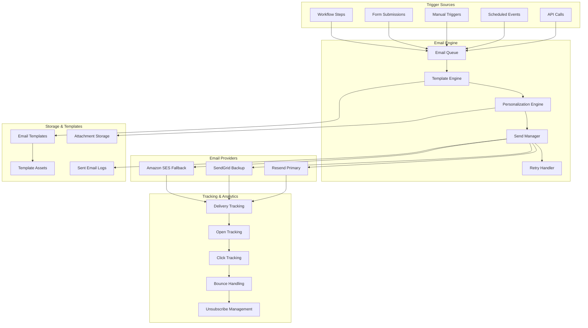

# IntakeFlow - Email Automation System Architecture

## Overview

This document outlines the comprehensive email automation system for IntakeFlow, designed to handle personalized email campaigns, transactional emails, and workflow-triggered communications. The system focuses on deliverability, personalization, tracking, and scalability while maintaining cost-effectiveness.

## Email System Architecture



## Core Email Components

### 1. Email Queue System

```typescript
// lib/email/email-queue.ts
import { Queue, Worker, Job } from "bullmq";
import { Redis } from "ioredis";

interface EmailJob {
  to: string;
  subject: string;
  templateId?: string;
  content?: string;
  variables?: Record<string, any>;
  attachments?: Array<{
    filename: string;
    content: Buffer | string;
    contentType?: string;
  }>;
  priority?: "low" | "normal" | "high" | "critical";
  sendAt?: Date;
  workspaceId: string;
  clientId?: string;
  workflowExecutionId?: string;
}

export class EmailQueue {
  private queue: Queue<EmailJob>;
  private worker: Worker<EmailJob>;
  private redis: Redis;

  constructor() {
    this.redis = new Redis(process.env.REDIS_URL!);

    this.queue = new Queue<EmailJob>("email-queue", {
      connection: this.redis,
      defaultJobOptions: {
        removeOnComplete: 100,
        removeOnFail: 50,
        attempts: 3,
        backoff: {
          type: "exponential",
          delay: 2000,
        },
      },
    });

    this.worker = new Worker<EmailJob>(
      "email-queue",
      this.processEmailJob.bind(this),
      {
        connection: this.redis,
        concurrency: 10,
      }
    );

    this.setupEventHandlers();
  }

  async addEmail(emailData: EmailJob): Promise<Job<EmailJob>> {
    const priority = this.getPriorityValue(emailData.priority || "normal");

    const jobOptions: any = {
      priority,
      delay: emailData.sendAt ? emailData.sendAt.getTime() - Date.now() : 0,
    };

    return await this.queue.add("send-email", emailData, jobOptions);
  }

  async addBulkEmails(emails: EmailJob[]): Promise<Job<EmailJob>[]> {
    const jobs = emails.map((email) => ({
      name: "send-email",
      data: email,
      opts: {
        priority: this.getPriorityValue(email.priority || "normal"),
        delay: email.sendAt ? email.sendAt.getTime() - Date.now() : 0,
      },
    }));

    return await this.queue.addBulk(jobs);
  }

  private async processEmailJob(job: Job<EmailJob>): Promise<void> {
    const emailData = job.data;

    try {
      // Log email attempt
      await this.logEmailAttempt(emailData, job.id!);

      // Process email through email service
      const result = await EmailService.sendEmail(emailData);

      // Log successful send
      await this.logEmailSuccess(emailData, job.id!, result);

      // Update workflow execution if applicable
      if (emailData.workflowExecutionId) {
        await this.updateWorkflowStep(
          emailData.workflowExecutionId,
          "completed"
        );
      }
    } catch (error) {
      // Log email failure
      await this.logEmailFailure(emailData, job.id!, error);

      // Update workflow execution if applicable
      if (emailData.workflowExecutionId) {
        await this.updateWorkflowStep(
          emailData.workflowExecutionId,
          "failed",
          error.message
        );
      }

      throw error; // Re-throw to trigger retry mechanism
    }
  }

  private getPriorityValue(priority: string): number {
    const priorities = {
      low: 1,
      normal: 5,
      high: 10,
      critical: 20,
    };
    return priorities[priority] || 5;
  }

  private setupEventHandlers(): void {
    this.worker.on("completed", (job) => {
      console.log(`Email job ${job.id} completed successfully`);
    });

    this.worker.on("failed", (job, err) => {
      console.error(`Email job ${job?.id} failed:`, err);
    });

    this.worker.on("stalled", (jobId) => {
      console.warn(`Email job ${jobId} stalled`);
    });
  }

  private async logEmailAttempt(
    emailData: EmailJob,
    jobId: string
  ): Promise<void> {
    await prisma.emailSent.create({
      data: {
        jobId,
        to: emailData.to,
        subject: emailData.subject,
        status: "pending",
        workspaceId: emailData.workspaceId,
        clientId: emailData.clientId,
        workflowExecutionId: emailData.workflowExecutionId,
        templateId: emailData.templateId,
      },
    });
  }

  private async logEmailSuccess(
    emailData: EmailJob,
    jobId: string,
    result: any
  ): Promise<void> {
    await prisma.emailSent.updateMany({
      where: { jobId },
      data: {
        status: "sent",
        sentAt: new Date(),
        messageId: result.messageId,
        provider: result.provider,
      },
    });
  }

  private async logEmailFailure(
    emailData: EmailJob,
    jobId: string,
    error: any
  ): Promise<void> {
    await prisma.emailSent.updateMany({
      where: { jobId },
      data: {
        status: "failed",
        error: error.message,
      },
    });
  }

  private async updateWorkflowStep(
    executionId: string,
    status: string,
    error?: string
  ): Promise<void> {
    // Update workflow execution step status
    await prisma.executionStep.updateMany({
      where: {
        executionId,
        status: "running",
      },
      data: {
        status,
        completedAt: new Date(),
        error,
      },
    });
  }
}
```

### 2. Template Engine

```typescript
// lib/email/template-engine.ts
import Handlebars from "handlebars";
import { JSDOM } from "jsdom";
import DOMPurify from "isomorphic-dompurify";

interface TemplateVariable {
  key: string;
  label: string;
  type: "text" | "number" | "date" | "boolean" | "url";
  required: boolean;
  defaultValue?: any;
}

interface EmailTemplate {
  id: string;
  name: string;
  subject: string;
  htmlContent: string;
  textContent?: string;
  variables: TemplateVariable[];
  workspaceId: string;
}

export class TemplateEngine {
  private static compiledTemplates = new Map<
    string,
    HandlebarsTemplateDelegate
  >();

  static registerHelpers(): void {
    // Date formatting helper
    Handlebars.registerHelper("formatDate", (date: Date, format: string) => {
      if (!date) return "";
      return new Intl.DateTimeFormat("en-US", {
        year: "numeric",
        month: format.includes("MM") ? "2-digit" : "short",
        day: "2-digit",
      }).format(new Date(date));
    });

    // Currency formatting helper
    Handlebars.registerHelper(
      "formatCurrency",
      (amount: number, currency = "USD") => {
        if (typeof amount !== "number") return "";
        return new Intl.NumberFormat("en-US", {
          style: "currency",
          currency,
        }).format(amount);
      }
    );

    // Conditional helper
    Handlebars.registerHelper("ifEquals", function (arg1, arg2, options) {
      return arg1 == arg2 ? options.fn(this) : options.inverse(this);
    });

    // Loop with index helper
    Handlebars.registerHelper("eachWithIndex", function (array, options) {
      let result = "";
      for (let i = 0; i < array.length; i++) {
        result += options.fn({
          ...array[i],
          index: i,
          isFirst: i === 0,
          isLast: i === array.length - 1,
        });
      }
      return result;
    });

    // URL helper
    Handlebars.registerHelper("url", (path: string) => {
      const baseUrl =
        process.env.NEXT_PUBLIC_APP_URL || "http://localhost:3000";
      return `${baseUrl}${path}`;
    });
  }

  static async compileTemplate(template: EmailTemplate): Promise<{
    subject: HandlebarsTemplateDelegate;
    html: HandlebarsTemplateDelegate;
    text?: HandlebarsTemplateDelegate;
  }> {
    const cacheKey = `${template.id}-${template.updatedAt}`;

    if (this.compiledTemplates.has(cacheKey)) {
      const cached = this.compiledTemplates.get(cacheKey)!;
      return cached as any;
    }

    const compiled = {
      subject: Handlebars.compile(template.subject),
      html: Handlebars.compile(template.htmlContent),
      text: template.textContent
        ? Handlebars.compile(template.textContent)
        : undefined,
    };

    this.compiledTemplates.set(cacheKey, compiled as any);
    return compiled;
  }

  static async renderTemplate(
    template: EmailTemplate,
    variables: Record<string, any>
  ): Promise<{
    subject: string;
    html: string;
    text?: string;
  }> {
    // Validate required variables
    this.validateVariables(template.variables, variables);

    // Sanitize variables
    const sanitizedVariables = this.sanitizeVariables(variables);

    // Add default variables
    const allVariables = {
      ...sanitizedVariables,
      currentYear: new Date().getFullYear(),
      currentDate: new Date(),
      appUrl: process.env.NEXT_PUBLIC_APP_URL,
    };

    const compiled = await this.compileTemplate(template);

    const rendered = {
      subject: compiled.subject(allVariables),
      html: this.sanitizeHtml(compiled.html(allVariables)),
      text: compiled.text ? compiled.text(allVariables) : undefined,
    };

    return rendered;
  }

  static validateVariables(
    templateVariables: TemplateVariable[],
    providedVariables: Record<string, any>
  ): void {
    const requiredVariables = templateVariables.filter((v) => v.required);

    for (const variable of requiredVariables) {
      if (
        !(variable.key in providedVariables) ||
        providedVariables[variable.key] === null ||
        providedVariables[variable.key] === undefined
      ) {
        throw new Error(
          `Required template variable '${variable.key}' is missing`
        );
      }
    }
  }

  static sanitizeVariables(
    variables: Record<string, any>
  ): Record<string, any> {
    const sanitized: Record<string, any> = {};

    for (const [key, value] of Object.entries(variables)) {
      if (typeof value === "string") {
        sanitized[key] = DOMPurify.sanitize(value);
      } else {
        sanitized[key] = value;
      }
    }

    return sanitized;
  }

  static sanitizeHtml(html: string): string {
    return DOMPurify.sanitize(html, {
      ALLOWED_TAGS: [
        "html",
        "head",
        "body",
        "title",
        "meta",
        "link",
        "style",
        "h1",
        "h2",
        "h3",
        "h4",
        "h5",
        "h6",
        "p",
        "br",
        "hr",
        "div",
        "span",
        "strong",
        "b",
        "em",
        "i",
        "u",
        "s",
        "ul",
        "ol",
        "li",
        "table",
        "thead",
        "tbody",
        "tr",
        "td",
        "th",
        "a",
        "img",
      ],
      ALLOWED_ATTR: [
        "href",
        "src",
        "alt",
        "title",
        "width",
        "height",
        "style",
        "class",
        "id",
        "colspan",
        "rowspan",
        "target",
        "rel",
      ],
      ALLOWED_URI_REGEXP:
        /^(?:(?:(?:f|ht)tps?|mailto|tel|callto|cid|xmpp):|[^a-z]|[a-z+.\-]+(?:[^a-z+.\-:]|$))/i,
    });
  }

  static extractVariablesFromTemplate(content: string): string[] {
    const regex = /\{\{\s*([^}]+)\s*\}\}/g;
    const variables = new Set<string>();
    let match;

    while ((match = regex.exec(content)) !== null) {
      const variable = match[1].trim().split(" ")[0]; // Handle helpers
      if (!variable.startsWith("#") && !variable.startsWith("/")) {
        variables.add(variable);
      }
    }

    return Array.from(variables);
  }
}

// Initialize helpers
TemplateEngine.registerHelpers();
```

### 3. Email Service with Provider Failover

```typescript
// lib/email/email-service.ts
import { Resend } from "resend";
import sgMail from "@sendgrid/mail";
import { SESClient, SendEmailCommand } from "@aws-sdk/client-ses";

interface EmailProvider {
  name: string;
  send(emailData: EmailData): Promise<EmailResult>;
  isHealthy(): Promise<boolean>;
}

interface EmailData {
  to: string;
  subject: string;
  html: string;
  text?: string;
  from?: string;
  replyTo?: string;
  attachments?: Array<{
    filename: string;
    content: Buffer | string;
    contentType?: string;
  }>;
}

interface EmailResult {
  success: boolean;
  messageId?: string;
  provider: string;
  error?: string;
}

class ResendProvider implements EmailProvider {
  name = "resend";
  private client: Resend;

  constructor() {
    this.client = new Resend(process.env.RESEND_API_KEY!);
  }

  async send(emailData: EmailData): Promise<EmailResult> {
    try {
      const { data, error } = await this.client.emails.send({
        from: emailData.from || process.env.FROM_EMAIL!,
        to: [emailData.to],
        subject: emailData.subject,
        html: emailData.html,
        text: emailData.text,
        reply_to: emailData.replyTo,
        attachments: emailData.attachments?.map((att) => ({
          filename: att.filename,
          content: att.content,
          content_type: att.contentType,
        })),
      });

      if (error) {
        return {
          success: false,
          provider: this.name,
          error: error.message,
        };
      }

      return {
        success: true,
        messageId: data?.id,
        provider: this.name,
      };
    } catch (error) {
      return {
        success: false,
        provider: this.name,
        error: error.message,
      };
    }
  }

  async isHealthy(): Promise<boolean> {
    try {
      // Simple health check - could be improved
      return !!process.env.RESEND_API_KEY;
    } catch {
      return false;
    }
  }
}

class SendGridProvider implements EmailProvider {
  name = "sendgrid";

  constructor() {
    sgMail.setApiKey(process.env.SENDGRID_API_KEY!);
  }

  async send(emailData: EmailData): Promise<EmailResult> {
    try {
      const msg = {
        to: emailData.to,
        from: emailData.from || process.env.FROM_EMAIL!,
        subject: emailData.subject,
        html: emailData.html,
        text: emailData.text,
        replyTo: emailData.replyTo,
        attachments: emailData.attachments?.map((att) => ({
          filename: att.filename,
          content: Buffer.isBuffer(att.content)
            ? att.content.toString("base64")
            : Buffer.from(att.content).toString("base64"),
          type: att.contentType,
          disposition: "attachment",
        })),
      };

      const [response] = await sgMail.send(msg);

      return {
        success: true,
        messageId: response.headers["x-message-id"],
        provider: this.name,
      };
    } catch (error) {
      return {
        success: false,
        provider: this.name,
        error: error.message,
      };
    }
  }

  async isHealthy(): Promise<boolean> {
    try {
      return !!process.env.SENDGRID_API_KEY;
    } catch {
      return false;
    }
  }
}

class SESProvider implements EmailProvider {
  name = "ses";
  private client: SESClient;

  constructor() {
    this.client = new SESClient({
      region: process.env.AWS_REGION || "us-east-1",
      credentials: {
        accessKeyId: process.env.AWS_ACCESS_KEY_ID!,
        secretAccessKey: process.env.AWS_SECRET_ACCESS_KEY!,
      },
    });
  }

  async send(emailData: EmailData): Promise<EmailResult> {
    try {
      const command = new SendEmailCommand({
        Source: emailData.from || process.env.FROM_EMAIL!,
        Destination: {
          ToAddresses: [emailData.to],
        },
        Message: {
          Subject: {
            Data: emailData.subject,
            Charset: "UTF-8",
          },
          Body: {
            Html: {
              Data: emailData.html,
              Charset: "UTF-8",
            },
            Text: emailData.text
              ? {
                  Data: emailData.text,
                  Charset: "UTF-8",
                }
              : undefined,
          },
        },
        ReplyToAddresses: emailData.replyTo ? [emailData.replyTo] : undefined,
      });

      const response = await this.client.send(command);

      return {
        success: true,
        messageId: response.MessageId,
        provider: this.name,
      };
    } catch (error) {
      return {
        success: false,
        provider: this.name,
        error: error.message,
      };
    }
  }

  async isHealthy(): Promise<boolean> {
    try {
      return !!(
        process.env.AWS_ACCESS_KEY_ID && process.env.AWS_SECRET_ACCESS_KEY
      );
    } catch {
      return false;
    }
  }
}

export class EmailService {
  private static providers: EmailProvider[] = [
    new ResendProvider(),
    new SendGridProvider(),
    new SESProvider(),
  ];

  static async sendEmail(emailData: EmailJob): Promise<EmailResult> {
    // Render template if templateId is provided
    let processedEmailData: EmailData;

    if (emailData.templateId) {
      const template = await prisma.emailTemplate.findUnique({
        where: { id: emailData.templateId },
      });

      if (!template) {
        throw new Error(`Email template ${emailData.templateId} not found`);
      }

      const rendered = await TemplateEngine.renderTemplate(
        template,
        emailData.variables || {}
      );

      processedEmailData = {
        to: emailData.to,
        subject: rendered.subject,
        html: rendered.html,
        text: rendered.text,
      };
    } else {
      processedEmailData = {
        to: emailData.to,
        subject: emailData.subject,
        html: emailData.content || "",
        text: emailData.content,
      };
    }

    // Try providers in order until one succeeds
    let lastError: string = "";

    for (const provider of this.providers) {
      try {
        // Check if provider is healthy
        const isHealthy = await provider.isHealthy();
        if (!isHealthy) {
          continue;
        }

        const result = await provider.send(processedEmailData);

        if (result.success) {
          return result;
        } else {
          lastError = result.error || "Unknown error";
          continue;
        }
      } catch (error) {
        lastError = error.message;
        continue;
      }
    }

    throw new Error(`All email providers failed. Last error: ${lastError}`);
  }

  static async getProviderStatus(): Promise<
    Array<{
      name: string;
      healthy: boolean;
    }>
  > {
    const statuses = await Promise.all(
      this.providers.map(async (provider) => ({
        name: provider.name,
        healthy: await provider.isHealthy(),
      }))
    );

    return statuses;
  }
}
```

### 4. Email Tracking & Analytics

```typescript
// lib/email/email-tracking.ts
export class EmailTracking {
  static generateTrackingPixel(emailId: string): string {
    const trackingUrl = `${process.env.NEXT_PUBLIC_APP_URL}/api/email/track/open/${emailId}`;
    return ``;
  }

  static wrapLinksWithTracking(html: string, emailId: string): string {
    const linkRegex = /<a\s+(?:[^>]*?\s+)?href=(["'])(.*?)\1/gi;

    return html.replace(linkRegex, (match, quote, url) => {
      if (url.startsWith("mailto:") || url.startsWith("tel:")) {
        return match; // Don't track mailto and tel links
      }

      const trackingUrl = `${
        process.env.NEXT_PUBLIC_APP_URL
      }/api/email/track/click/${emailId}?url=${encodeURIComponent(url)}`;
      return match.replace(url, trackingUrl);
    });
  }

  static async trackEmailOpen(
    emailId: string,
    request: Request
  ): Promise<void> {
    const ipAddress = request.headers.get("x-forwarded-for") || "unknown";
    const userAgent = request.headers.get("user-agent") || "unknown";

    await prisma.emailSent.update({
      where: { id: emailId },
      data: {
        openedAt: new Date(),
        openCount: { increment: 1 },
        lastOpenedAt: new Date(),
        openedFromIp: ipAddress,
        openedFromUserAgent: userAgent,
      },
    });

    // Log the event
    await prisma.emailEvent.create({
      data: {
        emailId,
        type: "OPENED",
        timestamp: new Date(),
        ipAddress,
        userAgent,
      },
    });
  }

  static async trackEmailClick(
    emailId: string,
    url: string,
    request: Request
  ): Promise<void> {
    const ipAddress = request.headers.get("x-forwarded-for") || "unknown";
    const userAgent = request.headers.get("user-agent") || "unknown";

    await prisma.emailSent.update({
      where: { id: emailId },
      data: {
        clickedAt: new Date(),
        clickCount: { increment: 1 },
        lastClickedAt: new Date(),
      },
    });

    // Log the event
    await prisma.emailEvent.create({
      data: {
        emailId,
        type: "CLICKED",
        timestamp: new Date(),
        ipAddress,
        userAgent,
        metadata: { url },
      },
    });
  }

  static async getEmailAnalytics(
    workspaceId: string,
    timeRange: {
      startDate: Date;
      endDate: Date;
    }
  ): Promise<{
    totalSent: number;
    totalDelivered: number;
    totalOpened: number;
    totalClicked: number;
    totalBounced: number;
    openRate: number;
    clickRate: number;
    bounceRate: number;
    topTemplates: Array<{
      templateId: string;
      templateName: string;
      sentCount: number;
      openRate: number;
      clickRate: number;
    }>;
  }> {
    const { startDate, endDate } = timeRange;

    const stats = await prisma.emailSent.aggregate({
      where: {
        workspaceId,
        sentAt: {
          gte: startDate,
          lte: endDate,
        },
      },
      _count: {
        id: true,
      },
      _sum: {
        openCount: true,
        clickCount: true,
      },
    });

    const statusCounts = await prisma.emailSent.groupBy({
      by: ["status"],
      where: {
        workspaceId,
        sentAt: {
          gte: startDate,
          lte: endDate,
        },
      },
      _count: {
        id: true,
      },
    });

    const totalSent = stats._count.id || 0;
    const totalOpened = await prisma.emailSent.count({
      where: {
        workspaceId,
        sentAt: { gte: startDate, lte: endDate },
        openedAt: { not: null },
      },
    });
    const totalClicked = await prisma.emailSent.count({
      where: {
        workspaceId,
        sentAt: { gte: startDate, lte: endDate },
        clickedAt: { not: null },
      },
    });

    const delivered =
      statusCounts.find((s) => s.status === "delivered")?._count.id || 0;
    const bounced =
      statusCounts.find((s) => s.status === "bounced")?._count.id || 0;

    // Get top templates
    const topTemplates = await prisma.emailSent.groupBy({
      by: ["templateId"],
      where: {
        workspaceId,
        sentAt: { gte: startDate, lte: endDate },
        templateId: { not: null },
      },
      _count: { id: true },
      orderBy: { _count: { id: "desc" } },
      take: 10,
    });

    const topTemplatesWithStats = await Promise.all(
      topTemplates.map(async (template) => {
        const templateData = await prisma.emailTemplate.findUnique({
          where: { id: template.templateId! },
          select: { name: true },
        });

        const templateOpens = await prisma.emailSent.count({
          where: {
            templateId: template.templateId,
            workspaceId,
            sentAt: { gte: startDate, lte: endDate },
            openedAt: { not: null },
          },
        });

        const templateClicks = await prisma.emailSent.count({
          where: {
            templateId: template.templateId,
            workspaceId,
            sentAt: { gte: startDate, lte: endDate },
            clickedAt: { not: null },
          },
        });

        return {
          templateId: template.templateId!,
          templateName: templateData?.name || "Unknown",
          sentCount: template._count.id,
          openRate:
            template._count.id > 0
              ? (templateOpens / template._count.id) * 100
              : 0,
          clickRate:
            template._count.id > 0
              ? (templateClicks / template._count.id) * 100
              : 0,
        };
      })
    );

    return {
      totalSent,
      totalDelivered: delivered,
      totalOpened,
      totalClicked,
      totalBounced: bounced,
      openRate: totalSent > 0 ? (totalOpened / totalSent) * 100 : 0,
      clickRate: totalSent > 0 ? (totalClicked / totalSent) * 100 : 0,
      bounceRate: totalSent > 0 ? (bounced / totalSent) * 100 : 0,
      topTemplates: topTemplatesWithStats,
    };
  }
}
```

### 5. Webhook Handlers for Email Events

```typescript
// app/api/webhooks/email/[provider]/route.ts
import { NextRequest, NextResponse } from 'next/server';
import crypto from 'crypto';

export async function POST(
  request: NextRequest,
  { params }: { params: { provider: string } }
) {
  const { provider } = params;
  const body = await request.text();

  try {
    switch (provider) {
      case 'resend':
        return await handleResendWebhook(body, request);
      case 'sendgrid':
        return await handleSendGridWebhook(body, request);
      case 'ses':
        return await handleSESWebhook(body, request);
      default:
        return NextResponse.json({ error: 'Unknown provider' }, { status: 400 });
    }
  } catch (error) {
    console.error(`Webhook error for ${provider}:`, error);
    return NextResponse.json({ error: 'Webhook processing failed' }, { status: 500 });
  }
}

async function handleResendWebhook(body: string, request: NextRequest): Promise<NextResponse> {
  // Verify webhook signature
  const signature = request.headers.get('resend-signature');
  const webhookSecret = process.env.RESEND_WEBHOOK_SECRET!;

  const expectedSignature = crypto
    .createHmac('sha256', webhookSecret)
```
