# IntakeFlow - Integration Strategy Document

## Overview

This document outlines the integration strategy for IntakeFlow, covering all external services including email providers, calendar systems, payment processors, e-signature services, and other third-party APIs. The focus is on cost-effective, reliable integrations that provide maximum value for solo professionals and small businesses.

## Integration Architecture

```mermaid
graph TB
    subgraph "IntakeFlow Core"
        A[Workflow Engine]
        B[Integration Manager]
        C[Webhook Handler]
        D[Queue System]
    end

    subgraph "Email Services"
        E1[Resend]
        E2[SendGrid]
        E3[Amazon SES]
        E4[Mailgun]
    end

    subgraph "Calendar Services"
        F1[Calendly]
        F2[Cal.com]
        F3[Google Calendar]
        F4[Outlook Calendar]
    end

    subgraph "Payment Services"
        G1[Stripe]
        G2[PayPal]
        G3[Square]
        G4[Paddle]
    end

    subgraph "Document Services"
        H1[DocuSign]
        H2[HelloSign/Dropbox Sign]
        H3[PandaDoc]
        H4[Adobe Sign]
    end

    subgraph "Storage Services"
        I1[AWS S3]
        I2[Cloudflare R2]
        I3[Google Drive]
        I4[Dropbox]
    end

    A --> B
    B --> C
    B --> D

    B --> E1
    B --> E2
    B --> E3
    B --> E4

    B --> F1
    B --> F2
    B --> F3
    B --> F4

    B --> G1
    B --> G2
    B --> G3
    B --> G4

    B --> H1
    B --> H2
    B --> H3
    B --> H4

    B --> I1
    B --> I2
    B --> I3
    B --> I4
```



## Email Service Integrations

### 1. Resend (Recommended for MVP)

**Why Choose Resend:**

- Developer-friendly API
- Excellent deliverability
- Generous free tier (3,000 emails/month)
- $20/month for 100k emails
- Built-in analytics and tracking

**Implementation:**

```typescript
// lib/email/resend.ts
import { Resend } from "resend";

const resend = new Resend(process.env.RESEND_API_KEY);

export async function sendEmail({
  to,
  subject,
  html,
  from = "noreply@yourdomain.com",
}: {
  to: string;
  subject: string;
  html: string;
  from?: string;
}) {
  try {
    const { data, error } = await resend.emails.send({
      from,
      to: [to],
      subject,
      html,
    });

    if (error) {
      throw new Error(`Email send failed: ${error.message}`);
    }

    return { success: true, messageId: data?.id };
  } catch (error) {
    console.error("Email send error:", error);
    return { success: false, error: error.message };
  }
}
```

**Configuration:**

```typescript
// Integration configuration
const emailConfig = {
  provider: "resend",
  apiKey: process.env.RESEND_API_KEY,
  fromEmail: process.env.FROM_EMAIL,
  webhookSecret: process.env.RESEND_WEBHOOK_SECRET,
  trackOpens: true,
  trackClicks: true,
};
```

### 2. Alternative Email Providers

#### SendGrid

- **Cost**: Free tier (100 emails/day), $15/month for 40k emails
- **Pros**: Mature platform, extensive features
- **Cons**: More complex setup, higher cost at scale

#### Amazon SES

- **Cost**: $0.10 per 1,000 emails (cheapest for volume)
- **Pros**: Extremely cost-effective, reliable
- **Cons**: Requires AWS setup, more technical complexity

#### Mailgun

- **Cost**: $35/month for 50k emails
- **Pros**: Good API, reliable delivery
- **Cons**: Higher cost, limited free tier

## Calendar Integration

### 1. Calendly (Primary Integration)

**Implementation Strategy:**

```typescript
// lib/integrations/calendly.ts
export class CalendlyIntegration {
  private apiKey: string;
  private baseUrl = "https://api.calendly.com";

  constructor(apiKey: string) {
    this.apiKey = apiKey;
  }

  async createSchedulingLink({
    eventType,
    clientEmail,
    clientName,
    customQuestions = [],
  }: {
    eventType: string;
    clientEmail: string;
    clientName: string;
    customQuestions?: Array<{ question: string; answer: string }>;
  }) {
    const response = await fetch(`${this.baseUrl}/scheduled_events`, {
      method: "POST",
      headers: {
        Authorization: `Bearer ${this.apiKey}`,
        "Content-Type": "application/json",
      },
      body: JSON.stringify({
        event_type: eventType,
        invitee: {
          email: clientEmail,
          name: clientName,
        },
        questions_and_answers: customQuestions,
      }),
    });

    return response.json();
  }

  async getEventTypes() {
    const response = await fetch(`${this.baseUrl}/event_types`, {
      headers: {
        Authorization: `Bearer ${this.apiKey}`,
      },
    });

    return response.json();
  }

  async handleWebhook(payload: any) {
    // Handle Calendly webhook events
    switch (payload.event) {
      case "invitee.created":
        return this.handleBookingCreated(payload);
      case "invitee.canceled":
        return this.handleBookingCanceled(payload);
      default:
        console.log("Unhandled Calendly event:", payload.event);
    }
  }

  private async handleBookingCreated(payload: any) {
    // Update database with booking information
    // Trigger follow-up workflows
  }

  private async handleBookingCanceled(payload: any) {
    // Handle cancellation logic
  }
}
```

### 2. Cal.com (Open Source Alternative)

**Benefits:**

- Self-hostable
- No per-booking fees
- Full customization control
- API-first approach

**Implementation:**

```typescript
// lib/integrations/cal.ts
export class CalIntegration {
  private apiKey: string;
  private baseUrl: string; // Your Cal.com instance URL

  async createBookingLink({
    eventTypeId,
    duration,
    clientData,
  }: {
    eventTypeId: number;
    duration: number;
    clientData: any;
  }) {
    // Cal.com API implementation
  }
}
```

### 3. Direct Calendar Integration (Google/Outlook)

```typescript
// lib/integrations/google-calendar.ts
import { google } from "googleapis";

export class GoogleCalendarIntegration {
  private calendar: any;

  constructor(credentials: any) {
    const auth = new google.auth.OAuth2(
      process.env.GOOGLE_CLIENT_ID,
      process.env.GOOGLE_CLIENT_SECRET,
      process.env.GOOGLE_REDIRECT_URI
    );

    auth.setCredentials(credentials);
    this.calendar = google.calendar({ version: "v3", auth });
  }

  async createEvent({
    summary,
    description,
    startTime,
    endTime,
    attendeeEmail,
  }: {
    summary: string;
    description: string;
    startTime: string;
    endTime: string;
    attendeeEmail: string;
  }) {
    const event = {
      summary,
      description,
      start: {
        dateTime: startTime,
        timeZone: "America/Los_Angeles",
      },
      end: {
        dateTime: endTime,
        timeZone: "America/Los_Angeles",
      },
      attendees: [{ email: attendeeEmail }],
    };

    return await this.calendar.events.insert({
      calendarId: "primary",
      resource: event,
    });
  }
}
```

## Payment Processing Integration

### 1. Stripe (Recommended)

**Why Stripe:**

- Industry standard
- Excellent developer experience
- Comprehensive features
- 2.9% + 30¢ per transaction

**Implementation:**

```typescript
// lib/integrations/stripe.ts
import Stripe from "stripe";

const stripe = new Stripe(process.env.STRIPE_SECRET_KEY!, {
  apiVersion: "2023-10-16",
});

export class StripeIntegration {
  async createPaymentLink({
    amount,
    currency = "usd",
    description,
    clientEmail,
    metadata = {},
  }: {
    amount: number;
    currency?: string;
    description: string;
    clientEmail: string;
    metadata?: Record<string, string>;
  }) {
    const paymentLink = await stripe.paymentLinks.create({
      line_items: [
        {
          price_data: {
            currency,
            product_data: {
              name: description,
            },
            unit_amount: amount * 100, // Convert to cents
          },
          quantity: 1,
        },
      ],
      customer_creation: "always",
      metadata: {
        clientEmail,
        ...metadata,
      },
      after_completion: {
        type: "redirect",
        redirect: {
          url: `${process.env.NEXT_PUBLIC_APP_URL}/payment/success`,
        },
      },
    });

    return paymentLink;
  }

  async createInvoice({
    clientEmail,
    description,
    amount,
    dueDate,
  }: {
    clientEmail: string;
    description: string;
    amount: number;
    dueDate?: Date;
  }) {
    // Create customer
    const customer = await stripe.customers.create({
      email: clientEmail,
    });

    // Create invoice
    const invoice = await stripe.invoices.create({
      customer: customer.id,
      collection_method: "send_invoice",
      days_until_due: dueDate
        ? Math.ceil((dueDate.getTime() - Date.now()) / (1000 * 60 * 60 * 24))
        : 30,
    });

    // Add line item
    await stripe.invoiceItems.create({
      customer: customer.id,
      invoice: invoice.id,
      amount: amount * 100,
      currency: "usd",
      description,
    });

    // Finalize and send
    const finalizedInvoice = await stripe.invoices.finalizeInvoice(invoice.id);
    await stripe.invoices.sendInvoice(invoice.id);

    return finalizedInvoice;
  }

  async handleWebhook(payload: any, signature: string) {
    const event = stripe.webhooks.constructEvent(
      payload,
      signature,
      process.env.STRIPE_WEBHOOK_SECRET!
    );

    switch (event.type) {
      case "payment_intent.succeeded":
        return this.handlePaymentSuccess(event.data.object);
      case "invoice.payment_succeeded":
        return this.handleInvoicePayment(event.data.object);
      case "payment_intent.payment_failed":
        return this.handlePaymentFailed(event.data.object);
      default:
        console.log(`Unhandled Stripe event: ${event.type}`);
    }
  }

  private async handlePaymentSuccess(paymentIntent: any) {
    // Update database with payment success
    // Trigger next workflow steps
  }

  private async handlePaymentFailed(paymentIntent: any) {
    // Handle payment failure
    // Send notification to user
  }
}
```

### 2. Alternative Payment Processors

#### PayPal

- **Pros**: Widely recognized, good for international payments
- **Cons**: Higher fees, less developer-friendly API
- **Fees**: 2.9% + fixed fee

#### Square

- **Pros**: Good for in-person payments, competitive rates
- **Cons**: Limited international support
- **Fees**: 2.6% + 10¢ online

## Document & E-Signature Integration

### 1. DocuSign (Enterprise Choice)

```typescript
// lib/integrations/docusign.ts
import { ApiClient, EnvelopesApi, EnvelopeDefinition } from "docusign-esign";

export class DocuSignIntegration {
  private apiClient: ApiClient;
  private envelopesApi: EnvelopesApi;

  constructor() {
    this.apiClient = new ApiClient();
    this.apiClient.setBasePath(process.env.DOCUSIGN_BASE_PATH);
    this.envelopesApi = new EnvelopesApi(this.apiClient);
  }

  async sendDocument({
    documentContent,
    signerEmail,
    signerName,
    subject,
    message,
  }: {
    documentContent: string;
    signerEmail: string;
    signerName: string;
    subject: string;
    message: string;
  }) {
    const envelope: EnvelopeDefinition = {
      emailSubject: subject,
      emailBlurb: message,
      documents: [
        {
          documentBase64: Buffer.from(documentContent).toString("base64"),
          name: "Contract.pdf",
          fileExtension: "pdf",
          documentId: "1",
        },
      ],
      recipients: {
        signers: [
          {
            email: signerEmail,
            name: signerName,
            recipientId: "1",
            tabs: {
              signHereTabs: [
                {
                  documentId: "1",
                  pageNumber: "1",
                  xPosition: "100",
                  yPosition: "100",
                },
              ],
            },
          },
        ],
      },
      status: "sent",
    };

    return await this.envelopesApi.createEnvelope(
      process.env.DOCUSIGN_ACCOUNT_ID!,
      { envelopeDefinition: envelope }
    );
  }
}
```

### 2. HelloSign/Dropbox Sign (Cost-Effective)

```typescript
// lib/integrations/hellosign.ts
export class HelloSignIntegration {
  private apiKey: string;
  private baseUrl = "https://api.hellosign.com/v3";

  constructor(apiKey: string) {
    this.apiKey = apiKey;
  }

  async sendSignatureRequest({
    templateId,
    signerEmail,
    signerName,
    customFields = {},
  }: {
    templateId: string;
    signerEmail: string;
    signerName: string;
    customFields?: Record<string, string>;
  }) {
    const formData = new FormData();
    formData.append("template_id", templateId);
    formData.append("subject", "Please sign this document");
    formData.append("message", "Please review and sign this document.");
    formData.append("signers[0][email_address]", signerEmail);
    formData.append("signers[0][name]", signerName);

    Object.entries(customFields).forEach(([key, value]) => {
      formData.append(`custom_fields[${key}]`, value);
    });

    const response = await fetch(
      `${this.baseUrl}/signature_request/send_with_template`,
      {
        method: "POST",
        headers: {
          Authorization: `Basic ${Buffer.from(this.apiKey + ":").toString(
            "base64"
          )}`,
        },
        body: formData,
      }
    );

    return response.json();
  }
}
```

## File Storage Integration

### 1. AWS S3 (Recommended)

```typescript
// lib/storage/s3.ts
import {
  S3Client,
  PutObjectCommand,
  GetObjectCommand,
} from "@aws-sdk/client-s3";
import { getSignedUrl } from "@aws-sdk/s3-request-presigner";

export class S3Storage {
  private client: S3Client;
  private bucket: string;

  constructor() {
    this.client = new S3Client({
      region: process.env.AWS_REGION,
      credentials: {
        accessKeyId: process.env.AWS_ACCESS_KEY_ID!,
        secretAccessKey: process.env.AWS_SECRET_ACCESS_KEY!,
      },
    });
    this.bucket = process.env.S3_BUCKET_NAME!;
  }

  async uploadFile(key: string, content: Buffer, contentType: string) {
    const command = new PutObjectCommand({
      Bucket: this.bucket,
      Key: key,
      Body: content,
      ContentType: contentType,
    });

    return await this.client.send(command);
  }

  async getSignedUrl(key: string, expiresIn = 3600) {
    const command = new GetObjectCommand({
      Bucket: this.bucket,
      Key: key,
    });

    return await getSignedUrl(this.client, command, { expiresIn });
  }
}
```

### 2. Cloudflare R2 (Cost-Effective Alternative)

```typescript
// lib/storage/r2.ts
import { S3Client } from "@aws-sdk/client-s3";

export class R2Storage {
  private client: S3Client;

  constructor() {
    this.client = new S3Client({
      region: "auto",
      endpoint: `https://${process.env.CLOUDFLARE_ACCOUNT_ID}.r2.cloudflarestorage.com`,
      credentials: {
        accessKeyId: process.env.R2_ACCESS_KEY_ID!,
        secretAccessKey: process.env.R2_SECRET_ACCESS_KEY!,
      },
    });
  }

  // Same methods as S3Storage
}
```

## Integration Management System

### 1. Integration Registry

```typescript
// lib/integrations/registry.ts
export interface Integration {
  id: string;
  name: string;
  type: "email" | "calendar" | "payment" | "document" | "storage";
  status: "active" | "inactive" | "error";
  config: Record<string, any>;
  credentials?: Record<string, any>;
}

export class IntegrationRegistry {
  private integrations = new Map<string, Integration>();

  register(integration: Integration) {
    this.integrations.set(integration.id, integration);
  }

  get(id: string): Integration | undefined {
    return this.integrations.get(id);
  }

  getByType(type: Integration["type"]): Integration[] {
    return Array.from(this.integrations.values()).filter(
      (integration) => integration.type === type
    );
  }

  async testConnection(id: string): Promise<boolean> {
    const integration = this.get(id);
    if (!integration) return false;

    try {
      // Implement connection testing logic for each integration type
      switch (integration.type) {
        case "email":
          return await this.testEmailConnection(integration);
        case "calendar":
          return await this.testCalendarConnection(integration);
        // ... other types
        default:
          return false;
      }
    } catch (error) {
      console.error(`Integration test failed for ${id}:`, error);
      return false;
    }
  }

  private async testEmailConnection(
    integration: Integration
  ): Promise<boolean> {
    // Test email service connection
    return true;
  }

  private async testCalendarConnection(
    integration: Integration
  ): Promise<boolean> {
    // Test calendar service connection
    return true;
  }
}
```

### 2. Webhook Handler

```typescript
// app/api/webhooks/[provider]/route.ts
import { NextRequest, NextResponse } from "next/server";

export async function POST(
  request: NextRequest,
  { params }: { params: { provider: string } }
) {
  const { provider } = params;
  const body = await request.text();
  const signature = request.headers.get("signature") || "";

  try {
    switch (provider) {
      case "stripe":
        return await handleStripeWebhook(body, signature);
      case "calendly":
        return await handleCalendlyWebhook(body, signature);
      case "docusign":
        return await handleDocuSignWebhook(body, signature);
      default:
        return NextResponse.json(
          { error: "Unknown provider" },
          { status: 400 }
        );
    }
  } catch (error) {
    console.error(`Webhook error for ${provider}:`, error);
    return NextResponse.json(
      { error: "Webhook processing failed" },
      { status: 500 }
    );
  }
}

async function handleStripeWebhook(body: string, signature: string) {
  // Process Stripe webhook
  return NextResponse.json({ received: true });
}

async function handleCalendlyWebhook(body: string, signature: string) {
  // Process Calendly webhook
  return NextResponse.json({ received: true });
}

async function handleDocuSignWebhook(body: string, signature: string) {
  // Process DocuSign webhook
  return NextResponse.json({ received: true });
}
```

## Cost Analysis

### Monthly Integration Costs (Estimated)

#### Starter Plan (0-100 clients/month)

- **Email**: Resend Free Tier - $0
- **Calendar**: Calendly Essentials - $8
- **Payment**: Stripe (2.9% + 30¢ per transaction)
- **Documents**: HelloSign Free - $0 (3 docs/month)
- **Storage**: AWS S3 - $5
- **Total Fixed**: ~$13/month + transaction fees

#### Growth Plan (100-500 clients/month)

- **Email**: Resend Pro - $20
- **Calendar**: Calendly Professional - $12
- **Payment**: Stripe fees
- **Documents**: HelloSign Essentials - $15
- **Storage**: AWS S3 - $15
- **Total Fixed**: ~$62/month + transaction fees

#### Scale Plan (500+ clients/month)

- **Email**: Resend Pro+ - $85
- **Calendar**: Calendly Teams - $20
- **Payment**: Stripe fees (negotiate better rates)
- **Documents**: HelloSign Business - $25
- **Storage**: AWS S3 - $30
- **Total Fixed**: ~$160/month + transaction fees

## Implementation Priority

### Phase 1 (MVP)

1. **Email Integration** - Resend
2. **Basic Calendar** - Calendly
3. **Simple Payments** - Stripe Payment Links
4. **File Storage** - AWS S3

### Phase 2 (Growth)

1. **Advanced Calendar** - Multiple providers
2. **Document Signing** - HelloSign
3. **Invoice Generation** - Stripe Invoices
4. **Webhook Management** - Full webhook system

### Phase 3 (Scale)

1. **Multiple Email Providers** - Failover system
2. **Advanced Document Features** - Templates, bulk sending
3. **Payment Plans** - Subscriptions, installments
4. **Custom Integrations** - Zapier, Make.com

## Security Considerations

### API Key Management

- Store all credentials encrypted in database
- Use environment variables for sensitive data
- Implement key rotation policies
- Monitor API usage and rate limits

### Webhook Security

- Verify webhook signatures
- Implement replay attack protection
- Use HTTPS for all webhook endpoints
- Log all webhook events for debugging

### Data Privacy

- Encrypt sensitive data at rest
- Implement data retention policies
- Provide data export/deletion capabilities
- Comply with GDPR and other regulations

This integration strategy provides a comprehensive foundation for building a robust, scalable SaaS platform with cost-effective third-party integrations.
