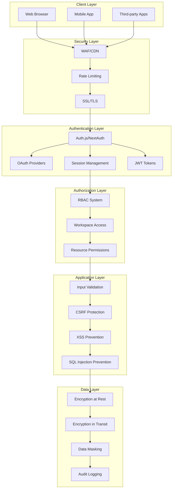

# IntakeFlow - Security & Authentication Strategy

## Overview

This document outlines the comprehensive security and authentication strategy for IntakeFlow, covering user authentication, data protection, API security, compliance requirements, and threat mitigation. The strategy is designed to protect sensitive client data while maintaining usability and performance.

## Security Architecture



## Authentication System

### 1. Auth.js Configuration

```typescript
// auth.ts (Enhanced)
import NextAuth from "next-auth";
import GoogleProvider from "next-auth/providers/google";
import CredentialsProvider from "next-auth/providers/credentials";
import { PrismaAdapter } from "@auth/prisma-adapter";
import { prisma } from "@/lib/prisma";
import bcrypt from "bcryptjs";
import { rateLimit } from "@/lib/rate-limit";

export const { handlers, signIn, signOut, auth } = NextAuth({
  adapter: PrismaAdapter(prisma),
  providers: [
    GoogleProvider({
      clientId: process.env.GOOGLE_CLIENT_ID!,
      clientSecret: process.env.GOOGLE_CLIENT_SECRET!,
      authorization: {
        params: {
          prompt: "consent",
          access_type: "offline",
          response_type: "code",
        },
      },
    }),
    CredentialsProvider({
      name: "credentials",
      credentials: {
        email: { label: "Email", type: "email" },
        password: { label: "Password", type: "password" },
      },
      async authorize(credentials, request) {
        if (!credentials?.email || !credentials?.password) {
          return null;
        }

        // Rate limiting for login attempts
        const rateLimitResult = await rateLimit(
          `login:${credentials.email}`,
          5, // 5 attempts
          900 // 15 minutes
        );

        if (!rateLimitResult.success) {
          throw new Error("Too many login attempts. Please try again later.");
        }

        const user = await prisma.user.findUnique({
          where: { email: credentials.email },
          include: {
            accounts: true,
            workspaces: true,
          },
        });

        if (!user || !user.password) {
          return null;
        }

        const isPasswordValid = await bcrypt.compare(
          credentials.password,
          user.password
        );

        if (!isPasswordValid) {
          return null;
        }

        // Log successful login
        await prisma.auditLog.create({
          data: {
            userId: user.id,
            action: "LOGIN",
            resource: "USER",
            resourceId: user.id,
            ipAddress: request?.headers?.["x-forwarded-for"] as string,
            userAgent: request?.headers?.["user-agent"] as string,
          },
        });

        return {
          id: user.id,
          email: user.email,
          name: user.name,
          image: user.image,
          emailVerified: user.emailVerified,
        };
      },
    }),
  ],
  session: {
    strategy: "jwt",
    maxAge: 30 * 24 * 60 * 60, // 30 days
    updateAge: 24 * 60 * 60, // 24 hours
  },
  jwt: {
    maxAge: 30 * 24 * 60 * 60, // 30 days
  },
  callbacks: {
    async jwt({ token, user, account }) {
      if (user) {
        token.id = user.id;
        token.emailVerified = user.emailVerified;
      }

      if (account) {
        token.accessToken = account.access_token;
        token.refreshToken = account.refresh_token;
      }

      return token;
    },
    async session({ session, token }) {
      if (token) {
        session.user.id = token.id as string;
        session.user.emailVerified = token.emailVerified as Date;

        // Add user workspaces to session
        const userWithWorkspaces = await prisma.user.findUnique({
          where: { id: token.id as string },
          include: {
            workspaces: {
              select: {
                id: true,
                name: true,
                slug: true,
                plan: true,
              },
            },
          },
        });

        session.user.workspaces = userWithWorkspaces?.workspaces || [];
      }

      return session;
    },
    async signIn({ user, account, profile }) {
      // Email verification check
      if (account?.provider === "credentials" && !user.emailVerified) {
        throw new Error("Please verify your email before signing in.");
      }

      // Additional security checks
      if (account?.provider === "google") {
        // Verify Google account
        if (!profile?.email_verified) {
          return false;
        }
      }

      return true;
    },
    async redirect({ url, baseUrl }) {
      // Ensure redirects are to the same domain
      if (url.startsWith("/")) return `${baseUrl}${url}`;
      else if (new URL(url).origin === baseUrl) return url;
      return baseUrl;
    },
  },
  pages: {
    signIn: "/signin",
    signOut: "/signout",
    error: "/auth/error",
    verifyRequest: "/auth/verify-request",
  },
  events: {
    async signIn({ user, account, isNewUser }) {
      // Log sign-in events
      await prisma.auditLog.create({
        data: {
          userId: user.id,
          action: "SIGNIN",
          resource: "USER",
          resourceId: user.id,
          metadata: {
            provider: account?.provider,
            isNewUser,
          },
        },
      });
    },
    async signOut({ session }) {
      // Log sign-out events
      if (session?.user?.id) {
        await prisma.auditLog.create({
          data: {
            userId: session.user.id,
            action: "SIGNOUT",
            resource: "USER",
            resourceId: session.user.id,
          },
        });
      }
    },
  },
  debug: process.env.NODE_ENV === "development",
});
```

### 2. Multi-Factor Authentication (MFA)

```typescript
// lib/auth/mfa.ts
import { authenticator } from "otplib";
import QRCode from "qrcode";
import { prisma } from "@/lib/prisma";

export class MFAService {
  static generateSecret(userEmail: string): string {
    return authenticator.generateSecret();
  }

  static async generateQRCode(
    userEmail: string,
    secret: string
  ): Promise<string> {
    const service = "IntakeFlow";
    const otpauth = authenticator.keyuri(userEmail, service, secret);
    return await QRCode.toDataURL(otpauth);
  }

  static verifyToken(token: string, secret: string): boolean {
    return authenticator.verify({ token, secret });
  }

  static async enableMFA(
    userId: string,
    secret: string,
    token: string
  ): Promise<boolean> {
    if (!this.verifyToken(token, secret)) {
      return false;
    }

    await prisma.user.update({
      where: { id: userId },
      data: {
        mfaSecret: secret,
        mfaEnabled: true,
      },
    });

    // Generate backup codes
    const backupCodes = Array.from({ length: 10 }, () =>
      Math.random().toString(36).substring(2, 10).toUpperCase()
    );

    await prisma.mfaBackupCode.createMany({
      data: backupCodes.map((code) => ({
        userId,
        code: await bcrypt.hash(code, 12),
      })),
    });

    return true;
  }

  static async verifyMFA(userId: string, token: string): Promise<boolean> {
    const user = await prisma.user.findUnique({
      where: { id: userId },
      select: { mfaSecret: true, mfaEnabled: true },
    });

    if (!user?.mfaEnabled || !user.mfaSecret) {
      return false;
    }

    return this.verifyToken(token, user.mfaSecret);
  }

  static async useBackupCode(userId: string, code: string): Promise<boolean> {
    const backupCodes = await prisma.mfaBackupCode.findMany({
      where: { userId, used: false },
    });

    for (const backupCode of backupCodes) {
      const isValid = await bcrypt.compare(code, backupCode.code);
      if (isValid) {
        await prisma.mfaBackupCode.update({
          where: { id: backupCode.id },
          data: { used: true, usedAt: new Date() },
        });
        return true;
      }
    }

    return false;
  }
}
```

### 3. Password Security

```typescript
// lib/auth/password.ts
import bcrypt from "bcryptjs";
import zxcvbn from "zxcvbn";

export class PasswordService {
  private static readonly SALT_ROUNDS = 12;
  private static readonly MIN_STRENGTH = 3; // 0-4 scale

  static async hashPassword(password: string): Promise<string> {
    return await bcrypt.hash(password, this.SALT_ROUNDS);
  }

  static async verifyPassword(
    password: string,
    hash: string
  ): Promise<boolean> {
    return await bcrypt.compare(password, hash);
  }

  static validatePasswordStrength(password: string): {
    isValid: boolean;
    score: number;
    feedback: string[];
  } {
    const result = zxcvbn(password);

    return {
      isValid: result.score >= this.MIN_STRENGTH,
      score: result.score,
      feedback: result.feedback.suggestions,
    };
  }

  static generateSecurePassword(length: number = 16): string {
    const charset =
      "abcdefghijklmnopqrstuvwxyzABCDEFGHIJKLMNOPQRSTUVWXYZ0123456789!@#$%^&*";
    let password = "";

    for (let i = 0; i < length; i++) {
      password += charset.charAt(Math.floor(Math.random() * charset.length));
    }

    return password;
  }

  static async checkPasswordHistory(
    userId: string,
    newPassword: string
  ): Promise<boolean> {
    const passwordHistory = await prisma.passwordHistory.findMany({
      where: { userId },
      orderBy: { createdAt: "desc" },
      take: 5, // Check last 5 passwords
    });

    for (const oldPassword of passwordHistory) {
      if (await this.verifyPassword(newPassword, oldPassword.passwordHash)) {
        return false; // Password was used before
      }
    }

    return true; // Password is new
  }

  static async savePasswordHistory(
    userId: string,
    passwordHash: string
  ): Promise<void> {
    await prisma.passwordHistory.create({
      data: { userId, passwordHash },
    });

    // Keep only last 5 passwords
    const oldPasswords = await prisma.passwordHistory.findMany({
      where: { userId },
      orderBy: { createdAt: "desc" },
      skip: 5,
    });

    if (oldPasswords.length > 0) {
      await prisma.passwordHistory.deleteMany({
        where: {
          id: { in: oldPasswords.map((p) => p.id) },
        },
      });
    }
  }
}
```

## Authorization & Access Control

### 1. Role-Based Access Control (RBAC)

```typescript
// lib/auth/rbac.ts
export enum Permission {
  // Workspace permissions
  WORKSPACE_READ = "workspace:read",
  WORKSPACE_WRITE = "workspace:write",
  WORKSPACE_DELETE = "workspace:delete",
  WORKSPACE_ADMIN = "workspace:admin",

  // Workflow permissions
  WORKFLOW_READ = "workflow:read",
  WORKFLOW_WRITE = "workflow:write",
  WORKFLOW_DELETE = "workflow:delete",
  WORKFLOW_EXECUTE = "workflow:execute",

  // Form permissions
  FORM_READ = "form:read",
  FORM_WRITE = "form:write",
  FORM_DELETE = "form:delete",
  FORM_SUBMIT = "form:submit",

  // Client permissions
  CLIENT_READ = "client:read",
  CLIENT_WRITE = "client:write",
  CLIENT_DELETE = "client:delete",

  // Integration permissions
  INTEGRATION_READ = "integration:read",
  INTEGRATION_WRITE = "integration:write",
  INTEGRATION_DELETE = "integration:delete",

  // Analytics permissions
  ANALYTICS_READ = "analytics:read",
}

export enum Role {
  OWNER = "owner",
  ADMIN = "admin",
  MEMBER = "member",
  VIEWER = "viewer",
}

const rolePermissions: Record<Role, Permission[]> = {
  [Role.OWNER]: Object.values(Permission),
  [Role.ADMIN]: [
    Permission.WORKSPACE_READ,
    Permission.WORKSPACE_WRITE,
    Permission.WORKFLOW_READ,
    Permission.WORKFLOW_WRITE,
    Permission.WORKFLOW_EXECUTE,
    Permission.FORM_READ,
    Permission.FORM_WRITE,
    Permission.CLIENT_READ,
    Permission.CLIENT_WRITE,
    Permission.INTEGRATION_READ,
    Permission.INTEGRATION_WRITE,
    Permission.ANALYTICS_READ,
  ],
  [Role.MEMBER]: [
    Permission.WORKSPACE_READ,
    Permission.WORKFLOW_READ,
    Permission.WORKFLOW_WRITE,
    Permission.WORKFLOW_EXECUTE,
    Permission.FORM_READ,
    Permission.FORM_WRITE,
    Permission.CLIENT_READ,
    Permission.CLIENT_WRITE,
    Permission.ANALYTICS_READ,
  ],
  [Role.VIEWER]: [
    Permission.WORKSPACE_READ,
    Permission.WORKFLOW_READ,
    Permission.FORM_READ,
    Permission.CLIENT_READ,
    Permission.ANALYTICS_READ,
  ],
};

export class RBACService {
  static hasPermission(userRole: Role, permission: Permission): boolean {
    return rolePermissions[userRole]?.includes(permission) || false;
  }

  static async getUserWorkspaceRole(
    userId: string,
    workspaceId: string
  ): Promise<Role | null> {
    const membership = await prisma.workspaceMember.findUnique({
      where: {
        userId_workspaceId: {
          userId,
          workspaceId,
        },
      },
    });

    return (membership?.role as Role) || null;
  }

  static async checkWorkspaceAccess(
    userId: string,
    workspaceId: string,
    permission: Permission
  ): Promise<boolean> {
    const role = await this.getUserWorkspaceRole(userId, workspaceId);
    if (!role) return false;

    return this.hasPermission(role, permission);
  }

  static async requireWorkspaceAccess(
    userId: string,
    workspaceId: string,
    permission: Permission
  ): Promise<void> {
    const hasAccess = await this.checkWorkspaceAccess(
      userId,
      workspaceId,
      permission
    );
    if (!hasAccess) {
      throw new ForbiddenError(`Insufficient permissions: ${permission}`);
    }
  }
}
```

### 2. Resource-Level Permissions

```typescript
// lib/auth/resource-permissions.ts
export class ResourcePermissionService {
  static async canAccessWorkflow(
    userId: string,
    workflowId: string,
    permission: Permission
  ): Promise<boolean> {
    const workflow = await prisma.workflowTemplate.findUnique({
      where: { id: workflowId },
      include: { workspace: true },
    });

    if (!workflow) return false;

    return await RBACService.checkWorkspaceAccess(
      userId,
      workflow.workspaceId,
      permission
    );
  }

  static async canAccessForm(
    userId: string,
    formId: string,
    permission: Permission
  ): Promise<boolean> {
    const form = await prisma.form.findUnique({
      where: { id: formId },
      include: { workspace: true },
    });

    if (!form) return false;

    return await RBACService.checkWorkspaceAccess(
      userId,
      form.workspaceId,
      permission
    );
  }

  static async canAccessClient(
    userId: string,
    clientId: string,
    permission: Permission
  ): Promise<boolean> {
    const client = await prisma.client.findUnique({
      where: { id: clientId },
      include: { workspace: true },
    });

    if (!client) return false;

    return await RBACService.checkWorkspaceAccess(
      userId,
      client.workspaceId,
      permission
    );
  }
}
```

## Data Protection & Encryption

### 1. Encryption at Rest

```typescript
// lib/encryption/data-encryption.ts
import crypto from "crypto";

export class DataEncryption {
  private static readonly ALGORITHM = "aes-256-gcm";
  private static readonly KEY_LENGTH = 32;
  private static readonly IV_LENGTH = 16;
  private static readonly TAG_LENGTH = 16;

  private static getEncryptionKey(): Buffer {
    const key = process.env.ENCRYPTION_KEY;
    if (!key) {
      throw new Error("ENCRYPTION_KEY environment variable is required");
    }
    return Buffer.from(key, "hex");
  }

  static encrypt(text: string): string {
    const key = this.getEncryptionKey();
    const iv = crypto.randomBytes(this.IV_LENGTH);
    const cipher = crypto.createCipher(this.ALGORITHM, key);
    cipher.setAAD(Buffer.from("IntakeFlow", "utf8"));

    let encrypted = cipher.update(text, "utf8", "hex");
    encrypted += cipher.final("hex");

    const tag = cipher.getAuthTag();

    return iv.toString("hex") + ":" + tag.toString("hex") + ":" + encrypted;
  }

  static decrypt(encryptedData: string): string {
    const key = this.getEncryptionKey();
    const parts = encryptedData.split(":");

    if (parts.length !== 3) {
      throw new Error("Invalid encrypted data format");
    }

    const iv = Buffer.from(parts[0], "hex");
    const tag = Buffer.from(parts[1], "hex");
    const encrypted = parts[2];

    const decipher = crypto.createDecipher(this.ALGORITHM, key);
    decipher.setAAD(Buffer.from("IntakeFlow", "utf8"));
    decipher.setAuthTag(tag);

    let decrypted = decipher.update(encrypted, "hex", "utf8");
    decrypted += decipher.final("utf8");

    return decrypted;
  }

  static hash(data: string): string {
    return crypto.createHash("sha256").update(data).digest("hex");
  }

  static generateKey(): string {
    return crypto.randomBytes(this.KEY_LENGTH).toString("hex");
  }
}
```

### 2. Sensitive Data Handling

```typescript
// lib/data/sensitive-data.ts
export class SensitiveDataHandler {
  private static readonly SENSITIVE_FIELDS = [
    "password",
    "mfaSecret",
    "apiKey",
    "accessToken",
    "refreshToken",
    "credentials",
  ];

  static maskSensitiveData(obj: any): any {
    if (typeof obj !== "object" || obj === null) {
      return obj;
    }

    if (Array.isArray(obj)) {
      return obj.map((item) => this.maskSensitiveData(item));
    }

    const masked = { ...obj };

    for (const key in masked) {
      if (this.SENSITIVE_FIELDS.includes(key.toLowerCase())) {
        masked[key] = "***MASKED***";
      } else if (typeof masked[key] === "object") {
        masked[key] = this.maskSensitiveData(masked[key]);
      }
    }

    return masked;
  }

  static encryptSensitiveFields(obj: any): any {
    if (typeof obj !== "object" || obj === null) {
      return obj;
    }

    const encrypted = { ...obj };

    for (const key in encrypted) {
      if (
        this.SENSITIVE_FIELDS.includes(key.toLowerCase()) &&
        typeof encrypted[key] === "string"
      ) {
        encrypted[key] = DataEncryption.encrypt(encrypted[key]);
      }
    }

    return encrypted;
  }

  static decryptSensitiveFields(obj: any): any {
    if (typeof obj !== "object" || obj === null) {
      return obj;
    }

    const decrypted = { ...obj };

    for (const key in decrypted) {
      if (
        this.SENSITIVE_FIELDS.includes(key.toLowerCase()) &&
        typeof decrypted[key] === "string"
      ) {
        try {
          decrypted[key] = DataEncryption.decrypt(decrypted[key]);
        } catch (error) {
          // Field might not be encrypted
          console.warn(`Failed to decrypt field ${key}:`, error);
        }
      }
    }

    return decrypted;
  }
}
```

## Security Middleware & Validation

### 1. Input Validation & Sanitization

```typescript
// lib/security/input-validation.ts
import { z } from "zod";
import DOMPurify from "isomorphic-dompurify";

export class InputValidator {
  static sanitizeHtml(input: string): string {
    return DOMPurify.sanitize(input, {
      ALLOWED_TAGS: ["b", "i", "em", "strong", "p", "br"],
      ALLOWED_ATTR: [],
    });
  }

  static sanitizeString(input: string): string {
    return input
      .replace(/[<>]/g, "") // Remove potential HTML tags
      .replace(/javascript:/gi, "") // Remove javascript: protocol
      .replace(/on\w+=/gi, "") // Remove event handlers
      .trim();
  }

  static validateEmail(email: string): boolean {
    const emailSchema = z.string().email();
    return emailSchema.safeParse(email).success;
  }

  static validateUrl(url: string): boolean {
    try {
      new URL(url);
      return true;
    } catch {
      return false;
    }
  }

  static validateWorkflowStep(step: any): boolean {
    const stepSchema = z.object({
      id: z.string(),
      type: z.enum([
        "form",
        "email",
        "document",
        "payment",
        "calendar",
        "condition",
        "delay",
        "webhook",
      ]),
      name: z.string().min(1).max(255),
      config: z.record(z.any()),
      position: z.object({
        x: z.number(),
        y: z.number(),
      }),
    });

    return stepSchema.safeParse(step).success;
  }

  static validateFormField(field: any): boolean {
    const fieldSchema = z.object({
      id: z.string(),
      name: z.string().min(1).max(255),
      label: z.string().min(1).max(255),
      type: z.enum([
        "text",
        "email",
        "phone",
        "textarea",
        "select",
        "date",
        "file",
        "number",
      ]),
      required: z.boolean(),
      placeholder: z.string().optional(),
      options: z.array(z.string()).optional(),
    });

    return fieldSchema.safeParse(field).success;
  }
}
```

### 2. CSRF Protection

```typescript
// lib/security/csrf.ts
import { NextRequest } from "next/server";
import crypto from "crypto";

export class CSRFProtection {
  private static readonly TOKEN_LENGTH = 32;
  private static readonly HEADER_NAME = "x-csrf-token";
  private static readonly COOKIE_NAME = "csrf-token";

  static generateToken(): string {
    return crypto.randomBytes(this.TOKEN_LENGTH).toString("hex");
  }

  static validateToken(request: NextRequest): boolean {
    const headerToken = request.headers.get(this.HEADER_NAME);
    const cookieToken = request.cookies.get(this.COOKIE_NAME)?.value;

    if (!headerToken || !cookieToken) {
      return false;
    }

    return crypto.timingSafeEqual(
      Buffer.from(headerToken, "hex"),
      Buffer.from(cookieToken, "hex")
    );
  }

  static requireCSRFToken(request: NextRequest): void {
    const method = request.method;

    // Skip CSRF check for safe methods
    if (["GET", "HEAD", "OPTIONS"].includes(method)) {
      return;
    }

    if (!this.validateToken(request)) {
      throw new Error("Invalid CSRF token");
    }
  }
}
```

### 3. XSS Prevention

```typescript
// lib/security/xss-prevention.ts
export class XSSPrevention {
  private static readonly DANGEROUS_PATTERNS = [
    /<script\b[^<]*(?:(?!<\/script>)<[^<]*)*<\/script>/gi,
    /javascript:/gi,
    /on\w+\s*=/gi,
    /<iframe\b[^<]*(?:(?!<\/iframe>)<[^<]*)*<\/iframe>/gi,
    /<object\b[^<]*(?:(?!<\/object>)<[^<]*)*<\/object>/gi,
    /<embed\b[^<]*(?:(?!<\/embed>)<[^<]*)*<\/embed>/gi,
  ];

  static containsXSS(input: string): boolean {
    return this.DANGEROUS_PATTERNS.some((pattern) => pattern.test(input));
  }

  static sanitizeInput(input: string): string {
    let sanitized = input;

    this.DANGEROUS_PATTERNS.forEach((pattern) => {
      sanitized = sanitized.replace(pattern, "");
    });

    return sanitized;
  }

  static validateUserInput(input: any): void {
    if (typeof input === "string" && this.containsXSS(input)) {
      throw new Error("Potentially malicious input detected");
    }

    if (typeof input === "object" && input !== null) {
      Object.values(input).forEach((value) => {
        this.validateUserInput(value);
      });
    }
  }
}
```

## Audit Logging & Monitoring

### 1. Audit Logging System

```typescript
// lib/audit/audit-logger.ts
export enum AuditAction {
  CREATE = "CREATE",
  READ = "READ",
  UPDATE = "UPDATE",
  DELETE = "DELETE",
  LOGIN = "LOGIN",
  LOGOUT = "LOGOUT",
  SIGNIN = "SIGNIN",
  SIGNOUT = "SIGNOUT",
  EXECUTE = "EXECUTE",
  EXPORT = "EXPORT",
  IMPORT = "IMPORT",
}

export enum AuditResource {
  USER = "USER",
  WORKSPACE = "WORKSPACE",
  WORKFLOW = "WORKFLOW",
  FORM = "FORM",
  CLIENT = "CLIENT",
  INTEGRATION = "INTEGRATION",
  EXECUTION = "EXECUTION",
}

export interface AuditLogEntry {
  userId?: string;
  action: AuditAction;
  resource: AuditResource;
  resourceId?: string;
  metadata?: any;
  ipAddress?: string;
  userAgent?: string;
  timestamp: Date;
}

export class AuditLogger {
  static async log(entry: Omit<AuditLogEntry, "timestamp">): Promise<void> {
    try {
      await prisma.auditLog.create({
        data: {
          ...entry,
          timestamp: new Date(),
          metadata: entry.metadata ? JSON.stringify(entry.metadata) : null,
        },
      });
    } catch (error) {
      console.error("Failed to write audit log:", error);
      // Don't throw error to avoid breaking the main operation
    }
  }

  static async getAuditLogs(
    workspaceId: string,
    filters: {
      userId?: string;
      action?: AuditAction;
      resource?: AuditResource;
      startDate?: Date;
      endDate?: Date;
      page?: number;
      limit?: number;
    } = {}
  ): Promise<{
    logs: AuditLogEntry[];
    total: number;
  }> {
    const where: any = {};

    if (filters.userId) where.userId = filters.userId;
    if (filters.action) where.action = filters.action;
    if (filters.resource) where.resource = filters.resource;
    if (filters.startDate || filters.endDate) {
      where.timestamp = {};
      if (filters.startDate) where.timestamp.gte = filters.startDate;
      if (filters.endDate) where.timestamp.lte = filters.endDate;
    }

    const page = filters.page || 1;
    const limit = filters.limit || 50;

    const [logs, total] = await Promise.all([
      prisma.auditLog.findMany({
        where,
        orderBy: { timestamp: "desc" },
        skip: (page - 1) * limit,
        take: limit,
        include: {
          user: {
            select: {
              id: true,
              name: true,
              email: true,
            },
          },
        },
      }),
      prisma.auditLog.count({ where }),
    ]);

    return { logs, total };
  }
}
```

### 2. Security Monitoring
