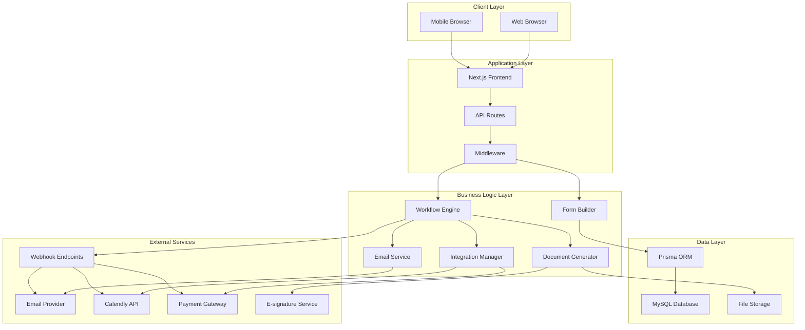

# IntakeFlow - Technical Architecture Document

## Overview

IntakeFlow is a lightweight SaaS platform designed to automate client onboarding and intake processes for solo professionals and small service-based businesses. This document outlines the technical architecture, technology stack, and system design decisions.

## Current Technology Stack Analysis

### Frontend

- **Next.js 14** with App Router
- **React 19** with TypeScript
- **Tailwind CSS 4** for styling
- **Radix UI** components for accessibility
- **Lucide React** for icons

### Authentication

- **Auth.js v5** (NextAuth) with Google OAuth
- Session-based authentication
- Custom sign-in/sign-out pages

### Current Features Implemented

- Dashboard with workflow management
- Visual workflow canvas with drag-and-drop
- Form builder with multiple field types
- Basic workflow editor with step configuration
- Responsive UI components

## Proposed Architecture

### System Architecture Diagram



### Core Components

#### 1. Workflow Engine

- **Purpose**: Execute automated workflows based on triggers
- **Features**:
  - Step-by-step execution
  - Conditional logic
  - Delay mechanisms
  - Error handling and retry logic
  - Webhook integration
- **Implementation**: Server-side with queue system

#### 2. Form Builder & Renderer

- **Purpose**: Create and display dynamic forms
- **Features**:
  - Drag-and-drop form creation
  - Multiple field types
  - Conditional fields
  - Form validation
  - Custom branding
- **Implementation**: React components with JSON schema

#### 3. Email Automation System

- **Purpose**: Send automated emails based on workflow triggers
- **Features**:
  - Template management
  - Personalization
  - Delivery tracking
  - Bounce handling
- **Implementation**: Queue-based with external email service

#### 4. Document Management

- **Purpose**: Generate and manage documents
- **Features**:
  - Template-based generation
  - PDF creation
  - E-signature integration
  - Version control
- **Implementation**: Server-side generation with cloud storage

#### 5. Integration Hub

- **Purpose**: Manage third-party integrations
- **Features**:
  - OAuth management
  - API rate limiting
  - Webhook handling
  - Error recovery
- **Implementation**: Modular integration system

## Technology Stack Recommendations

### Database & ORM

- **MySQL 8.0+** - Reliable, cost-effective, well-supported
- **Prisma** - Type-safe ORM with excellent Next.js integration
- **Connection pooling** - PgBouncer or built-in Prisma pooling

### Email Services (Cost-effective options)

1. **Resend** - $20/month for 100k emails, developer-friendly
2. **SendGrid** - Free tier: 100 emails/day, $15/month for 40k
3. **Mailgun** - $35/month for 50k emails
4. **Amazon SES** - $0.10 per 1000 emails (cheapest for volume)

### File Storage

- **AWS S3** - Pay-as-you-go, highly reliable
- **Cloudflare R2** - S3-compatible, no egress fees
- **Local storage** - For development/small deployments

### Queue System

- **BullMQ** with Redis - Robust job processing
- **Inngest** - Serverless workflow engine (free tier available)
- **Database-based queues** - Simple implementation for MVP

### Monitoring & Analytics

- **Sentry** - Error tracking (free tier available)
- **Vercel Analytics** - Basic web analytics
- **Custom dashboard** - Built-in analytics for business metrics

## Self-Hosting Strategy

### Deployment Options

#### Option 1: VPS Deployment (Recommended for cost)

- **Provider**: Hetzner, DigitalOcean, or Linode
- **Specs**: 2 CPU, 4GB RAM, 80GB SSD (~$20-30/month)
- **Stack**: Docker Compose with:
  - Next.js application
  - MySQL database
  - Redis for caching/queues
  - Nginx reverse proxy
  - SSL with Let's Encrypt

#### Option 2: Serverless Hybrid

- **Frontend**: Vercel (free tier for personal projects)
- **Database**: PlanetScale (free tier: 1GB storage)
- **Functions**: Vercel Functions or AWS Lambda
- **Storage**: AWS S3 or Cloudflare R2

#### Option 3: Full Cloud (Scalable)

- **Platform**: Railway, Render, or Fly.io
- **Database**: Managed MySQL service
- **Estimated cost**: $50-100/month for production

### Docker Configuration

```dockerfile
# Dockerfile example
FROM node:18-alpine AS base
WORKDIR /app
COPY package*.json ./
RUN npm ci --only=production

FROM base AS build
COPY . .
RUN npm run build

FROM base AS runtime
COPY --from=build /app/.next ./.next
COPY --from=build /app/public ./public
EXPOSE 3000
CMD ["npm", "start"]
```

### Environment Configuration

```yaml
# docker-compose.yml
version: "3.8"
services:
  app:
    build: .
    ports:
      - "3000:3000"
    environment:
      - DATABASE_URL=mysql://user:pass@db:3306/intakeflow
      - REDIS_URL=redis://redis:6379
    depends_on:
      - db
      - redis

  db:
    image: mysql:8.0
    environment:
      MYSQL_ROOT_PASSWORD: rootpassword
      MYSQL_DATABASE: intakeflow
    volumes:
      - mysql_data:/var/lib/mysql

  redis:
    image: redis:7-alpine
    volumes:
      - redis_data:/data

volumes:
  mysql_data:
  redis_data:
```

## Security Considerations

### Authentication & Authorization

- **Multi-factor authentication** for admin accounts
- **Role-based access control** (RBAC)
- **API key management** for integrations
- **Session security** with secure cookies

### Data Protection

- **Encryption at rest** for sensitive data
- **TLS/SSL** for all communications
- **Input validation** and sanitization
- **SQL injection prevention** via Prisma
- **XSS protection** with Content Security Policy

### Compliance

- **GDPR compliance** for EU users
- **Data retention policies**
- **Audit logging** for sensitive operations
- **Backup and recovery** procedures

## Performance Optimization

### Caching Strategy

- **Redis** for session storage and temporary data
- **Next.js caching** for static content
- **Database query optimization** with proper indexing
- **CDN** for static assets

### Scalability Considerations

- **Horizontal scaling** with load balancers
- **Database read replicas** for high-traffic scenarios
- **Queue workers** for background processing
- **Microservices architecture** for future growth

## Development Workflow

### Code Organization

```
src/
├── app/                 # Next.js app directory
├── components/          # Reusable UI components
├── lib/                # Utility functions and configurations
├── prisma/             # Database schema and migrations
├── services/           # Business logic services
├── types/              # TypeScript type definitions
├── hooks/              # Custom React hooks
└── utils/              # Helper functions
```

### Testing Strategy

- **Unit tests** with Jest and React Testing Library
- **Integration tests** for API endpoints
- **E2E tests** with Playwright
- **Database tests** with test containers

### CI/CD Pipeline

- **GitHub Actions** for automated testing and deployment
- **Docker builds** for consistent environments
- **Automated database migrations**
- **Environment-specific deployments**

## Cost Estimation (Monthly)

### MVP Deployment

- **VPS Hosting**: $25
- **Domain & SSL**: $2
- **Email Service**: $20 (Resend)
- **File Storage**: $5 (AWS S3)
- **Monitoring**: $0 (free tiers)
- **Total**: ~$52/month

### Production Scale (1000 users)

- **VPS Hosting**: $50 (upgraded specs)
- **Database**: $25 (managed MySQL)
- **Email Service**: $35 (higher volume)
- **File Storage**: $15
- **CDN**: $10
- **Monitoring**: $20
- **Total**: ~$155/month

## Next Steps

1. **Database Schema Design** - Define all entities and relationships
2. **API Design** - RESTful endpoints for all operations
3. **Integration Planning** - Detailed integration specifications
4. **MVP Feature Prioritization** - Core features for initial release
5. **Development Timeline** - Realistic milestones and deliverables

This architecture provides a solid foundation for building a scalable, cost-effective SaaS platform while maintaining flexibility for future enhancements.
